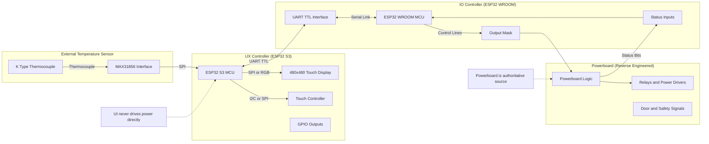

# ESP32-S3 Filament & SilicaGel Dryer UI

## Management Summary

> [!NOTE]
>
> Große Teile der Dokumentation basieren auf aktuellen Source-Code Ständen, Analysen und Reverse-Engineering. Die Dokumentation wurde primär von ChatGPT
> zusammengefasst und ausgearbeitet.
> 

**Technische Grundlage (Kurzüberblick):**
- **UI/Host:** ESP32‑S3, 480×480 Touchdisplay, **LVGL 9.4.x**
- **Client/Powerboard:** ESP32‑WROOM steuert Aktuatoren (Heater, Fans, Motor, Lamp) und liefert Telemetrie
- **Kommunikation:** UART/TTL (Serial2), ASCII‑Protokoll mit CRLF (Host ↔ Client)
- **Temperaturmessung:** externer **K‑Type Sensor** über **MAX31856** (zusätzliche Genauigkeit/Plausibilität)

Der **ESP32-S3 Filament & Silicat Dryer** ist ein spezialisiertes Steuer- und Bedienkonzept für einen kombinierten
Filament- und Silicagel-Trockner im Umfeld des FDM-3D-Drucks.

Beim FDM-3D-Druck stellt **Feuchtigkeit im Filament** eine der größten Qualitätsrisiken dar. Unterschiedliche Materialien
wie PLA, PETG, ABS, ASA oder technische Kunststoffe reagieren sehr unterschiedlich auf Feuchtigkeit und benötigen
jeweils **eigene Trocknungstemperaturen und Trocknungszeiten**.

Zusätzlich wird Filament häufig zusammen mit **Silicagel** gelagert, das Feuchtigkeit aufnimmt. Dieses Silicagel muss
regelmäßig regeneriert werden, was eine Trocknung bei hohen Temperaturen (typischerweise über 100 °C) über definierte
Zeitspannen erfordert.

Der hier beschriebene Filament-Silicat-Dryer verfolgt deshalb einen **All-in-One-Ansatz**:
- gleichzeitige Trocknung von bis zu zwei Filamentrollen
- Regeneration von Silicagel in einem rotierenden Korb
- Nutzung robuster, vorhandener Hardware eines Mini-Backofens
- vollständiger Ersatz der ursprünglichen Anzeige- und Steuerlogik

Die bestehende Hersteller-Hardware wurde **analysiert und reverse-engineered**. Das Powerboard inklusive Ansteuerung
von Heizung, Lüftern, Motor und Sensorik wurde unverändert weiterverwendet. Die ursprüngliche Benutzeroberfläche
(7-Segment-Anzeige, LEDs, einfache Tasterlogik) wurde vollständig entfernt und durch dieses Projekt ersetzt.

Das Ergebnis ist ein **sicheres, transparentes und erweiterbares System**, das sowohl für den täglichen Betrieb als auch
für Wartung, Service und Weiterentwicklung geeignet ist.

> [!WARNING]
> 
> **USB darf nicht angeschlossen werden, während das Gerät am 230-V-Netz betrieben wird.**  
> Durch netzseitige Bezüge des PowerBoards können beim Anstecken von USB gefährliche Potentialunterschiede entstehen, die ESP32 oder PC beschädigen. 
> USB nur bei gezogenem Netzstecker, mit USB-Isolator oder über Trenntrafo verwenden.

## Screenshots (Platzhalter)

  

## Installation

> [!WARNING]
> 
> **!!!!! NIE USB verwenden, wenn Netzstecker eingesteckt ist !!!!!!!**

> [Installationsanweisung](doc/filament-silicagel-dryer_installation_v2.md)

## Systemarchitektur – Überblick

Zentrales Prinzip: **Oven Runtime State als Single Source of Truth**

### Komponenten-Diagramm

## Entwicklungsphasen

> **Hinweis:** 
> **T1** (Display-/Touch‑Bring‑up) und  
> **T2** (erster LVGL‑Architektur‑Ansatz) waren bewusst frühe Grundlagenphasen.  
> Die wesentlichen, produktionsnahen Implementierungen starten ab  
> **T3** und sind entsprechend ab dort detailliert dokumentiert.

Siehe Dokumente unter `/docs`:
- [Entwicklungsphase T3 - Architektur / UX](doc/ESP32-S3_UI_T3_Zusammenfassung.md)
- [Entwicklungsphase T4 - screen_main](doc/ESP32-S3_UI_T4_Zusammenfassung.md)
- [Entwicklungsphase T5 - oven-logic](doc/ESP32-S3_UI_T5_Zusammenfassung.md)
- [Entwicklungsphase T6 - host/client Kommunikation (architektur/test)](doc/ESP32-S3_UI_T6_Zusammenfassung.md)
- [Entwicklungsphase T7 - host/client UX Integration](doc/ESP32-S3_UI_T7_Zusammenfassung.md)
- [Entwicklungsphase T8 - screen_dbg_hw](doc/ESP32-S3_UI_T8_Zusammenfassung.md)

## ⚠️ Sicherheitshinweis: USB-Verbindung im laufenden Betrieb

### Hintergrund
Das PowerBoard schaltet netzbetriebene Verbraucher (230 V AC) über TRIAC-basierte
Leistungsstufen. Obwohl der Niedervoltbereich (5 V / 3,3 V) funktional getrennt ist,
bestehen **elektrische Bezüge zum Netzbereich**, z. B. über TRIAC-Gate-Schaltungen,
Schutzdioden (PD-Netzwerke) und EMV-Strukturen.

Der ESP32 wird direkt vom PowerBoard versorgt und ist daher Teil dieser elektrischen
Domäne.

### Risiko beim Anschluss von USB
Beim Anschluss eines USB-Kabels wird die **USB-Masse des PCs/Laptops** direkt mit der
**Masse des ESP32** verbunden. Ist das Gerät gleichzeitig mit dem 230-V-Netz verbunden,
kann dies zu folgenden Problemen führen:

- ungewollten **Potentialunterschieden** zwischen PC und Gerät,
- **Beschädigung des ESP32**, des PowerBoards oder des USB-Ports am PC,
- im ungünstigen Fall zu gefährlichen Fehlerströmen durch EMV-Kopplungen oder Transienten.

Auch wenn keine direkte Gleichspannungsverbindung zu Phase (L) oder Neutralleiter (N)
messbar ist, können **kapazitive Kopplungen und kurzzeitige Überspannungen** auftreten.

### Verbindliche Regel
**USB darf nicht angeschlossen werden, während das Gerät am 230-V-Netz betrieben wird.**

### Erlaubte Nutzung
Eine USB-Verbindung ist nur unter einer der folgenden Bedingungen zulässig:
- Das Gerät ist vollständig **vom Netz getrennt** (Netzstecker gezogen), oder
- es wird ein **USB-Isolator** verwendet, oder
- das Gerät wird über eine **galvanisch getrennte Versorgung** betrieben
  (z. B. Trenntrafo).

### Empfehlung
- Firmware-Updates und Debugging **nur im spannungslosen Zustand** durchführen.
- Für Debugging im Betrieb ausschließlich **galvanisch isolierte Werkzeuge** verwenden.
- Der ESP32 ist als **interne Gerätelektronik** zu betrachten und nicht als
  USB-sichere Entwicklungsplattform.

Die Nichtbeachtung dieser Hinweise kann zu Hardware-Schäden führen.