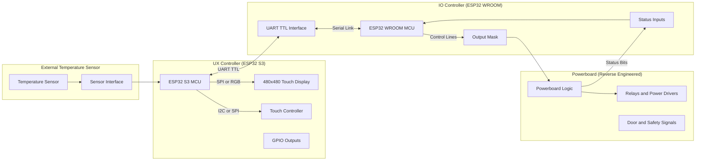

# ESP32-S3 Filament & SilicaGel Dryer UI

> English documentation is available in [README_EN.md](README_EN.md).
> Diese README ist die deutsche Hauptfassung.

## Management Summary

> [!NOTE]
>
> Große Teile der Dokumentation basieren auf aktuellen Source-Code-Ständen, Analysen und Reverse-Engineering.
> Die Formulierungen wurden zu wesentlichen Teilen KI-gestützt ausgearbeitet und werden schrittweise technisch nachgeschärft.

Technische Grundlage:

- `HOST`: ESP32-S3 mit 480x480-Touchdisplay und LVGL
- `CLIENT`: ESP32-WROOM für Aktorik, Telemetrie und Safety-Gating
- Kommunikation: UART/TTL mit ASCII-Protokoll
- Temperaturmessung: externer Thermofühler plus clientseitige Sensorik

Der Filament- und SilicaGel-Dryer ersetzt die originale Bedien- und Steuerlogik eines Mini-Backofens durch eine transparente Zwei-Controller-Architektur. Ziel ist kein kosmetischer Umbau, sondern ein nachvollziehbares, wartbares und erweiterbares Trocknungssystem für Filament und Silicagel.

## Aktueller Release-Stand

- Version: `0.7.3`
- Fokus:
  - konfigurierbarer Parameterscreen auf dem `HOST`
  - NVM-persistente Fast-Shortcuts
  - konfigurierbare Heater-Curve-Presets
  - Display-Timeout mit Dimmung und Wake-on-Touch-Schutz
  - hostseitige Langzeit-CSV-Aggregation `CSV_LR_HOST`
  - erweiterte aktive Hardware-, Wiring- und BOM-Baseline in der Doku

## Kritische Sicherheitsregel

> [!WARNING]
>
> **USB darf nicht angeschlossen werden, waehrend das Geraet am 230-V-Netz betrieben wird.**
> Durch netzseitige Bezuege des wiederverwendeten Powerboards koennen gefaehrliche Potentialunterschiede entstehen.

Erlaubte Varianten:

- Netzstecker ziehen, bevor USB verbunden wird
- USB-Isolator verwenden
- galvanisch getrennte Versorgung / isoliertes Setup verwenden

Die gepflegte Fassung dieser Regeln liegt in [doc/03_user_guide/01_installation_and_safety.md](doc/03_user_guide/01_installation_and_safety.md).

## Dokumentationsstatus

Aktiv gepflegt:

- Hardware- und Reverse-Engineering-Grundlagen
- Softwarearchitektur fuer `HOST`, `CLIENT` und Kommunikation
- Installations- und Sicherheitsbasis
- Bedienkonzept und Screen-Ueberblick
- Release- und Update-Baseline

Noch im Ausbau:

- vollstaendige Wiring-Dokumentation
- BOM mit Varianten
- Test- und Validierungsnachweise
- bebilderte Installationsschritte

## Einstieg

- Dokumentationsindex: [doc/README.md](doc/README.md)
- Hardware: [doc/01_reverse_engineering_and_hardware/README.md](doc/01_reverse_engineering_and_hardware/README.md)
- Hardware-Setup: [doc/01_reverse_engineering_and_hardware/04_hardware_setup.md](doc/01_reverse_engineering_and_hardware/04_hardware_setup.md)
- Wiring-Baseline: [doc/01_reverse_engineering_and_hardware/05_wiring_baseline.md](doc/01_reverse_engineering_and_hardware/05_wiring_baseline.md)
- BOM-Baseline: [doc/01_reverse_engineering_and_hardware/06_bom_baseline.md](doc/01_reverse_engineering_and_hardware/06_bom_baseline.md)
- Softwarearchitektur: [doc/02_software_architecture/README.md](doc/02_software_architecture/README.md)
- User Guide: [doc/03_user_guide/README.md](doc/03_user_guide/README.md)
- Installation und Sicherheit: [doc/03_user_guide/01_installation_and_safety.md](doc/03_user_guide/01_installation_and_safety.md)
- Betrieb und Screens: [doc/03_user_guide/02_operation_and_screens.md](doc/03_user_guide/02_operation_and_screens.md)
- Release und Update: [doc/03_user_guide/03_release_and_update.md](doc/03_user_guide/03_release_and_update.md)

## Referenzplattform

Aktuelle Basis:

- EMPHSISM AFTO-1505D Mini-Backofen / Airfryer
- reverse-engineertes Powerboard wird weiterverwendet
- Original-UI wird durch `HOST` und `CLIENT` ersetzt

Die aktive Hardware-Dokumentation liegt unter [doc/01_reverse_engineering_and_hardware/README.md](doc/01_reverse_engineering_and_hardware/README.md).

## Systemarchitektur

Zentrales Prinzip: `Oven Runtime State` als Single Source of Truth.

```mermaid
flowchart LR

  subgraph UX["UX Controller (ESP32 S3)"]
    S3["ESP32 S3 MCU"]
    TFT["480x480 Touch Display"]
    TOUCH["Touch Controller"]
    IO["GPIO Outputs"]
  end

  subgraph CLIENT["IO Controller (ESP32 WROOM)"]
    WROOM["ESP32 WROOM MCU"]
    UART2["UART TTL Interface"]
    OUT["Output Mask"]
    IN["Status Inputs"]
  end

  subgraph PWR["Powerboard (Reverse Engineered)"]
    PB["Powerboard Logic"]
    REL["Relays and Power Drivers"]
    SNS["Door and Safety Signals"]
  end

  subgraph SENS["External Temperature Sensor"]
    TC["Temperature Sensor"]
    AMP["Sensor Interface"]
  end

  S3 -->|"SPI or RGB"| TFT
  S3 -->|"I2C or SPI"| TOUCH
  S3 <-->|"UART TTL"| UART2
  UART2 <-->|"Serial Link"| WROOM
  WROOM -->|"Control Lines"| OUT
  OUT --> PB
  PB --> REL
  PB -->|"Status Bits"| IN
  IN --> WROOM
  TC --> AMP
  AMP --> S3
```

Die detaillierte Architektur ist unter [doc/02_software_architecture/README.md](doc/02_software_architecture/README.md) beschrieben.
