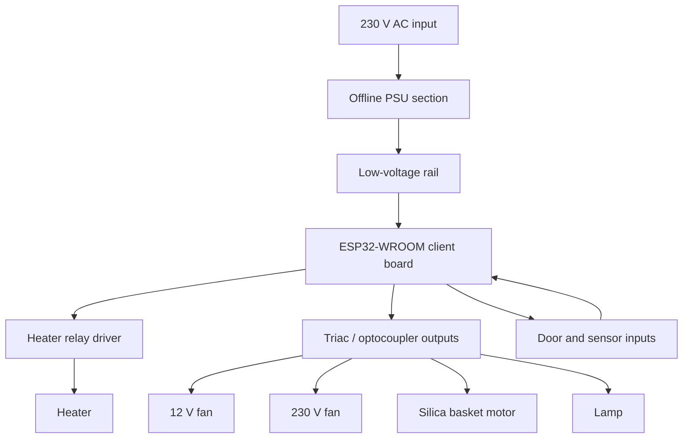

# Power Board Analysis

## Goal

The original oven power board is reused instead of being redesigned from scratch. The reverse-engineering work exists to understand:

- power conversion and low-voltage supply
- actuator paths for heater, fans, lamp and motor
- door and sensor signals
- risks when connecting custom ESP32 hardware

## What is currently known

The reverse-engineering documents archived from the previous structure show a consistent pattern:

- the board contains the mains-side power stage and the low-voltage supply
- the heater is switched through a relay path
- 230 V loads such as lamp, motor and fan stages are driven through optocoupler / triac style paths
- the board exposes low-voltage control and status connections that are now driven by the `CLIENT`

## Power board reference images

### Top side with labeled sections

This view is currently the most useful reference for:

- identifying the mains-side power section
- locating the low-voltage control area
- understanding the physical separation between high-voltage and logic domains

### Bottom side with connector labeling

This image is especially relevant for:

- the 12-pin connector area
- correlating connector pins with the archived reverse-engineering notes
- future connector-level wiring documentation

### Door-related board area

This image supports the current interpretation that the door signal is part of the low-voltage safety/control domain and should be documented separately from the actuator outputs.

## Functional block view

## Control lines used by the current firmware

The active output bit mapping is defined in `include/output_bitmask.h`:

- `BIT_FAN12V`
- `BIT_FAN230V`
- `BIT_LAMP`
- `BIT_SILICA_MOTOR`
- `BIT_FAN230V_SLOW`
- `BIT_DOOR`
- `BIT_HEATER`

The current `CLIENT` firmware treats the power board as hardware-authoritative:

- commands arrive from `HOST`
- output application happens on `CLIENT`
- telemetry and effective output truth are reported back to `HOST`
- safety gating remains on the `CLIENT`

## Important safety note

The board is mains-related. Existing project warnings remain valid:

- do not attach USB while the oven is connected to mains
- use isolation or disconnected mains supply during development
- treat the board as non-trivial mains hardware, not as a benign low-voltage module

## Source of historic details

Detailed pin traces, annotated photos and earlier analysis notes remain in:

- `doc/archive/pre_reorg_v0.7.1/legacy_docs/reverse_engineering/`
- `doc/archive/pre_reorg_v0.7.1/legacy_docs/images/`
