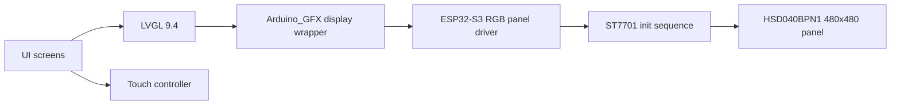

# LVGL Display and Panel Specifics

## Hardware identity

The current `HOST` uses an ESP32-S3 with a 480x480 touch display stack.

The code base references:

- panel: `HSD040BPN1-A00`
- controller family: `ST7701`
- backlight GPIO: `38`
- LVGL version: `9.4.0`

Relevant implementation files:

- `src/app/display/panel_hsd040bpn1.h`
- `src/app/display/display_hsd040bpn1.h`
- `src/app/display/display_hsd040bpn1.cpp`

## Integration characteristics

The display integration is not generic boilerplate. It has panel-specific constraints:

- RGB panel interface on the ESP32-S3
- separate register initialization sequence for the ST7701 family
- explicit backlight control
- touch integration handled separately from the display bring-up

## Known quirks from the current implementation history

- stable operation was achieved with a lower pixel clock than initially tested
- color order and pixel format needed panel-specific tuning
- the initialization sequence is tightly coupled to this exact panel family

## Display stack overview

## Why this matters for documentation

This display section should remain separate because three concerns often get mixed up:

- panel electrical timing
- controller register initialization
- LVGL/UI behavior on top of a working framebuffer path

That separation will make future display bring-up changes less risky.

## Historic vendor files

Vendor packs, data sheets and flashing utilities are preserved in the archive:

- `doc/archive/pre_reorg_v0.7.1/legacy_docs/hardware/ESP32-S3 4848S04_Display/`
