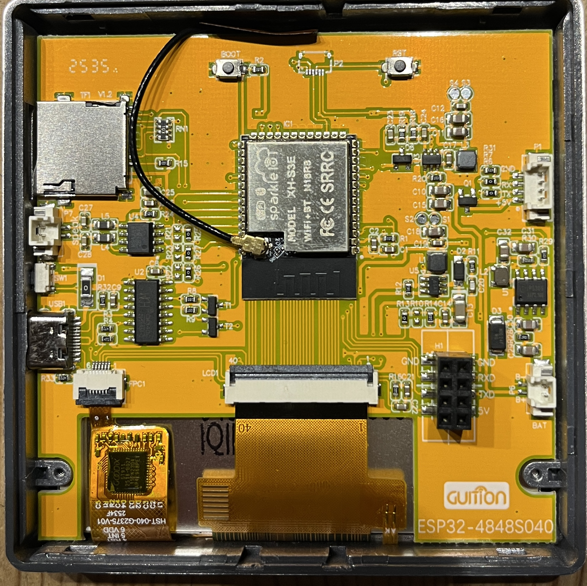
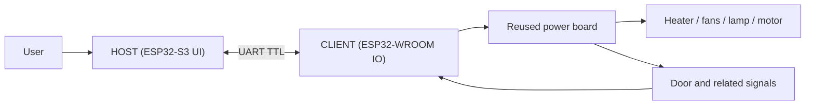

# Hardware Setup Baseline

This page describes the currently documented hardware split for the active project line.

It is not yet a complete manufacturing guide. It is the maintained baseline for understanding which assemblies exist and how they relate to each other.

## System assemblies

The current hardware stack consists of four major blocks:

1. base appliance body and mechanics
2. reused original oven power board
3. `HOST` controller with ESP32-S3 display/touch hardware
4. `CLIENT` controller with ESP32-WROOM IO integration

## Base appliance

Current reference platform:

- EMPHSISM AFTO-1505D mini oven / air fryer

The active documentation currently assumes this appliance family as the reference build target. Compatibility with other ovens should not be assumed yet.

## Visual hardware references

### PowerBoard top side

### ESP32-S3 display board

## Reused power board

The original power board remains in the system and is responsible for the mains-side actuator stage and low-voltage supply context.

Documented functions include:

- heater switching path
- 230 V fan path
- 12 V fan path
- lamp path
- silica basket motor path
- door/sensor-related low-voltage signals

This board must be treated as mains-related hardware.

## HOST assembly

The `HOST` side is the operator-facing board set.

Current documented baseline:

- ESP32-S3 controller
- 480x480 panel
- ST7701 display family
- separate touch controller path
- LVGL-based UI

Relevant implementation references:

- [src/app/display/display_hsd040bpn1.cpp](/Users/bernhardklein/workspace/arduino/esp32/FilamentSilicatDryer_480x480/src/app/display/display_hsd040bpn1.cpp)
- [src/app/display/panel_hsd040bpn1.h](/Users/bernhardklein/workspace/arduino/esp32/FilamentSilicatDryer_480x480/src/app/display/panel_hsd040bpn1.h)

## CLIENT assembly

The `CLIENT` side is the hardware-facing controller.

Current documented baseline:

- ESP32-WROOM
- UART link to `HOST`
- output control lines to the reused power board
- door/sensor acquisition
- local safety gating and telemetry reporting

Relevant code references:

- [include/pins_client.h](/Users/bernhardklein/workspace/arduino/esp32/FilamentSilicatDryer_480x480/include/pins_client.h)
- [include/output_bitmask.h](/Users/bernhardklein/workspace/arduino/esp32/FilamentSilicatDryer_480x480/include/output_bitmask.h)

## High-level block relationship

## What is still missing

The following items are intentionally still open:

- exact connector mapping between all assemblies
- final mounting positions and fastening details
- validated cable routing guidance
- variant table for supported boards

## Images needed for the next revision

To turn this baseline into a practical rebuild guide, the next revision should include:

- overall interior hardware photo
- `HOST` mounting photo
- `CLIENT` mounting photo
- power board overview photo
- sensor placement photo
