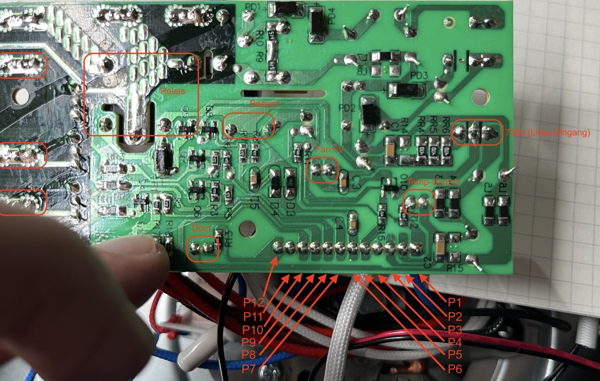
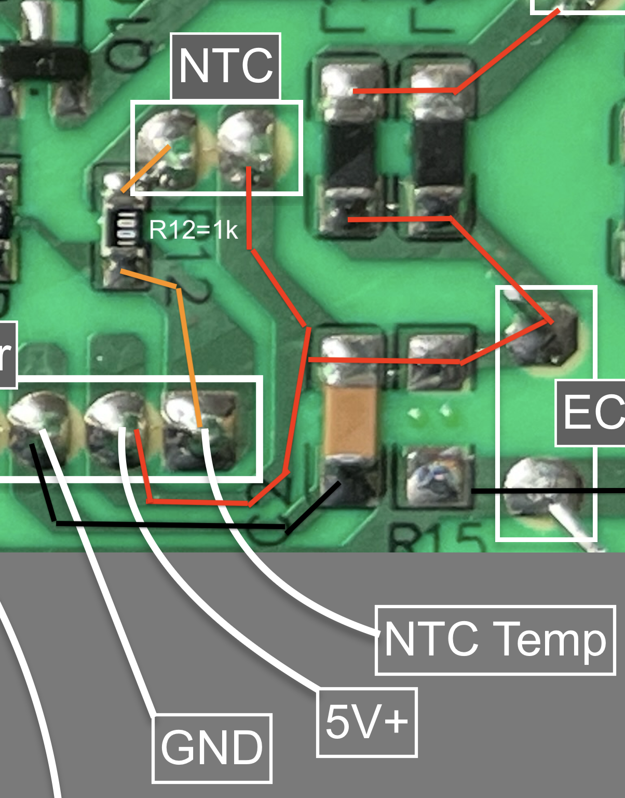
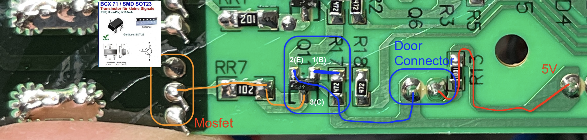

# Wiring Baseline

This page defines the current active wiring baseline for the project.

It is intentionally conservative: only relationships that are already visible in the code base or hardware archive are documented here as active baseline. Connector-level photos and final pin-by-pin diagrams will be added later.

## Wiring philosophy

The project is split into two wiring domains:

- `HOST` domain for UI, display, touch and user interaction
- `CLIENT` domain for hardware IO and interaction with the reused power board

The `CLIENT` is the only controller that directly drives the reused oven hardware.

## Wiring reference images

### PowerBoard top side with labels

### PowerBoard bottom side with connector labeling

These two images are the current best visual basis for correlating the archived reverse-engineering notes with the active wiring baseline.

## Core controller link

The current controller-to-controller link is:

- UART/TTL between `HOST` and `CLIENT`

Current `CLIENT` UART pin baseline from [include/pins_client.h](/Users/bernhardklein/workspace/arduino/esp32/FilamentSilicatDryer_480x480/include/pins_client.h):

- `CLIENT_RX2 = GPIO16`
- `CLIENT_TX2 = GPIO17`

## CLIENT logical output mapping

The active logical output names are defined in [include/output_bitmask.h](/Users/bernhardklein/workspace/arduino/esp32/FilamentSilicatDryer_480x480/include/output_bitmask.h).

Current output set:

- `BIT_FAN12V`
- `BIT_FAN230V`
- `BIT_LAMP`
- `BIT_SILICA_MOTOR`
- `BIT_FAN230V_SLOW`
- `BIT_DOOR`
- `BIT_HEATER`

## CLIENT GPIO baseline

The current `CLIENT` GPIO mapping in [include/pins_client.h](/Users/bernhardklein/workspace/arduino/esp32/FilamentSilicatDryer_480x480/include/pins_client.h) is:

- `OVEN_FAN12V -> GPIO32`
- `OVEN_FAN230V -> GPIO33`
- `OVEN_LAMP -> GPIO25`
- `OVEN_SILICAT_MOTOR -> GPIO26`
- `OVEN_FAN230V_SLOW -> GPIO27`
- `OVEN_DOOR_SENSOR -> GPIO14`
- `OVEN_HEATER -> GPIO12`

Additional sensor-related pins currently documented there:

- `OVEN_TEMP1_PORT1 -> GPIO36`
- `OVEN_TEMP_KTYPE -> GPIO39`

## Recommended series resistors and line treatment

The archived GPIO-to-powerboard documentation provides a useful practical recommendation baseline:

- all actuator control outputs from `CLIENT` to the power board should use series resistors in the `220-330 Ohm` range
- `CLIENT` UART TX (`GPIO17`) should also use a `220-330 Ohm` series resistor
- `CLIENT` UART RX (`GPIO16`) can remain direct or use a small optional resistor depending on wiring quality
- the door input should not be treated like a generic push-pull output line
- ADC inputs should not receive the same blanket series treatment as digital outputs

This matters because the project operates close to mains-related circuitry and the series resistors improve:

- GPIO protection against miswiring and edge cases
- signal damping
- EMV robustness
- UART stability

Archived source used for this baseline:

- `doc/archive/pre_reorg_v0.7.1/legacy_docs/hardware/esp32_powerboard_gpio_series_resistors.md`

## Output-line summary

Based on the archived resistor guidance and the current GPIO mapping, the following lines should be treated as protected digital outputs toward the power board:

- `OVEN_FAN12V -> GPIO32`
- `OVEN_FAN230V -> GPIO33`
- `OVEN_FAN230V_SLOW -> GPIO25`
- `OVEN_LAMP -> GPIO26`
- `OVEN_SILICAT_MOTOR -> GPIO27`
- `OVEN_HEATER -> GPIO12`
- `CLIENT_TX2 -> GPIO17`

## HOST display baseline

The active `HOST` display documentation currently guarantees:

- ST7701-family panel integration
- RGB display path on ESP32-S3
- separate touch path
- dedicated backlight control

For panel-specific details see [02_lvgl_display.md](02_lvgl_display.md).

## Sensor and door reference images

### Hotspot NTC wiring on the original power board

### Door-related board area

## What is intentionally not claimed yet

This page does not yet claim:

- final connector names
- cable colors
- wire gauges
- verified alternate GPIO mappings
- exact board-to-board harness pictures

Those details should only be added once verified against real hardware photos.

## Images needed for the next revision

To turn this into a practical wiring guide, I will need:

- photo of the complete wiring harness
- close-up of `HOST` wiring
- close-up of `CLIENT` wiring
- close-up of power board low-voltage connections
- photo or sketch of sensor wiring

## Related archive sources

Useful legacy references that should later be distilled into the active documentation:

- `doc/archive/pre_reorg_v0.7.1/legacy_docs/hardware/esp32_powerboard_gpio_series_resistors.md`
- `doc/img/hardware/hotspot_ntc_connection.png`
- `PN8034` wiring image from the archive, to be migrated into `doc/img` when actively used
- `doc/archive/pre_reorg_v0.7.1/legacy_docs/reverse_engineering/pcb-reverse-engineering.pdf`
