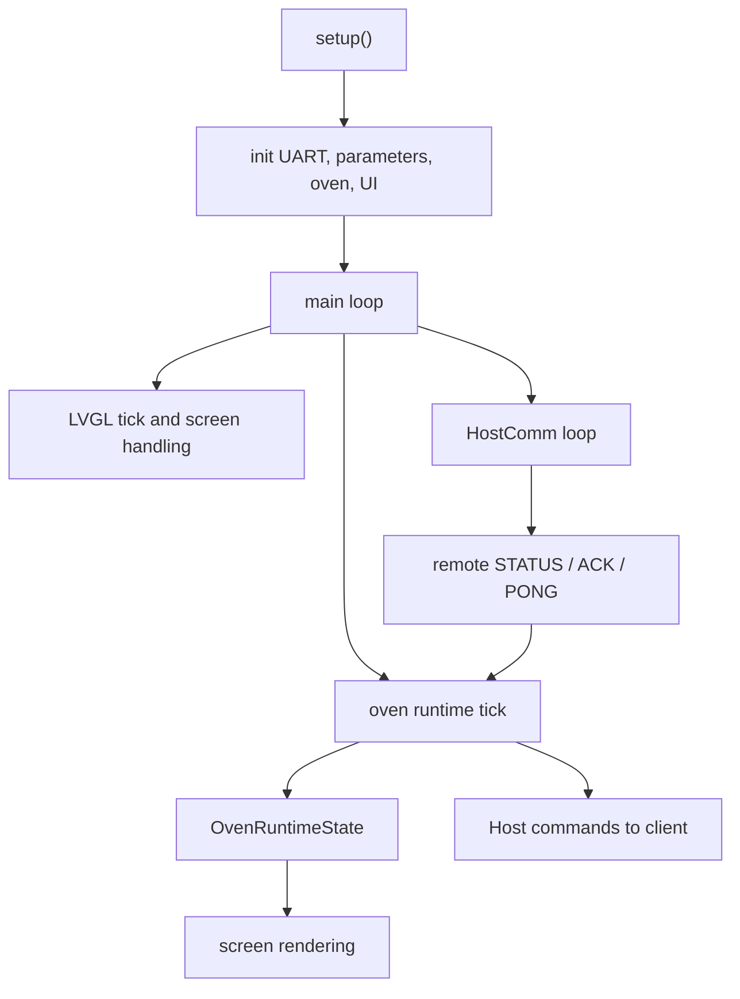
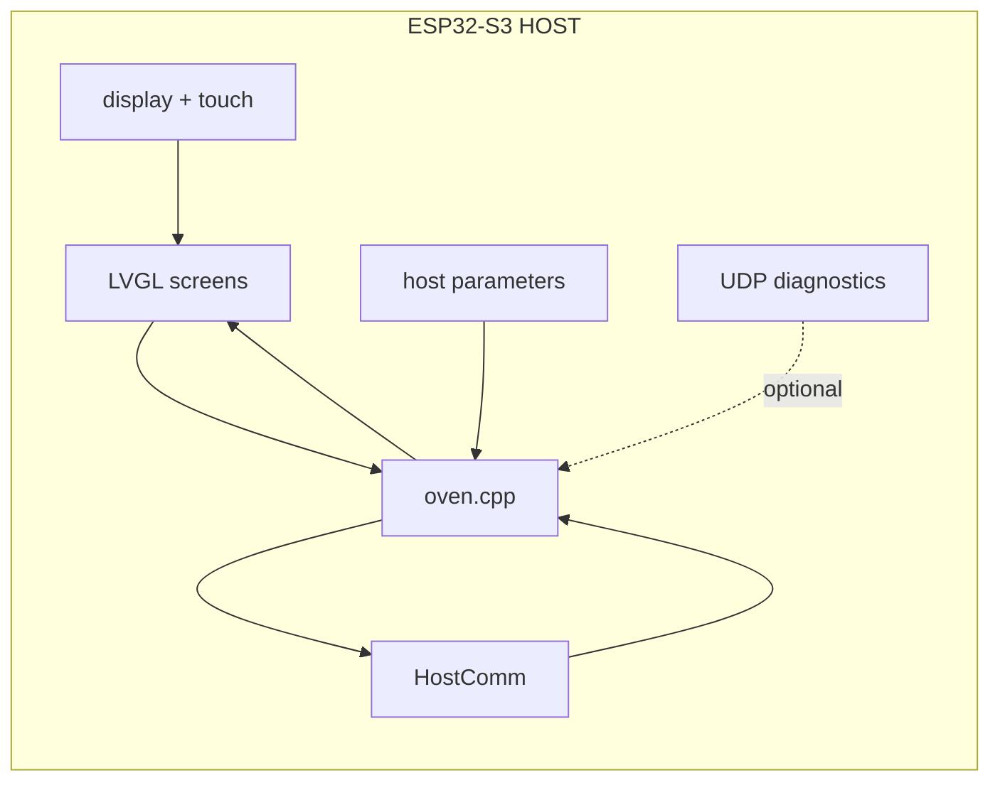

# HOST Architecture

## Responsibility

The `HOST` runs on the ESP32-S3 and owns:

- LVGL UI
- runtime state presented to the user
- drying logic and heater policy
- parameter persistence
- UART coordination with the `CLIENT`
- optional Wi-Fi / UDP diagnostics

The `HOST` does not directly drive the power board outputs.

## Main runtime modules

- `src/app/main.cpp`
- `src/app/oven/oven.cpp`
- `src/share/HostComm.cpp`
- `src/app/ui/**`
- `src/app/display/**`
- `src/app/host_parameters.cpp`

## Control flow

## State model

The central host-side abstraction is `OvenRuntimeState` from `include/oven.h`.

It consolidates:

- target and measured temperatures
- effective actuator states from client telemetry
- communication health
- mode state such as `STOPPED`, `RUNNING`, `WAITING`, `POST`
- selected preset, heater profile and timing information

That state acts as the UI-facing single source of truth.

## Heater control model

The host decides heater intent, but not the final hardware truth.

The current logic in `oven.cpp` includes:

- preset-based target temperatures
- separate heater policies for low, mid, high and silica use cases
- min-on and min-off timing for relay protection
- hotspot and chamber safety limits
- comm-loss safe stop behavior

## Host architecture diagram

## Design consequence

The host is the policy and UX layer. It should remain free of assumptions that bypass client telemetry.
