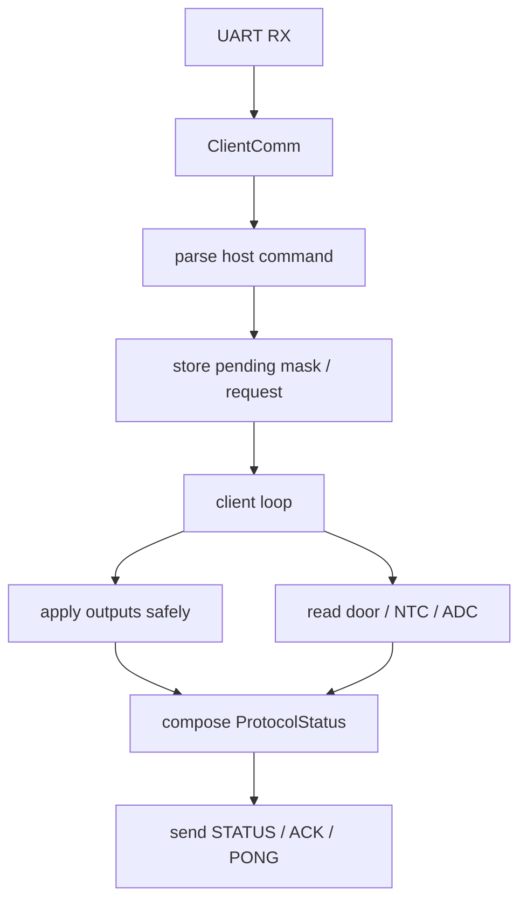

# CLIENT Architecture

## Responsibility

The `CLIENT` runs on the ESP32-WROOM and is the hardware-facing controller.

It owns:

- UART reception from the `HOST`
- output application to the power board
- telemetry generation
- safety gating close to the hardware
- sensor readout used for status reporting

## Main runtime modules

- `src/client/FSD_Client.cpp`
- `src/client/ClientComm.cpp`
- `src/client/heater_io.cpp`
- `src/client/sensor_ntc.cpp`
- `src/share/protocol.cpp`

## Architectural rules visible in the code

- incoming UART callbacks do not directly switch outputs
- mask changes are marked pending and applied from the main loop
- effective output truth is reported back, not just the requested mask
- host timeout forces a safe output mask
- door and thermal conditions can gate outputs locally

## Client processing diagram

## Safety model

The client is deliberately hardware-authoritative:

- if the host disappears, the client forces a safe state
- if an output should not remain active due to safety conditions, the effective mask can differ from the requested mask
- the host UI must therefore trust client telemetry, not host intent alone

## Output mapping

The active output map is defined in `include/output_bitmask.h`:

- fan 12 V
- fan 230 V
- lamp
- silica motor
- fan 230 V slow
- door status bit
- heater

## Design consequence

The client should stay narrow and deterministic. Business logic belongs on the host; electrical truth belongs on the client.
