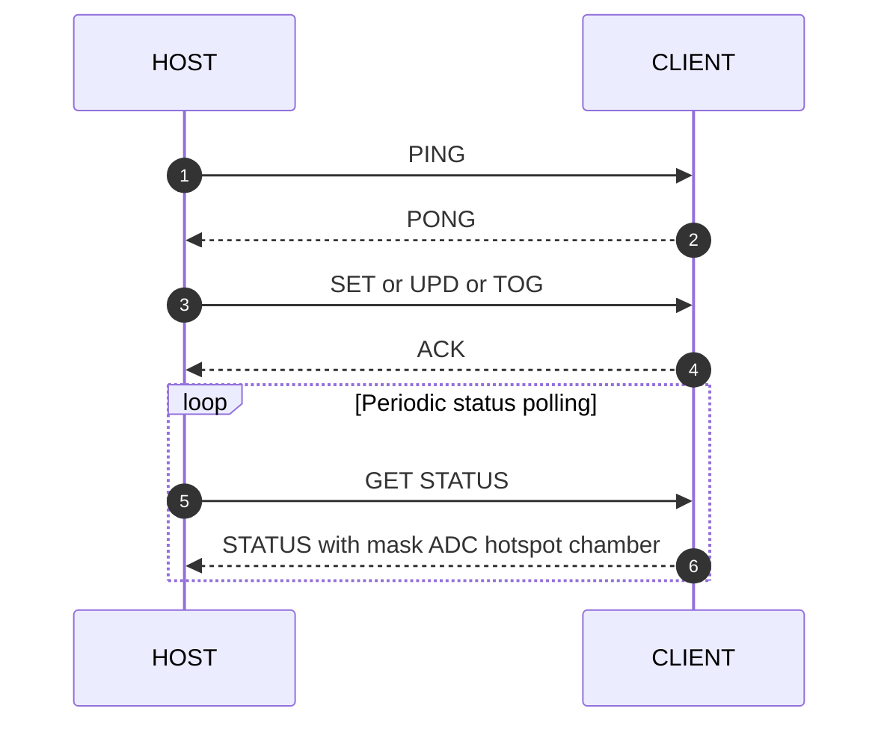

# Communication Protocol

## Role

The `HOST` and `CLIENT` communicate over `Serial2` with a line-based ASCII protocol.

Shared definitions live in:

- `include/protocol.h`
- `src/share/protocol.cpp`
- `src/share/HostComm.cpp`
- `src/client/ClientComm.cpp`

## Transport characteristics

- UART / TTL link
- messages are line-based
- frames are terminated with `CRLF`
- protocol is human-readable ASCII

## Message families

### Host to client

- `H;SET;XXXX`
- `H;UPD;SSSS;CCCC`
- `H;TOG;TTTT`
- `H;GET;STATUS`
- `H;PING`
- `H;RST`

### Client to host

- `C;ACK;SET;MMMM`
- `C;ACK;UPD;MMMM`
- `C;ACK;TOG;MMMM`
- `C;STATUS;...`
- `C;PONG`
- `C;RST`

## Status payload

`ProtocolStatus` currently contains:

- `outputsMask`
- `adcRaw[4]`
- `tempHotspot_dC`
- `tempChamber_dC`

The chamber temperature is the main control/UI temperature. The hotspot temperature is the safety temperature.

The current `C;STATUS` wire format is:

- `C;STATUS;<mask>;<a0>;<a1>;<a2>;<a3>;<hotspot_dC>;<chamber_dC>`

Some legacy comments in the code still describe the older single-temperature variant, but the codec implementation already uses the two-temperature format above.

## Protocol sequence

## Robustness principles

The current implementation shows several explicit protocol design choices:

- both sides assemble complete lines before parsing
- stray bytes and partial garbage are tolerated up to a limit
- host and client both use timeout-based link supervision
- the host can safe-stop on comm loss
- the client can force safe outputs on host timeout

## Why the protocol matters architecturally

The protocol is not only transport. It is the contract that enforces the split between host policy and client hardware truth.
