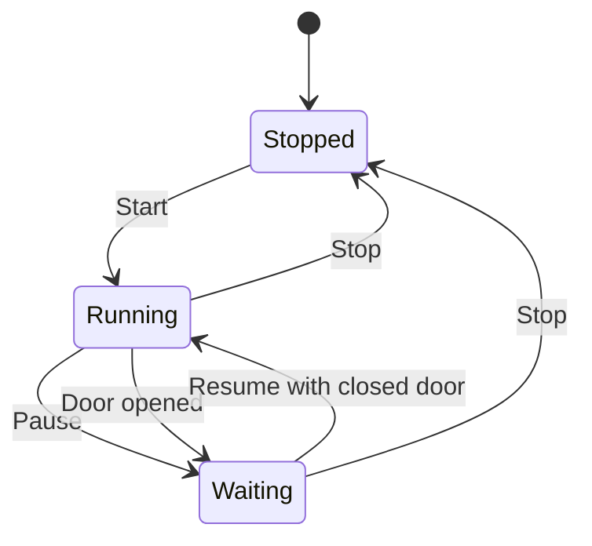

# Operation and Screens

## Main operating concept

The dryer is operated primarily from the `HOST` touch UI.

The normal workflow is:

1. select a preset or adjust parameters
2. start a drying run
3. monitor current chamber and hotspot temperatures
4. pause, resume or stop as needed

## Main screen

The main screen is the operational center.

It provides:

- runtime and progress
- target and current temperatures
- actuator state icons
- start / stop / pause / resume actions
- fast preset buttons

Behavioral baseline:

- fast preset buttons are intended for stopped state
- door-open conditions can move the system into a waiting state
- the lower action reflects the next useful action, not just raw state text

## Parameter screen

The parameter screen is new in the recent mainline work and currently manages:

- fast shortcut assignment
- heater-curve parameters for preset groups
- display timeout parameters

Saving parameters writes host-side persistent storage and triggers a reboot.

## Screen interaction model

## What the user should trust

- chamber temperature is the main process temperature
- hotspot temperature is the safety-oriented reference
- displayed actuator states should reflect client telemetry, not only host intent

## Historic screen deep dives

Previous screen-specific notes remain archived in:

- `doc/archive/pre_reorg_v0.7.1/legacy_docs/screens/`
- `doc/archive/pre_reorg_v0.7.1/legacy_docs/deep_dives/`
