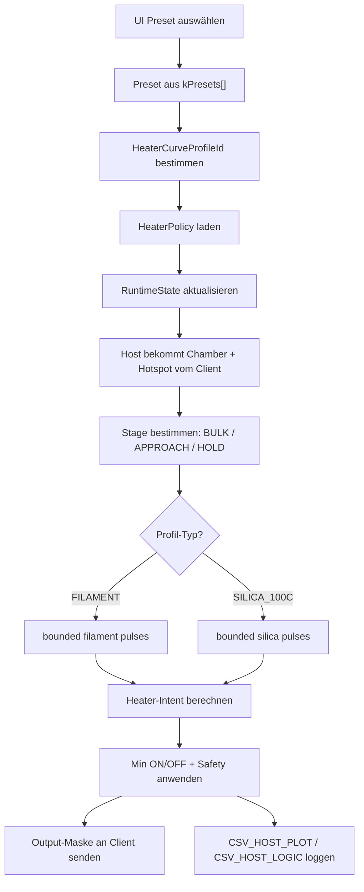
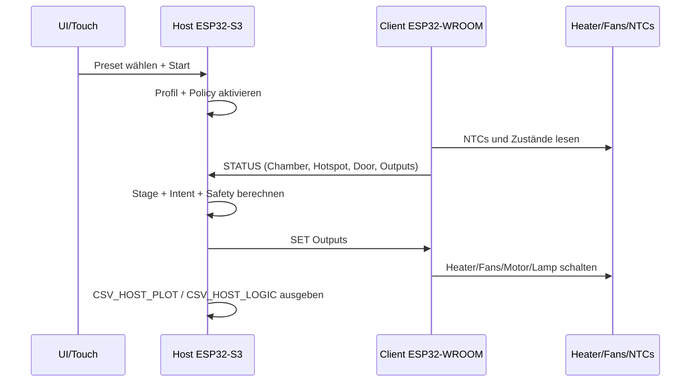

# T16 HeaterCurve Technik

Stand: aktueller Source-Stand nach `T16_Phase_4.1.3`

## Ziel

Diese Doku zeigt Dir, wie die HeaterCurve-Technik im Host aktuell funktioniert:

- wie ein Preset auf eine HeaterCurve gemappt wird
- welche Regelidee dahinter steckt
- welche Parameter heute schon im Code existieren
- welche Presets von welcher Curve abgedeckt werden

Das Ganze beschreibt den echten Ist-Stand im Code. Kein Wunschbild, kein Theoriepapier.

## Kurzbild

## Architektur in 3 Schichten

### 1. Preset-Schicht

Hier liegt die fachliche Auswahl aus der UI:

- Name
- Trocknungstemperatur
- Dauer
- Materialklasse
- HeaterCurve-Profil
- Post-Plan

Die Presets liegen in:

- [include/oven.h](/Users/bernhardklein/workspace/arduino/esp32/FilamentSilicatDryer_480x480/include/oven.h)

### 2. HeaterCurve-Schicht

Hier wird festgelegt, welche Regelcharakteristik das Preset bekommt:

- `LOW_45C`
- `MID_60C`
- `HIGH_80C`
- `SILICA_100C`

Das Profil sagt also nicht nur "welches Material", sondern vor allem:

- wie lang ein Puls sein darf
- wann wieder nachgeheizt werden darf
- wie konservativ vor Target abgeschaltet wird
- wie Safety und Fan-Logik einwirken

### 3. Laufzeit-/Regelschicht

Zur Laufzeit entscheidet der Host mit den Telemetriedaten vom Client:

- `tempChamberC` ist die Fuehrungsgroesse
- `tempHotspotC` ist Zusatzschutz und Filament-Guard
- daraus werden Stage, Pulse, Soak-Zeiten und Safety abgeleitet

## Datenfluss

## Was der Host wirklich regelt

Wichtig:

- Der Host ist die `single-source-of-truth`.
- Geregelt wird primär auf `Chamber`.
- `Hotspot` wird bei Filament als zusaetzlicher Guard genutzt.
- Bei `SILICA_100C` ist die Regelung bewusst noch staerker chamber-dominiert.

## Stages

Der Host kennt aktuell 3 Heizstufen:

- `BULK_HEAT`
  - weit weg vom Target
  - grobe Aufheizphase
- `APPROACH`
  - naehert sich dem Target
  - vorsichtiger
- `HOLD`
  - Haltebereich
  - nur noch kurze, begrenzte Nachheizpulse

Die Stage ergibt sich aus:

- `target - chamber`
- `approachBandC`
- `holdBandC`

## Grundidee der Algorithmen

### Filament

Filament arbeitet nicht mehr als offenes Dauerheizen, sondern als Pulsregler:

1. kurzer Heizpuls
2. Heater aus
3. Soak-/Beobachtungsphase
4. erst danach neue Entscheidung

Zusaetzlich greifen Guards:

- Hotspot darf Reheat blockieren
- Hotspot kann Force-Off ausloesen
- Chamber vor Target kann prädiktiv zum Abschalten fuehren
- nach `WAIT` wird konservativ resumed
- Fan wird mit Mindestschaltzeit und Fast-Phase nach Heater-Pulsen gefuehrt

### Silica

`SILICA_100C` arbeitet ebenfalls mit begrenzten Pulsen, aber mit anderer Charakteristik:

- erster Puls deutlich laenger
- Bulk-/Approach-/Hold-Pulse getrennt
- laengere Soak-Phasen
- Reheat primär nach Chamber-Fenster
- Hotspot eher als Safety-Cutoff, nicht als Fuehrungsgroesse

## Preset- und Curve-Uebersicht

| HeaterCurve | Gedachter Bereich | Presets / Beispiele | Preset-Temperaturen | Regelcharakter |
|---|---|---|---|---|
| `LOW_45C` | niedrige Filament-Trocknung | `PLA`, `TPU`, `Spec-BVOH`, `Spec-PVA`, `Spec-TPU 82A`, `Spec-WOOD-Composite` | `42.5°C .. 52.5°C` | vorsichtig, kurze bis mittlere Pulse, Fokus auf Overshoot-Vermeidung |
| `MID_60C` | mittlere Filament-Trocknung | `PETG`, `Spec-HIPS`, `Spec-PETG-HF`, `Spec-PLA-CF`, `Spec-PP` | `55.0°C .. 65.0°C` | etwas kraeftiger als `LOW_45C`, weiterhin filament-sicher |
| `HIGH_80C` | hohe Filament-Trocknung | `ABS`, `ASA`, `Spec-ASA-CF`, `Spec-PA`, `Spec-PC`, `Spec-PPS`, `Spec-PVDF-PPSU` | `70.0°C .. 85.0°C` | frueheres Reheat und staerkere Hold-Pulse als bei `MID_60C` |
| `SILICA_100C` | Silicagel trocknen | `SILICA` | `105.0°C` | bounded high-temp pulses, chamber-dominiert, konservative Safety |

## Welche Presets heute wohin gemappt sind

| HeaterCurve | Presets |
|---|---|
| `LOW_45C` | `CUSTOM`, `PLA`, `TPU`, `Spec-BVOH`, `Spec-PLA-WoodMetal`, `Spec-PVA`, `Spec-TPU 82A`, `Spec-WOOD-Composite` |
| `MID_60C` | `PETG`, `Spec-HIPS`, `Spec-PETG-HF`, `Spec-PLA-CF`, `Spec-PLA-HT`, `Spec-PP`, `Spec-PP-GF` |
| `HIGH_80C` | `ABS`, `ASA`, `Spec-ASA-CF`, `Spec-PA(CF,PET,PH*)`, `Spec-PC(CF/FR)`, `Spec-PC-ABS`, `Spec-PET-CF`, `Spec-PETG-CF`, `Spec-POM`, `Spec-PPS(+CF)`, `Spec-PVDF-PPSU` |
| `SILICA_100C` | `SILICA` |

## Safety-Logik

Der Host schaltet den Heater ab, wenn eine dieser Bedingungen greift:

- Tür offen
- `Hotspot >= hotspotMaxC`
- `Chamber >= chamberMaxC`
- `Chamber >= target + targetOvershootCapC`

Bei Filament kommt zusaetzlich im Regler selbst dazu:

- Hotspot-Force-Off
- Hotspot-Reheat-Block
- prädiktives Abschalten vor Target

## WAIT / Door-Verhalten

Wenn die Tür während `RUNNING` geöffnet wird:

- der Host geht in `WAIT`
- Heater aus
- nach manuellem Fortsetzen wird nicht wie Kaltstart resumed
- stattdessen:
  - Resume-Soak
  - kurzer oder mittlerer Resume-Puls
  - Zieltemperatur und Unterbruchdauer fliessen ein

## Fan-Verhalten

Bei Filament:

- nach einem Heizpuls wird `FAN230V` für eine feste Zeit bevorzugt
- Umschalten zwischen `FAN230V` und `FAN230V_SLOW` hat eine Mindestschaltzeit
- Ziel: bessere Durchmischung ohne hektisches Umschalten

Bei Silica:

- aktuell keine eigene komplexe Fan-Hysterese wie bei Filament
- Fokus liegt erst einmal auf stabilen bounded pulses

## Parameter-Matrix

| Parameter | Info | `LOW_45C` | `MID_60C` | `HIGH_80C` | `SILICA_100C` |
|---|---|---:|---:|---:|---:|
| `materialClass` | Grobe Materialgruppe fuer bestehende Speziallogik im Host. | `FILAMENT` | `FILAMENT` | `FILAMENT` | `SILICA` |
| `hysteresisC` | Hysterese im `HOLD`-Bereich der Basis-Policy. Bestimmt, wie weit die Chamber unter Target fallen darf, bevor wieder geheizt wird. | `1.5 C` | `1.5 C` | `1.5 C` | `2.5 C` |
| `approachBandC` | Abstand zum Target, ab dem von `BULK_HEAT` nach `APPROACH` gewechselt wird. | `10.0 C` | `10.0 C` | `10.0 C` | `10.0 C` |
| `holdBandC` | Abstand zum Target, ab dem in den `HOLD`-Bereich gewechselt wird. | `4.0 C` | `4.0 C` | `4.0 C` | `2.5 C` |
| `targetOvershootCapC` | Harte Host-Safety-Grenze relativ zum Target. Wird sie ueberschritten, setzt der Host `safetyCutoffActive`. | `+2.0 C` | `+2.0 C` | `+2.0 C` | `+3.0 C` |
| `chamberMaxC` | Absolute maximale Chamber-Temperatur fuer die Host-Safety. | `120.0 C` | `120.0 C` | `120.0 C` | `120.0 C` |
| `hotspotMaxC` | Absolute maximale Hotspot-Temperatur fuer die Host-Safety. | `140.0 C` | `140.0 C` | `140.0 C` | `140.0 C` |
| `firstPulseMaxMs` | Maximaldauer des allerersten Heizpulses nach Start. Begrenzt den initialen Energieeintrag. | `10000 ms` | `11000 ms` | `12000 ms` | `45000 ms` |
| `bulkPulseMaxMs` | Maximaldauer eines Heizpulses im groben Aufheizbereich weit unter Target. | `10000 ms` | `10000 ms` | `10000 ms` | `18000 ms` |
| `approachPulseMaxMs` | Maximaldauer eines Heizpulses in der Annäherungsphase an das Target. | `7000 ms` | `7000 ms` | `7000 ms` | `12000 ms` |
| `holdPulseMaxMs` | Maximaldauer eines kurzen Nachheizpulses im spaeten Haltebereich. | `6000 ms` | `6000 ms` | `6000 ms` | `8000 ms` |
| `firstSoakMs` | Erzwingt nach dem ersten Heizpuls eine Beobachtungs-/Abkuehlphase ohne neues Heizen. Wichtig gegen Nachlauf-Overshoot. | `45000 ms` | `45000 ms` | `45000 ms` | `60000 ms` |
| `reheatSoakMs` | Erzwingt zwischen Folgepulsen eine Pause, damit das traege System nachlaufen und ausgewertet werden kann. | `30000 ms` | `30000 ms` | `30000 ms` | `35000 ms` |
| `safetySoakMs` | Zusaetzliche Sperrzeit nach einem Safety-Ereignis, bevor wieder geheizt werden darf. | `90000 ms` | `90000 ms` | `90000 ms` | `120000 ms` |
| `bulkPulseEnableBelowTargetC` | Fehler zum Target, ab dem statt kleinerer Pulse noch ein voller Bulk-Puls erlaubt wird. | `20.0 C` | `20.0 C` | `20.0 C` | `25.0 C` |
| `approachPulseEnableBelowTargetC` | Fehler zum Target, ab dem noch ein Approach-Puls statt eines Hold-Pulses erlaubt wird. | `10.0 C` | `10.0 C` | `10.0 C` | `12.0 C` |
| `reheatEnableBelowTargetC` | Chamber muss mindestens um diesen Betrag unter Target liegen, bevor wieder geheizt werden darf. | `3.0 C` | `3.0 C` | `2.0 C` | `4.0 C` |
| `forceOffBeforeTargetC` | Direkte Abschaltreserve vor Target fuer spaetere Pulse. Verhindert, dass bei zu spaeter Abschaltung zu viel Restwaerme nachkommt. | `1.0 C` | `1.0 C` | `1.0 C` | `1.0 C` |
| `firstPulseForceOffBeforeTargetC` | Strengere Abschaltreserve fuer den allerersten Puls, um den ersten Peak zu entschaerfen. | `2.0 C` | `2.0 C` | `2.0 C` | `2.0 C` |
| `hotspotReheatBlockAboveTargetC` | Blockiert bei Filament einen neuen Heizpuls, wenn der Hotspot noch zu weit ueber dem Target liegt. | `+5.0 C` | `+5.0 C` | `+5.0 C` | `n/a` |
| `hotspotForceOffAboveTargetC` | Erzwingt bei Filament Heater-OFF, wenn der Hotspot weit ueber dem Target liegt. | `+10.0 C` | `+10.0 C` | `+10.0 C` | `n/a` |
| `fanMinSwitchMs` | Minimaler Umschaltabstand zwischen `FAN230V` und `FAN230V_SLOW` zur Schonung von Motor und Elektronik. | `5000 ms` | `5000 ms` | `5000 ms` | `n/a` |
| `fanFastAfterHeatMs` | Haelt bei Filament nach einem Heizpuls den schnellen Luefter fuer eine feste Zeit aktiv. | `12000 ms` | `12000 ms` | `12000 ms` | `n/a` |
| `waitResumeSoakMs` | Standard-Sperrzeit nach `WAIT -> RUNNING`, bevor wieder geheizt werden darf. | `12000 ms` | `12000 ms` | `12000 ms` | `n/a` |
| `waitResumeSoakMinMs` | Untergrenze fuer die Resume-Sperrzeit nach `WAIT`. | `5000 ms` | `5000 ms` | `5000 ms` | `n/a` |
| `waitResumeSoakHotTargetMs` | Kuerzere Resume-Sperrzeit fuer heissere Filament-Targets. | `7000 ms` | `7000 ms` | `7000 ms` | `n/a` |
| `waitResumePulseShortMs` | Kurzer Recovery-Puls nach `WAIT`, wenn nur wenig Temperatur zum Target fehlt. | `6000 ms` | `6000 ms` | `6000 ms` | `n/a` |
| `waitResumePulseLongMs` | Laengerer Recovery-Puls nach `WAIT`, wenn deutlich mehr Temperatur zum Target fehlt. | `8000 ms` | `8000 ms` | `8000 ms` | `n/a` |
| `waitResumeLongPulseErrorC` | Temperaturfehler, ab dem nach `WAIT` der lange Recovery-Puls verwendet wird. | `8.0 C` | `8.0 C` | `8.0 C` | `n/a` |
| `waitResumeMediumPulseErrorC` | Temperaturfehler, ab dem ein mittlerer Recovery-Puls verwendet wird. | `5.0 C` | `5.0 C` | `5.0 C` | `n/a` |
| `midTargetC` | Schwelle, ab der Filament-Targets als mittlerer/hoeherer Temperaturbereich behandelt werden. | `70.0 C` | `70.0 C` | `70.0 C` | `n/a` |
| `waitResumeHotTargetC` | Schwelle, ab der Filament-Targets als heiss betrachtet und defensiver resumiert werden. | `80.0 C` | `80.0 C` | `80.0 C` | `n/a` |
| `waitResumeLongOpenMs` | Tueroeffnungsdauer, ab der der Resume-Pfad als laengerer Unterbruch behandelt wird. | `15000 ms` | `15000 ms` | `15000 ms` | `n/a` |
| `controlStrategy` | Beschreibt die aktuell verwendete Regelidee im Host. | `bounded filament pulses + fan hysteresis` | `bounded filament pulses + fan hysteresis` | `bounded filament pulses + fan hysteresis` | `bounded silica pulses, chamber-dominated` |
| `safetyPrimarySensor` | Fuehrende Groesse fuer die Safety-Entscheidung. | `Chamber + Hotspot` | `Chamber + Hotspot` | `Chamber + Hotspot` | `Chamber primär, Hotspot als Zusatz-Cutoff` |
| `reheatDecisionBasis` | Hauptgroesse fuer die Freigabe neuer Heizpulse. | `Chamber + Hotspot-Guards` | `Chamber + Hotspot-Guards` | `Chamber + Hotspot-Guards` | `Chamber` |

## Was heute schon gut funktioniert

- klare Preset-zu-Profil-Zuordnung
- bounded pulses statt offener Dauerheizung
- gute Trennung zwischen Filament und `SILICA_100C`
- Resume-Pfad nach `WAIT`
- Logging mit `CSV_HOST_PLOT`, `CSV_HOST_LOGIC`, `CSV_CLIENT_PLOT`, `CSV_CLIENT_LOGIC`

## Wo noch Luft drin ist

- `LOW_45C` kann noch etwas sauberer um den ersten Peak werden
- `LOW_45C`, `MID_60C` und `HIGH_80C` sind fachlich getrennt, aber noch nicht bis ins Letzte auskalibriert
- Hotspot-NTC ist im High-Temp-Bereich weiterhin nur begrenzt belastbar
- NTC-Kurven koennen spaeter empirisch noch verbessert werden

## Kurzfazit

Die HeaterCurve-Technik ist aktuell kein starres Thermostat mehr, sondern ein profilgesteuerter Pulsregler mit Safety-, Soak- und Resume-Logik.

Der wichtigste Punkt dabei:

- Das Preset bestimmt nicht nur die Zieltemperatur.
- Das Preset bestimmt auch, wie der Ofen thermisch dorthin arbeitet.

