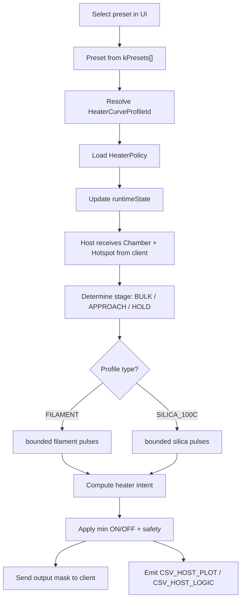
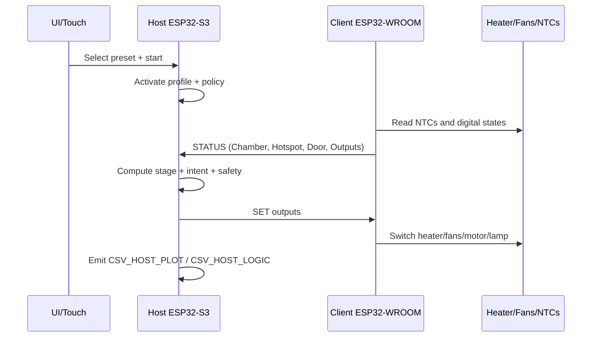

# T16 HeaterCurve Technology

Status: current source state after `T16_Phase_4.1.3`

## Goal

This document explains how the current HeaterCurve system works in the host:

- how a preset is mapped to a HeaterCurve
- which control idea is used
- which parameters already exist in code
- which presets are covered by which curve

This is the real implementation state. No theory paper, no future concept.

## Quick overview

## Architecture in 3 layers

### 1. Preset layer

This is the functional selection from the UI:

- name
- drying temperature
- duration
- material class
- heater curve profile
- post plan

The presets are defined in:

- [include/oven.h](/Users/bernhardklein/workspace/arduino/esp32/FilamentSilicatDryer_480x480/include/oven.h)

### 2. HeaterCurve layer

This decides which control characteristic is used:

- `LOW_45C`
- `MID_60C`
- `HIGH_80C`
- `SILICA_100C`

So the profile does not only mean "what material", it also means:

- how long a pulse may run
- when reheating is allowed again
- how early the host forces heater off before target
- how safety and fan behavior are applied

### 3. Runtime / control layer

At runtime the host decides with the telemetry from the client:

- `tempChamberC` is the main control value
- `tempHotspotC` is extra protection and a filament guard
- stage, pulses, soak times and safety are derived from that

## Data flow

## What the host really controls

Important:

- The host is the `single-source-of-truth`.
- Control is primarily based on `Chamber`.
- `Hotspot` is used as an extra guard for filament.
- For `SILICA_100C`, control is deliberately even more chamber-dominated.

## Stages

The host currently uses 3 heating stages:

- `BULK_HEAT`
  - far away from target
  - coarse warm-up
- `APPROACH`
  - getting closer to target
  - more careful
- `HOLD`
  - maintenance band
  - only short bounded reheat pulses

The stage is derived from:

- `target - chamber`
- `approachBandC`
- `holdBandC`

## Core control idea

### Filament

Filament is no longer open continuous heating. It is a pulse controller:

1. short heating pulse
2. heater off
3. soak / observation phase
4. only then a new decision

Additional guards:

- hotspot may block reheating
- hotspot may force heater off
- chamber can trigger predictive shutoff before target
- resume after `WAIT` is conservative
- fan uses minimum switching time and a fast phase after heater pulses

### Silica

`SILICA_100C` also uses bounded pulses, but with a different profile:

- much longer first pulse
- separate bulk / approach / hold pulses
- longer soak phases
- reheating mainly based on chamber window
- hotspot mainly used as a safety cutoff, not as the leading control value

## Preset and curve overview

| HeaterCurve | Intended range | Presets / examples | Preset temperatures | Control character |
|---|---|---|---|---|
| `LOW_45C` | low filament drying temperatures | `PLA`, `TPU`, `Spec-BVOH`, `Spec-PVA`, `Spec-TPU 82A`, `Spec-WOOD-Composite` | `42.5°C .. 52.5°C` | careful, short to medium pulses, focused on avoiding overshoot |
| `MID_60C` | medium filament drying temperatures | `PETG`, `Spec-HIPS`, `Spec-PETG-HF`, `Spec-PLA-CF`, `Spec-PP` | `55.0°C .. 65.0°C` | stronger than `LOW_45C`, still filament-safe |
| `HIGH_80C` | high filament drying temperatures | `ABS`, `ASA`, `Spec-ASA-CF`, `Spec-PA`, `Spec-PC`, `Spec-PPS`, `Spec-PVDF-PPSU` | `70.0°C .. 85.0°C` | earlier reheating and stronger hold pulses than `MID_60C` |
| `SILICA_100C` | silica drying | `SILICA` | `105.0°C` | bounded high-temp pulses, chamber-dominated, conservative safety |

## Current preset mapping

| HeaterCurve | Presets |
|---|---|
| `LOW_45C` | `CUSTOM`, `PLA`, `TPU`, `Spec-BVOH`, `Spec-PLA-WoodMetal`, `Spec-PVA`, `Spec-TPU 82A`, `Spec-WOOD-Composite` |
| `MID_60C` | `PETG`, `Spec-HIPS`, `Spec-PETG-HF`, `Spec-PLA-CF`, `Spec-PLA-HT`, `Spec-PP`, `Spec-PP-GF` |
| `HIGH_80C` | `ABS`, `ASA`, `Spec-ASA-CF`, `Spec-PA(CF,PET,PH*)`, `Spec-PC(CF/FR)`, `Spec-PC-ABS`, `Spec-PET-CF`, `Spec-PETG-CF`, `Spec-POM`, `Spec-PPS(+CF)`, `Spec-PVDF-PPSU` |
| `SILICA_100C` | `SILICA` |

## Safety logic

The host forces heater off when one of these conditions becomes true:

- door open
- `Hotspot >= hotspotMaxC`
- `Chamber >= chamberMaxC`
- `Chamber >= target + targetOvershootCapC`

For filament, the controller also adds:

- hotspot force-off
- hotspot reheat block
- predictive shutoff before target

## WAIT / door handling

If the door is opened during `RUNNING`:

- host goes into `WAIT`
- heater off
- after manual continue, the run does not resume as a cold start
- instead it uses:
  - resume soak
  - short or medium resume pulse
  - target temperature and interruption duration are both considered

## Fan behavior

For filament:

- after a heating pulse, `FAN230V` is preferred for a fixed amount of time
- switching between `FAN230V` and `FAN230V_SLOW` has a minimum switch delay
- goal: better air mixing without fast toggling

For silica:

- there is currently no dedicated advanced fan hysteresis like filament has
- focus is first on stable bounded pulses

## Parameter matrix

| Parameter | Info | `LOW_45C` | `MID_60C` | `HIGH_80C` | `SILICA_100C` |
|---|---|---:|---:|---:|---:|
| `materialClass` | Coarse material group for existing host-side special logic. | `FILAMENT` | `FILAMENT` | `FILAMENT` | `SILICA` |
| `hysteresisC` | Hysteresis in the `HOLD` area of the base policy. Defines how far chamber may fall below target before reheating is allowed. | `1.5 C` | `1.5 C` | `1.5 C` | `2.5 C` |
| `approachBandC` | Distance to target where the host switches from `BULK_HEAT` to `APPROACH`. | `10.0 C` | `10.0 C` | `10.0 C` | `10.0 C` |
| `holdBandC` | Distance to target where the host enters `HOLD`. | `4.0 C` | `4.0 C` | `4.0 C` | `2.5 C` |
| `targetOvershootCapC` | Hard host safety margin relative to target. If exceeded, the host sets `safetyCutoffActive`. | `+2.0 C` | `+2.0 C` | `+2.0 C` | `+3.0 C` |
| `chamberMaxC` | Absolute maximum chamber temperature for host safety. | `120.0 C` | `120.0 C` | `120.0 C` | `120.0 C` |
| `hotspotMaxC` | Absolute maximum hotspot temperature for host safety. | `140.0 C` | `140.0 C` | `140.0 C` | `140.0 C` |
| `firstPulseMaxMs` | Maximum duration of the very first heating pulse after start. Limits initial energy input. | `10000 ms` | `11000 ms` | `12000 ms` | `45000 ms` |
| `bulkPulseMaxMs` | Maximum duration of a heating pulse in the coarse warm-up area far below target. | `10000 ms` | `10000 ms` | `10000 ms` | `18000 ms` |
| `approachPulseMaxMs` | Maximum duration of a heating pulse in the approach phase near target. | `7000 ms` | `7000 ms` | `7000 ms` | `12000 ms` |
| `holdPulseMaxMs` | Maximum duration of a short reheat pulse in the late hold area. | `6000 ms` | `6000 ms` | `6000 ms` | `8000 ms` |
| `firstSoakMs` | Forces an observation / cooldown phase after the first pulse. Important to avoid run-on overshoot. | `45000 ms` | `45000 ms` | `45000 ms` | `60000 ms` |
| `reheatSoakMs` | Forces a pause between later pulses so the thermal system can settle and be evaluated. | `30000 ms` | `30000 ms` | `30000 ms` | `35000 ms` |
| `safetySoakMs` | Extra lockout time after a safety event before heating is allowed again. | `90000 ms` | `90000 ms` | `90000 ms` | `120000 ms` |
| `bulkPulseEnableBelowTargetC` | Error to target where a full bulk pulse is still allowed instead of a smaller pulse. | `20.0 C` | `20.0 C` | `20.0 C` | `25.0 C` |
| `approachPulseEnableBelowTargetC` | Error to target where an approach pulse is still allowed instead of a hold pulse. | `10.0 C` | `10.0 C` | `10.0 C` | `12.0 C` |
| `reheatEnableBelowTargetC` | Chamber must be at least this far below target before reheating is allowed. | `3.0 C` | `3.0 C` | `2.0 C` | `4.0 C` |
| `forceOffBeforeTargetC` | Direct shutoff reserve before target for later pulses. Avoids too much thermal run-on after late shutoff. | `1.0 C` | `1.0 C` | `1.0 C` | `1.0 C` |
| `firstPulseForceOffBeforeTargetC` | Stronger shutoff reserve for the very first pulse, to soften the first peak. | `2.0 C` | `2.0 C` | `2.0 C` | `2.0 C` |
| `hotspotReheatBlockAboveTargetC` | Blocks a new filament heating pulse if hotspot is still too far above target. | `+5.0 C` | `+5.0 C` | `+5.0 C` | `n/a` |
| `hotspotForceOffAboveTargetC` | Forces heater off for filament if hotspot is far above target. | `+10.0 C` | `+10.0 C` | `+10.0 C` | `n/a` |
| `fanMinSwitchMs` | Minimum switch delay between `FAN230V` and `FAN230V_SLOW` to protect motor and electronics. | `5000 ms` | `5000 ms` | `5000 ms` | `n/a` |
| `fanFastAfterHeatMs` | Keeps fast fan active for a fixed time after a filament heat pulse. | `12000 ms` | `12000 ms` | `12000 ms` | `n/a` |
| `waitResumeSoakMs` | Default lockout time after `WAIT -> RUNNING` before reheating may start again. | `12000 ms` | `12000 ms` | `12000 ms` | `n/a` |
| `waitResumeSoakMinMs` | Lower boundary for resume soak time after `WAIT`. | `5000 ms` | `5000 ms` | `5000 ms` | `n/a` |
| `waitResumeSoakHotTargetMs` | Shorter resume soak for hotter filament targets. | `7000 ms` | `7000 ms` | `7000 ms` | `n/a` |
| `waitResumePulseShortMs` | Short recovery pulse after `WAIT` if only a small temperature gap remains. | `6000 ms` | `6000 ms` | `6000 ms` | `n/a` |
| `waitResumePulseLongMs` | Longer recovery pulse after `WAIT` if the temperature gap is larger. | `8000 ms` | `8000 ms` | `8000 ms` | `n/a` |
| `waitResumeLongPulseErrorC` | Temperature error threshold where the long recovery pulse is used after `WAIT`. | `8.0 C` | `8.0 C` | `8.0 C` | `n/a` |
| `waitResumeMediumPulseErrorC` | Temperature error threshold where a medium recovery pulse is used. | `5.0 C` | `5.0 C` | `5.0 C` | `n/a` |
| `midTargetC` | Threshold where filament targets are treated as medium / higher temperature operation. | `70.0 C` | `70.0 C` | `70.0 C` | `n/a` |
| `waitResumeHotTargetC` | Threshold where filament targets are treated as hot and resumed more conservatively. | `80.0 C` | `80.0 C` | `80.0 C` | `n/a` |
| `waitResumeLongOpenMs` | Door-open duration where the resume path is treated as a longer interruption. | `15000 ms` | `15000 ms` | `15000 ms` | `n/a` |
| `controlStrategy` | Describes the currently used host-side control idea. | `bounded filament pulses + fan hysteresis` | `bounded filament pulses + fan hysteresis` | `bounded filament pulses + fan hysteresis` | `bounded silica pulses, chamber-dominated` |
| `safetyPrimarySensor` | Leading value for safety decisions. | `Chamber + Hotspot` | `Chamber + Hotspot` | `Chamber + Hotspot` | `Chamber primary, Hotspot as extra cutoff` |
| `reheatDecisionBasis` | Main value used to allow new heating pulses. | `Chamber + Hotspot guards` | `Chamber + Hotspot guards` | `Chamber + Hotspot guards` | `Chamber` |

## What already works well

- clear preset-to-profile mapping
- bounded pulses instead of open continuous heating
- good separation between filament and `SILICA_100C`
- dedicated resume path after `WAIT`
- logging with `CSV_HOST_PLOT`, `CSV_HOST_LOGIC`, `CSV_CLIENT_PLOT`, `CSV_CLIENT_LOGIC`

## Where there is still room for improvement

- `LOW_45C` can still become a bit cleaner around the first peak
- `LOW_45C`, `MID_60C` and `HIGH_80C` are separated logically, but not fully fine-tuned yet
- hotspot NTC is still only partially trustworthy in the high-temperature range
- NTC curves may still be improved empirically later

## Short conclusion

The HeaterCurve system is no longer a simple thermostat. It is now a profile-driven pulse controller with safety, soak and resume logic.

The most important point:

- The preset does not only define the target temperature.
- The preset also defines how the oven should thermally get there.

