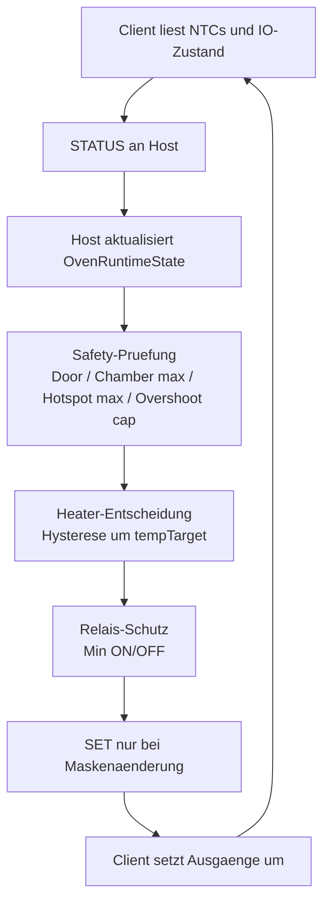

# T16 Phase 1 Dokumentation

## Status

Phase 1 ist abgeschlossen.

Ziel von Phase 1 war die Bereinigung des produktiven Host-Regelpfads, damit die Dual-NTC-Architektur im Code klarer sichtbar wird und historische T11-Reste den weiteren Ausbau nicht mehr verunklaeren.

Diese Phase war ein reiner Struktur- und Konsolidierungsschritt.
Ein sinnvoller Hardware-Runtimetest war dafuer noch nicht zwingend erforderlich.

---

## Scope von Phase 1

Bearbeitet wurde ausschliesslich der produktive Host-Regelpfad plus die technische Versionsangabe.

Schwerpunkte:
- historische T11-Reste aus dem produktiven Pfad entfernen
- Safety-Semantik im Host klarer machen
- Startverhalten des Heaters sicherer machen
- redundanten Kommunikations-Traffic reduzieren
- Regelschwellen zentralisieren
- Versionierung auf `<major>.<minor>.<patch>` vorbereiten

Nicht Ziel dieser Phase:
- materialabhaengige Heizkurven
- neue Presetlogik
- reale Hardware-Heiztests
- Tuning auf PLA, TPU, PETG oder Silica

---

## Umgesetzte Schritte

## T16_Phase_1.0

Commit:
- `926c758`

Inhalt:
- produktive T11-Reste in [`oven.cpp`](/Users/bernhardklein/workspace/arduino/esp32/FilamentSilicatDryer_480x480/src/app/oven/oven.cpp) und [`oven.h`](/Users/bernhardklein/workspace/arduino/esp32/FilamentSilicatDryer_480x480/include/oven.h) entfernt
- veraltete Thermal-Model-Strukturen und irrefuehrende Legacy-Kommentare aus dem aktiven Host-Pfad entfernt
- `safetyCutoffActive` korrigiert, so dass der Door-Fall im Safety-Status enthalten ist

Wirkung:
- der produktive Code beschreibt jetzt deutlicher Chamber als Control und Hotspot als Safety

---

## T16_Phase_1.1

Commit:
- `9a89a23`

Inhalt:
- Host sendet Heater-`SET`-Frames im RUNNING-Pfad nur noch bei echter Maskenaenderung

Wirkung:
- weniger UART-/ACK-Traffic
- bessere Lesbarkeit von Logs
- weniger unnoetige Last auf dem Host-Client-Kommunikationspfad

---

## T16_Phase_1.2

Commit:
- `8809b40`

Inhalt:
- [`oven_start()`](/Users/bernhardklein/workspace/arduino/esp32/FilamentSilicatDryer_480x480/src/app/oven/oven.cpp) startet nicht mehr mit blindem `HEATER=ON`
- Heater-Intent und Heater-Effective werden beim Start explizit auf `false` gesetzt

Wirkung:
- kein ungepruefter Heizimpuls direkt beim Start
- erste Heizanforderung kommt sauber aus dem normalen Regelpfad

---

## T16_Phase_1.3

Commit:
- `87e072d`

Inhalt:
- zentrale Host-Konstanten fuer Hysterese, Overshoot-Cap und absolute Safety-Grenzen eingefuehrt
- Default-Hysterese des Runtime-State an diese zentralen Konstanten gebunden

Wirkung:
- weniger verstreute Schwellwerte
- bessere Grundlage fuer spaetere Material- und Profilpolitik

---

## T16_Phase_1.4

Commit:
- `ac496f7`

Inhalt:
- Host-Safety-Entscheidung in eine eigene Helper-Funktion gekapselt
- Versionsangaben in [`versions.h`](/Users/bernhardklein/workspace/arduino/esp32/FilamentSilicatDryer_480x480/include/versions.h) auf `0.5.0` und auf das SemVer-Schema umgestellt
- String-Literale dort gleichzeitig technisch sauber als `const char[]` modelliert

Wirkung:
- Safety-Regeln sind zentral gebuendelt
- naechste fachliche Schritte koennen gezielter auf einer Stelle aufsetzen
- Versionierung ist weniger historisch und besser wartbar

---

## Architekturstand nach Phase 1

### Rollenmodell

- Host:
  - UI
  - Runtime-State
  - Heizentscheidung
  - Hysterese und Safety-Policy
- Client:
  - Sensorik
  - Aktor-Ansteuerung
  - lokale Safety-Gates
  - Status-Telemetrie

### Temperaturmodell

- `tempChamberC`:
  - fuehrende Regelgroesse
  - UI-relevante Temperatur
- `tempHotspotC`:
  - Safety-Temperatur
  - keine direkte Regelgroesse

### Heater-Modell

- `heater_request_on`:
  - Host-Entscheidung
- `heater_actual_on`:
  - effektiver, relais-konformer Heizstatus

---

## Mermaid Uebersicht

---

## Betroffene Dateien in Phase 1

- [`include/oven.h`](/Users/bernhardklein/workspace/arduino/esp32/FilamentSilicatDryer_480x480/include/oven.h)
- [`include/versions.h`](/Users/bernhardklein/workspace/arduino/esp32/FilamentSilicatDryer_480x480/include/versions.h)
- [`src/app/oven/oven.cpp`](/Users/bernhardklein/workspace/arduino/esp32/FilamentSilicatDryer_480x480/src/app/oven/oven.cpp)

---

## Compile-Status

Alle Unterschritte dieser Phase wurden jeweils erfolgreich gebaut mit:

- `pio run -e host_esp32s3_st7701`
- `pio run -e client_esp32_wroom`

Damit ist Phase 1 durchgehend compilefaehig abgeschlossen worden.

---

## Bekannte Restpunkte nach Phase 1

- die fachliche Heizstrategie ist noch generisch und noch nicht materialklassen-spezifisch
- Presets transportieren noch keine differenzierte Regelpolitik fuer Filament vs. Silica
- reale thermische Validierung auf Hardware steht noch aus
- veraltete Dokumente im Repo existieren weiterhin und muessen spaeter bereinigt werden

---

## Empfehlung fuer Phase 2

Phase 2 sollte jetzt auf die fachliche Heizentscheidung gehen:

1. Safety- und Regelpfad fachlich fuer Filament und Silica differenzieren
2. Overshoot-Regeln materialabhaengig modellieren
3. Wieder-Einschaltstrategie und konservatives Verhalten bei Filamenten schaerfen
4. danach gezielt Hardware-Runtimetests vorbereiten

Spätestens ab Phase 2 oder kurz danach sind echte Hardware-Runtimetests sinnvoll und fachlich wichtig.
