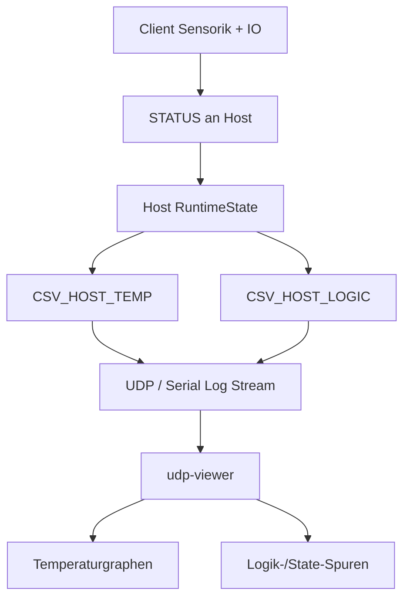

# T16 Phase 2.0 Logging und Testplan

## Ziel

Phase 2.0 schafft die gemeinsame Grundlage fuer:

- auswertbare UDP-/CSV-Logs im `udp-viewer`
- Trennung zwischen Temperaturdarstellung und Logikdarstellung
- spaetere fachliche Heizkurvenarbeit in Phase 2.x
- reproduzierbare Tests

In diesem Schritt wurde noch keine materialabhaengige Heizstrategie eingefuehrt.
Es geht bewusst zuerst um Beobachtbarkeit und Testbarkeit.

---

## Logging-Zielbild

Es werden zwei Logklassen vorgesehen:

1. `PLOT`
- fuer Temperaturkurven
- fuer Graphen im `udp-viewer`
- numerisch und zeitlich stabil

2. `LOGIC`
- fuer digitale und semantische Zustandsverlaeufe
- fuer Heater/Door/Safety/Mode
- gut lesbar als Zustandsdiagramm oder digitale Spur

---

## Aktueller Scope in T16_Phase_2.0

### Host PLOT

CSV-Prefix:
- `CSV_HOST_TEMP`

Aktuelle Felder:
- `tempChamber_dC`
- `tempHotspot_dC`
- `tempTarget_dC`
- `tempLow_dC`
- `tempHigh_dC`
- `safetyCutoffActive`

Zweck:
- Chamber-Kurve gegen Hotspot-Kurve betrachten
- Target und Hysteresefenster sichtbar machen
- Safety-Ereignisse im selben Zeitkontext sehen

### Host LOGIC

CSV-Prefix:
- `CSV_HOST_LOGIC`

Aktuelle Felder:
- `mode`
- `running`
- `heater_request_on`
- `heater_actual_on`
- `door_open`
- `safetyCutoffActive`
- `commAlive`
- `linkSynced`

Zweck:
- Host-Entscheidung gegen effektiven Heizstatus vergleichen
- Safety- und Kommunikationszustaende im Zeitverlauf sehen

---

## Mermaid Datenfluss

---

## Testvorgehen

## 1. Automatisierte Tests

### Ziel
Format- und Grundverhalten frueh absichern, noch bevor echte Hardwarelaeufe ausgewertet werden.

### Sinnvolle Testbausteine

- CSV-Format-Tests
  - `CSV_HOST_TEMP` hat konstante Feldanzahl
  - `CSV_HOST_LOGIC` hat konstante Feldanzahl
  - Prefixe sind stabil

- Host-Logiktests
  - Safety wird bei Door Open aktiv
  - Safety wird bei Chamber-Max aktiv
  - Safety wird bei Hotspot-Max aktiv
  - Safety wird bei Overshoot-Cap aktiv
  - `heater_request_on` und `heater_actual_on` verhalten sich erwartbar

- Zustandswechseltests
  - STOPPED -> RUNNING
  - RUNNING -> WAITING
  - RUNNING -> POST
  - RUNNING -> STOPPED

### Ergebnis

Automatisierte Tests sollen nicht die reale Thermik beweisen, aber:
- Formatstabilitaet sichern
- offensichtliche Regressionsfehler frueh finden
- Logdaten fuer den `udp-viewer` kompatibel halten

---

## 2. Manuelle Software-/Integrationspruefung

### Ziel
Vor Hardware-Heiztests sicherstellen, dass Logstroeme plausibel aussehen.

### Schritte

1. Firmware mit aktiviertem UDP-/CSV-Logging starten
2. `udp-viewer` mit laufendem Stream verbinden
3. pruefen, ob `CSV_HOST_TEMP` empfangen wird
4. pruefen, ob `CSV_HOST_LOGIC` empfangen wird
5. Door oeffnen/schliessen und auf Zustandswechsel achten
6. Start/Stop/Wait ausloesen und auf `mode`-Wechsel achten
7. pruefen, ob `heater_request_on` und `heater_actual_on` als getrennte Signale sichtbar sind

---

## 3. Manuelle Hardware-Runtimetests

### Wichtig

Ab den naechsten Phase-2-Schritten werden reale Hardware-Runtimetests sinnvoll und fachlich wichtig.
Insbesondere sobald materialabhaengige Heizstrategie oder Overshoot-Feinheiten veraendert werden.

### Erste sinnvolle Testfaelle

#### Test H1: Kaltstart
- System kalt
- Preset starten
- beobachten:
  - `tempChamberC`
  - `tempHotspotC`
  - `heater_request_on`
  - `heater_actual_on`
  - `safetyCutoffActive`

#### Test H2: Zielnaehe
- auf Zieltemperatur zulaufen
- beobachten:
  - wie frueh der Heater abgeschaltet wird
  - ob Hotspot deutlich vor Chamber ansteigt
  - ob Overshoot sichtbar wird

#### Test H3: Door Open waehrend RUNNING
- waehrend laufender Trocknung Tuer oeffnen
- erwarten:
  - Safety aktiv
  - Heater aus
  - klare Zustandsaenderung in `LOGIC`

#### Test H4: Kommunikationsverlust
- Host/Client-Verbindung stoeren
- erwarten:
  - `commAlive` bzw. `linkSynced` kippen
  - sicherer Zustand sichtbar

#### Test H5: Preset-Vergleich
- spaeter PLA vs. TPU vs. Silica
- erwarten:
  - unterscheidbare Temperatur- und Logikverlaeufe

---

## Erfolgskriterien fuer T16_Phase_2.0

- Host erzeugt getrennte `PLOT`- und `LOGIC`-Logs
- Feldschema ist fuer den `udp-viewer` stabil auswertbar
- automatisierte Tests koennen spaeter darauf aufsetzen
- manuelle Hardwaretests sind klar vorbereitet

---

## Betroffene Dateien

- [`include/log_csv.h`](/Users/bernhardklein/workspace/arduino/esp32/FilamentSilicatDryer_480x480/include/log_csv.h)
- [`src/app/oven/oven.cpp`](/Users/bernhardklein/workspace/arduino/esp32/FilamentSilicatDryer_480x480/src/app/oven/oven.cpp)
