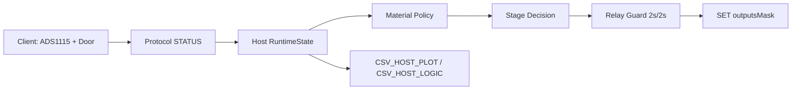

# T16 Phase 2 Dokumentation

## Ziel

Phase 2 hebt die Host-Heizkurve von einer einfachen Einheits-Hysterese auf eine fachlich getrennte und besser beobachtbare Regelbasis:

- getrennte Host-Policy fuer `Filament` und `Silica`
- einfache mehrstufige Heizstrategie
- erweiterte Host-Logs fuer spaetere Hardware-Analyse

## Umgesetzte Schritte

### T16_Phase_2.1

- `HeaterMaterialClass` eingefuehrt:
  - `FILAMENT`
  - `SILICA`
- `HeaterPolicy` eingefuehrt
- Presets tragen jetzt explizit ihre Materialklasse
- Host waehlt seine Heizparameter anhand der aktiven Materialklasse

### T16_Phase_2.2

- `HeaterControlStage` eingefuehrt:
  - `IDLE`
  - `BULK_HEAT`
  - `APPROACH`
  - `HOLD`
- dreistufige Heizentscheidung im Host-Regelpfad implementiert
- `tempToleranceC` bildet jetzt den jeweils aktiven Regelbereich der aktuellen Heizphase ab

### T16_Phase_2.3 / T16_Phase_2.3.1

- Host-Logic-CSV um `materialClass` und `heaterStage` erweitert
- CSV-Schema und Runtime-Ausgabe wieder konsistent gemacht

## Architekturstand

## Aktuelle Heizlogik

### Materialklassen

- `Filament`
  - engere Heizstrategie
  - kleinere tolerierte Zielueberschreitung
- `Silica`
  - groesseres Hysterese-/Annäherungsfenster
  - groessere tolerierte Zielueberschreitung innerhalb der Host-Policy

### Heizphasen

- `BULK_HEAT`
  - System ist noch klar unter Soll
  - Heizer wird grundsaetzlich angefordert, solange keine Safety aktiv ist
- `APPROACH`
  - System naehrt sich dem Soll
  - Regelung wird frueher defensiv
- `HOLD`
  - Zielbereich erreicht
  - undershoot-lastige Nachregelung, um Overshoot zu vermeiden

## Wichtige Grenzen

- Door open => Heater aus
- Chamber max => Heater aus
- Hotspot max => Heater aus
- Target + Overshoot-Cap => Heater aus
- Relais-Schutz:
  - min ON = 2s
  - min OFF = 2s

## Betroffene Dateien

- `include/oven.h`
- `src/app/oven/oven.cpp`
- `include/log_csv.h`

## Bewertung

Phase 2 liefert jetzt keine optimierte End-Heizkurve, aber eine brauchbare fachliche Basis:

- Chamber regelt, Hotspot schuetzt
- Materialklassen sind getrennt modelliert
- Heizphasen sind sichtbar modelliert
- Logging ist fuer reale Heizlaeufe nutzbar

Was noch nicht fertig ist:

- Feintuning der Schwellen anhand echter Messlaeufe
- materialfeiner Ausbau innerhalb `Filament`
- abgesicherte Aussagen zur realen Overshoot-Guete

## Build-Status

Zum Abschluss der Phase erfolgreich gebaut:

- `pio run -e host_esp32s3_st7701`
- `pio run -e client_esp32_wroom`
