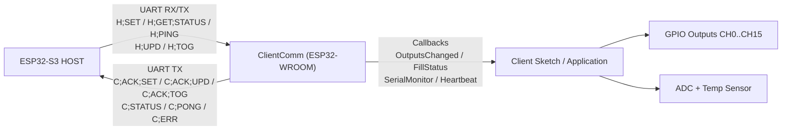
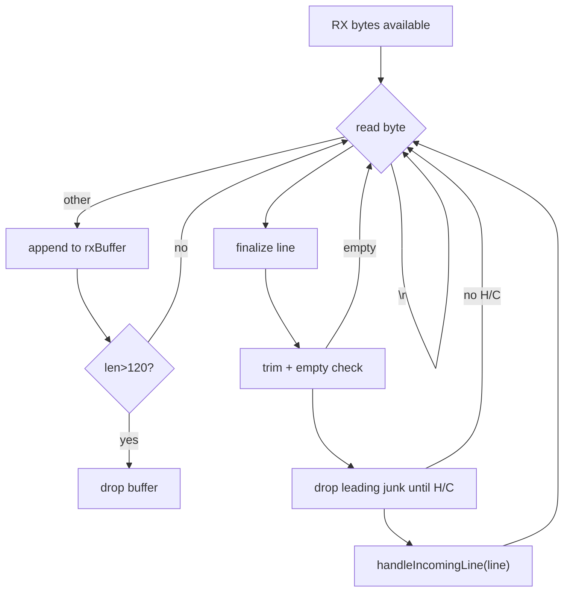
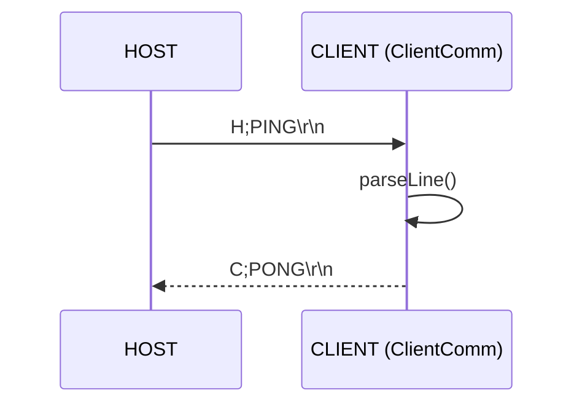
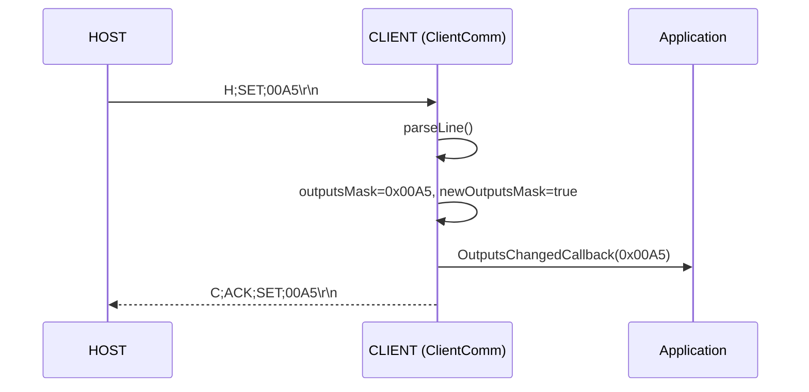
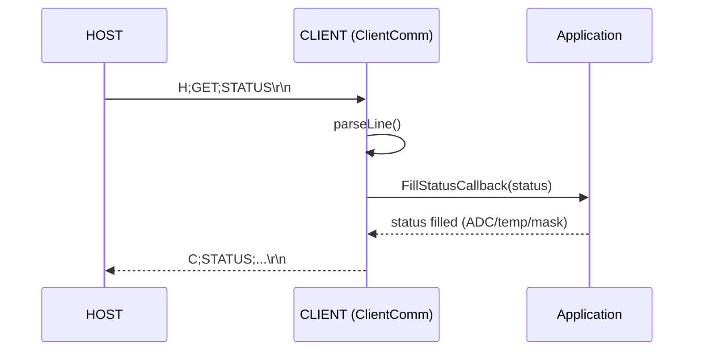

# ClientComm – UART Client Communication Handler (ESP32-WROOM)

**Version:** 0.4  
**Date:** 2026-01-30  
**File:** `ClientComm.cpp` / `ClientComm.h`  
**Role:** CLIENT-side UART protocol handler (ESP32-WROOM) for a Host↔Client link (ESP32-S3 HOST)

---

## Ziel und Kontext

`ClientComm` kapselt die komplette **UART-Link-Kommunikation** auf der CLIENT-Seite:

- RX: Frames vom HOST (Textprotokoll, CRLF-terminated)
- Parsing: Delegiert an `ProtocolCodec::parseLine(...)`
- Reaktion: Set/Update/Tog der Output-Maske, Status-Ausgabe, PING/PONG
- TX: Antworten an den HOST über `Serial2` (oder konfigurierbares `HardwareSerial`)

Wichtig: `ClientComm` ist **non-blocking** und darf permanent in `loop()` laufen.

---

## Architekturüberblick



---

## Kommunikationsprotokoll (kurz)

Frames sind **ASCII**, durch `\r\n` abgeschlossen.

### Host → Client

| Frame             | Bedeutung                              |
| ----------------- | -------------------------------------- |
| `H;SET;FFFF`      | Setzt komplette 16-bit Maske           |
| `H;UPD;SSSS;CCCC` | Set/Clr Teilmasken (setMask/clearMask) |
| `H;TOG;TTTT`      | Toggles Bits                           |
| `H;GET;STATUS`    | Fordert Status an                      |
| `H;PING`          | Link-Test                              |

### Client → Host

| Frame                            | Bedeutung                         |
| -------------------------------- | --------------------------------- |
| `C;ACK;SET;FFFF`                 | ACK für SET (übernommene Maske)   |
| `C;ACK;UPD;FFFF`                 | ACK für UPD (resultierende Maske) |
| `C;ACK;TOG;FFFF`                 | ACK für TOG (resultierende Maske) |
| `C;STATUS;mask;a0;a1;a2;a3;temp` | Statuspayload                     |
| `C;PONG`                         | Antwort auf PING                  |
| `C;ERR;SET;code`                 | Fehler für SET                    |

---

## Versionshistorie

### V0.4 (2026-01-30)
#### Client – Zusammenfassung der Änderungen (V0.3 → V0.4 / T10.x)

**Zeitraum:** ab 07.01.2026 (Client V0.3) bis heute  
**Geltungsbereich:** ausschließlich **Client** (ESP32-WROOM)

---

#### 1. Tür-Safety (Client-autoritative Abschaltung)

- **DOOR OPEN ⇒ HEATER + MOTOR sofort AUS**
- Umsetzung vollständig **client-seitig**, unabhängig vom Host
- Door-Bit wird **niemals als Output** behandelt, nur als Telemetrie
- Edge-Detection im `loop()` zur sofortigen Reaktion bei Tür-Öffnung
- PWM-Heater wird dabei **hart abgeschaltet** (kein Soft-Disable)

**Ziel:** Hardware-Sicherheit auch bei fehlerhafter Host-Logik

---

#### 2. Effektive Output-Maske (`g_effectiveMask`)

- Einführung einer **client-internen effektiven Maske**
- Klare Trennung zwischen:
  - vom Host angeforderter Maske
  - tatsächlich angewandter Hardware-Maske (inkl. Safety-Gating)
- STATUS meldet **immer den realen Hardware-Zustand**
- Verhindert UI-Inkonsistenzen bei Safety-Eingriffen

---

#### 3. PWM-Heater-Stabilisierung (ESP32 Arduino Core ≥ 3.x)

- Überarbeitung von `heaterPwmEnable()`:
  - deterministischer PWM-Start („Kick-Sequenz“)
  - explizites `ledcAttach()` / `ledcDetach()`
  - definierter LOW-Zustand beim Abschalten
- Behebung eines **Initial-Start-Bugs**:
  - beim **ersten START nach Boot** kein 4 kHz-Signal
  - erst nach STOP → START korrekt
- Ursache: **LEDC-Initialisierung / Timing**
- Lösung: garantierte Initialisierung + definierte Duty-Writes

**Ergebnis:** PWM ist ab dem **ersten START zuverlässig aktiv**

---

#### 4. Absolute Over-Temperature-Sicherung (Client Hard-Limit)

- Einführung einer **absoluten Temperaturgrenze im Client**
- Überschreitung ⇒ **HEATER sofort HARD OFF**
- Vollständig **unabhängig vom Host**
- Temperaturbasis: MAX6675 / `tempRaw` (0,25 °C-Schritte)

**Schützt vor:**  
Host-Crash, UI-Fehlern, Logik-Bugs, Kommunikationsproblemen

---

#### 5. Host-Watchdog / Kommunikations-Fail-Safe

- Neuer **Client-Watchdog** für Host-Kommunikation
- Timeout: **2000 ms** (`constexpr`)
- **Jedes gültige Frame** setzt den Timeout zurück
- Bei Timeout:
  - sofortiger Übergang in **Safe-State**
  - **HEATER, MOTOR, FAN230 etc. AUS**

**Behebt kritisches Szenario:**  
Host stürzt ab / wird neu geflasht, Client läuft weiter, HEATER bleibt sonst aktiv

---

#### 6. Konsolidierter Safety- & Status-Pfad

- Safety-Checks (Door, Overtemp, Watchdog) sind **nicht UI-abhängig**
- STATUS-Frames triggern:
  - Temperatur-Überwachung
  - konsistente Rückmeldung des realen Zustands
- Keine implizite Annahme mehr, dass der Host „immer korrekt arbeitet“

---

#### 7. Logging & Diagnose (Client)

- Gezielte Logs für:
  - Door-Events
  - PWM Attach / Detach
  - Host-Timeout
  - Over-Temperature
- Reduktion von Log-Spam
- Logs sind **zustandsgetrieben**, nicht zyklisch

---

#### Gesamtfazit

> Der Client wurde zwischen V0.3 und V0.4 systematisch zu einer  
> **sicherheits-autoritativen Instanz** ausgebaut.  
> Kritische Aktoren – insbesondere der HEATER – sind nun gegen  
> **Host-Abstürze, Tür-Öffnungen, Kommunikationsausfälle und Initialisierungsfehler** abgesichert.  
>  
> Der Client kann den Ofen jederzeit selbstständig in einen **sicheren Zustand** überführen –  
> unabhängig von UI oder Host-Logik.

### V0.3 (2026-01-07)

- **Robuste Verarbeitung eingehender Zeilen**
  - `trim()` auf kompletter Zeile
  - Ignorieren leerer Zeilen
  - Entfernen führender Junk-Bytes bis `H` oder `C`
  - **Wichtig:** Nach `handleIncomingLine(line)` wird **nicht** `return` gemacht, sondern weiter RX gepumpt (`continue`)  
- Stabilität bestätigt durch umfangreiche HOST-TestCases

#### Fazit

`ClientComm` V0.3 ist ein **robuster, non-blocking UART Client-Handler**, der:

- line assembly zuverlässig verarbeitet (inkl. Junk/Boot-Noise)
- Host-Kommandos (SET/UPD/TOG/GET STATUS/PING) korrekt beantwortet
- die Applikation sauber über Callbacks integriert
- und sich im Zusammenspiel mit den HOST-TestCases als stabil bewährt hat.
---

### V0.2 (2026-01-06)

- Fixes in line processing
- Heartbeat Callback eingeführt

---

## Public API (ClientComm)

### Konstruktor & Setup

- `ClientComm(HardwareSerial &serial, uint8_t rx, uint8_t tx)`
- `begin(uint32_t baudrate)`

### Laufzeit

- `loop()`  
  Non-blocking RX/TX Verarbeitung (muss häufig aufgerufen werden)

### Status-/Event Flags

- `bool hasNewOutputsMask() const`
- `uint16_t getOutputsMask() const`
- `void clearNewOutputsMaskFlag()`

- `bool statusRequested() const`
- `void clearStatusRequestedFlag()`

### Antworten / TX

- `void sendStatus(const ProtocolStatus &status)`
- `void processLine(const String &line)` (Test/Simulation: bypass UART)

### Callbacks (Integration in Anwendung)

- `setOutputsChangedCallback(OutputsChangedCallback cb)`  
  Wird bei SET/UPD/TOG ausgelöst, liefert neue Maske.

- `setFillStatusCallback(FillStatusCallback cb)`  
  Anwendung füllt vor `sendStatus()` ADC/Temp/Mask.

- `setTxLineCallback(TxLineCallback cb)`  
  Optionales SerialMonitor-Logging für gesendete Frames.

- `setHeartBeatCallback(HeartBeatCallback cb)`  
  Optionales “alive”-Signal bei UART Activity.

---

## Ablauf: RX Line Assembly in `loop()`

### Eigenschaften

- Liest alle verfügbaren RX Bytes
- `\r` wird verworfen
- `\n` beendet eine Zeile
- Schutz vor runaway garbage: Buffer-Limit 120 Zeichen

### Wichtige Robustheitsregeln

1. **Zeile trimmen** (`line.trim()`)
2. **Leere Zeilen ignorieren**
3. **Leading Junk entfernen**  
   Entfernt führende Bytes bis ein `H` oder `C` gefunden wird
4. **Keine frühe Rückkehr**  
   Nach Verarbeitung einer Zeile wird weiter gelesen (kein `return`), damit Burst-RX korrekt verarbeitet wird.



---

## Ablauf: `handleIncomingLine()`

`handleIncomingLine()` delegiert das Parsing vollständig an `ProtocolCodec::parseLine(...)`.

- Bei Parse-Fehler:
  - Zeile wird geloggt (`RAW("[CLIENT] Failed to parse line: ...")`)
  - Keine ERR-Frame-Rücksendung (bewusst minimal; optional erweiterbar)

### Zustandsdiagramm (Client)

```mermaid
stateDiagram-v2
    [*] --> Idle

    Idle --> OnSet : H;SET
    OnSet --> Idle : C;ACK;SET

    Idle --> OnUpd : H;UPD
    OnUpd --> Idle : C;ACK;UPD

    Idle --> OnTog : H;TOG
    OnTog --> Idle : C;ACK;TOG

    Idle --> OnGetStatus : H;GET;STATUS
    OnGetStatus --> Idle : C;STATUS

    Idle --> OnPing : H;PING
    OnPing --> Idle : C;PONG
```



---

## Sequenzen

### PING/PONG (Link-Test)



### SET + ACK;SET



### GET/STATUS + STATUS



---

## Implementierungsdetails & bekannte Stolpersteine

### 1) „return“ im RX-Pfad vermeiden

In früheren Iterationen war ein `return` nach Zeilenverarbeitung kritisch, weil dann bei Burst-RX nur die erste Zeile verarbeitet wurde.  
V0.3 nutzt konsequent `continue`, um RX vollständig zu konsumieren.

### 2) “Junk”-Bytes / Boot Noise

Auf echten UART-Verbindungen können am Anfang der Kommunikation Steuerzeichen/Junk auftreten.  
V0.3 entfernt führenden Junk bis `H` oder `C`. Das hat sich in den TestCases als stabil erwiesen.

### 3) Heartbeat nur bei Activity

`_heartBeatCb()` wird **nur** aufgerufen, wenn RX Activity vorhanden war (`hadActivity == true`).  
So wird die Applikation nicht geflutet.

---

## Minimaler Integrations-Guide (Client Sketch)

```cpp
#include "ClientComm.h"

static constexpr uint8_t LINK_RX = 16;
static constexpr uint8_t LINK_TX = 17;

ClientComm comm(Serial2, LINK_RX, LINK_TX);

static void onOutputs(uint16_t m) {
  // apply to GPIO
}

static void fillStatus(ProtocolStatus &st) {
  // st.outputsMask = ...
  // st.adcRaw[...] = ...
  // st.tempRaw = ...
}

static void monitor(const String &line, const char *dir) {
  Serial.printf("[CLIENT] [%s]: %s\n", dir, line.c_str());
}

static void hb() {
  // optional: LED pulse / counter
}

void setup() {
  Serial.begin(115200);
  comm.setOutputsChangedCallback(onOutputs);
  comm.setFillStatusCallback(fillStatus);
  comm.setTxLineCallback(monitor);
  comm.setHeartBeatCallback(hb);
  comm.begin(115200);
}

void loop() {
  comm.loop();
}
```

---

## T10.1.40 – Client Safety Watchdog (Host-Timeout)

### Motivation

Der Client (ESP32-WROOM / Powerboard) ist sicherheitskritisch, da er den
**HEATER direkt hardwareseitig steuert** (PWM, 4 kHz).

Ein kritisches Fehlerszenario tritt auf, wenn:
- der **HOST (ESP32-S3)** abstürzt, neu geflasht oder blockiert
- der **Client weiterläuft**
- zuvor **HEATER = ON** gesetzt war

Ohne zusätzliche Schutzmechanismen würde der HEATER **unbegrenzt weiterlaufen**.

→ **Gefahr von Überhitzung und Sachschäden (Severity: HIGH)**

---

### Sicherheitskonzept

Der Client implementiert einen **Host-Watchdog**:

- **Jedes gültige Protokoll-Frame** vom Host gilt als *Lebenszeichen*
  - SET / UPD / TOG
  - GET STATUS
  - PING
- Bleibt dieses Lebenszeichen zu lange aus, wird ein **Hard-Fail-Safe ausgelöst**

---

### Version 0.4 (2026-01-30) – Ergänzungen (T10.1.41)

#### Kontext / Problem (HIGH)
Beim **ersten START nach Boot** wurde im UI zwar RUNNING angezeigt, aber der **CLIENT schaltete den HEATER nicht zuverlässig ein** – am Oszilloskop war **kein 4 kHz PWM-Signal** sichtbar.  
Erst nach **STOP → START** wurde der PWM-Ausgang korrekt aktiv.

**Risiko:** Anwender verlässt sich auf UI-Zustand, reale Heizleistung bleibt aus (funktional kritisch) – außerdem ist die Stelle sicherheitsrelevant, weil PWM-Ansteuerung deterministisch sein muss.

#### Beobachtung / Reproduzierbarkeit
- System bootet, UI kommt hoch
- Preset auswählen
- **START (1. Mal)** → UI läuft, aber **kein 4 kHz** am HEATER-Pin
- nach **STOP**, kurzer Pause, **START (2. Mal)** → PWM sofort sichtbar

Client-Log zeigte dabei:
- SET;0051 wird empfangen und ACK gesendet
- „PWM attached …“ wird geloggt
- dennoch war beim ersten Start am Oszi kein Signal (sporadisch / initial)

#### Ursache (Root Cause)
Im Zusammenspiel aus **LEDC Attach/Write** und dem initialen GPIO/LEDC-Zustand konnte der **erste Duty-Write nach Attach** unter bestimmten Bedingungen „verloren“ gehen bzw. nicht deterministisch am Pin ankommen (Timing/GPIO-Matrix/LEDC-Startphase).

#### Fix / Patch
Die Funktion `heaterPwmEnable(true)` wurde so angepasst, dass der PWM-Start **deterministisch** wird:
- definierter „Kick“-Start
- sofortiges Setzen eines bekannten Duty-States (0 → Ziel-Duty)
- kurze `delayMicroseconds()`-Stabilisierung
- optionaler zweiter Duty-Write (harmlos, aber robust gegen „first-write lost“)

> Ergebnis: **1. START nach Boot** liefert zuverlässig 4 kHz PWM am Oszilloskop, ohne STOP/START Workaround.

#### Test / Verifikation
- Mehrfacher Kaltstart (Power-Cycle)
- Preset auswählen → START
- Oszilloskop: PWM 4 kHz sofort sichtbar (Duty gemäß Konfiguration)
- STOP → PWM aus (Detach), Pin in Safe-Level
- Wieder START → PWM wieder korrekt

#### Hinweise / Lessons Learned
- PWM-Ansteuerung auf ESP32 sollte **nicht nur logisch korrekt**, sondern auch **elektrisch deterministisch** sein.
- Bei sicherheitsrelevanten Aktoren (HEATER) ist „first-run reliability“ Pflicht, sonst entstehen schwer zu diagnostizierende Feldfehler.

