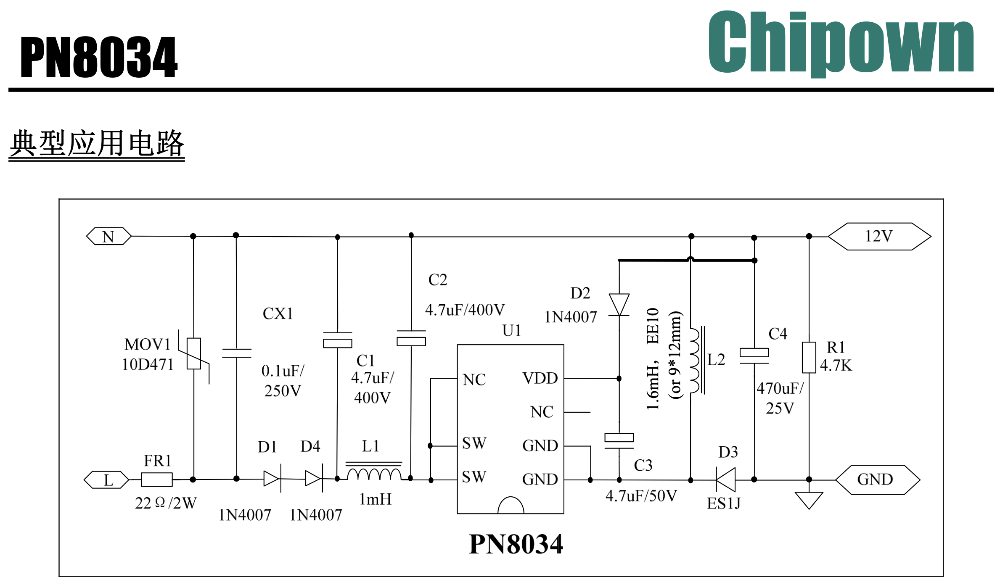

# PowerBoard 230 V – Vollanalyse & Zuordnung zur PN8034-Referenzschaltung

---

---

## Überblick

Du hast ein Powerboard, dessen Hilfsspannungsversorgung und EMV-Beschaltung stark an die **PN8034-Referenzschaltung** angelehnt ist.  
Ziel dieses Dokuments ist:

1. **Analyse** der im Foto sichtbaren Komponenten (230-V-Seite / Netzteilbereich)
2. **Bewertung** bezüglich FI-Thema (RCD)
3. **Zuordnung** der realen PCB-Elemente zu den Elementen aus Bild 1 (Herstellerdiagramm)

**Wichtiger Rahmen:**  
**PE ist nur am Gehäuse angeschlossen** und **nicht** auf das Powerboard geführt.

---

## a) Bildanalyse (PCB – funktionale Bereiche)

Auf dem Foto sind grob diese Funktionsblöcke erkennbar:

1. **Netzeingang / Schutz / EMV**  
   MOV (PVR1), X-Kondensator (PCC1), evtl. Serienimpedanz (RX/NTC), Drossel(n)

2. **Primärnetzteil (PN8034N)**  
   Controller-IC + Primärpfad (Dioden, Drossel/Übertrager, HV-Elkos)

3. **Sekundärversorgung (12 V / 5 V)**  
   12-V-Puffer (Elko 25 V), nachgeschaltet 7805 für 5 V

4. **Lastschaltbereich**  
   Relais (Heater), TRIACs (Fan/Motor/Lampe)

---

## b) Kondensatoren auf der 230-V-Seite: Lokalisierung & FI-Relevanz

### Sichtbare Kondensatoren (relevant für Netzteil/EMV)

| PCB-Label | Typ / Aufdruck | Position im Foto | Funktion | FI-Relevanz |
|---|---|---|---|---|
| **PCC1** | 0.22 µF / 275 V (typ. X2) | gelber Block | L↔N-Entstörung | ❌ |
| **(CX1 ähnlich)** | kleiner Folien/kerko (falls vorhanden) | nahe Netzeingang | HF-Bypass L↔N | ❌ |
| **EC2 / EC3** | 4.7 µF / 450 V (Elkos) | 2 große Elkos oben | HV-Zwischenkreis | ❌ |
| **EC4** | 4.7 µF / 50 V | nahe Buzzer | Sekundär-Glättung | ❌ |
| **C4 (im Wiring)** | 470 µF / 25 V (PCB: PEC?/EC?) | 12-V-Puffer-Elko | 12-V-Puffer | ❌ |
| **EC1 / EC5** | 470 µF / 16 V | links unten | 5-V-/Logik-Puffer | ❌ |

### Wichtige Aussage zu Y-Kondensatoren
Da **PE nicht ans Board geführt** ist, sind klassische **Y-Caps (L/N→PE)** hier **nicht sinnvoll platzierbar** und auf der Topside auch nicht erkennbar.  
➡️ Ein FI-Trip durch „Y-Cap-Leck nach PE“ ist in diesem Board-Layout **nicht der primäre Mechanismus**.

---

## c) PVR1 – 14D471K

**Typ:** MOV / Varistor (Metal Oxide Varistor)

- **14D**: ca. 14 mm Scheibendurchmesser
- **471**: Varistorspannung ~470 V
- **K**: Toleranzklasse

**Anschluss:** typischerweise **L ↔ N** (Netz parallel)

**Funktion:** Überspannungsschutz / Transientenbegrenzung.

**FI-Bezug:**  
Ein MOV ist nicht gegen PE, aber ein **gealterter MOV** kann
- nichtlinear „anlecken“,
- bei Netzspannung hohe Stromspitzen verursachen,
- oder thermisch vorgeschädigt sein.

➡️ Bei „FI fliegt sofort“ ist er ein **hochprioritärer Kandidat** (Diagnose durch Auslöten/Bein anheben).

---

## d) „5TET3.15A / 250 V“

Das ist die **Netzsicherung**:

- **T3.15A** (träge), 250 V
- Schutz bei Überstrom/Kurzschluss

**FI-Bezug:** keine direkte FI-Ursache, aber sie liegt im Netzeingangspfad.

---

## e) PCC1 – 275 V / 0.22 µF

Sehr wahrscheinlich ein **X2-Entstörkondensator**:

- Anschluss **L ↔ N**
- reduziert leitungsgebundene Störungen
- dämpft Schaltspitzen/Schaltflanken

**FI-Bezug:** praktisch keiner, da nicht nach PE.

---

## f) PE nur am Gehäuse (kein PE am Board)

Das ist elektrisch entscheidend:

- Kein definierter Ableitstrompfad vom Board nach PE
- Ein FI kann dann nur auslösen, wenn ein Fehlerstrom von L/N **zum Gehäuse** entsteht, z. B.:
  - beschädigte Leitung, gequetschte Ader
  - Kriechstrecke/Schmutzpfad PCB → Schraubpunkt → Gehäuse
  - Isolationsfehler in Lasten (Heater, Motor, Fan) oder Verkabelung

---

## g) RX – was ist das?

Im Herstellerdiagramm ist **RX** typischerweise ein **Serienwiderstand im Primärpfad** (oft 1–2 W).  
Im Foto ist ein axialer Widerstand (mit Farbringen) nahe der Netzseite/Relaisregion erkennbar.

**Aufgaben von RX (typisch):**
- Einschaltstrombegrenzung (zusammen mit NTC/Serienimpedanz)
- Dämpfung von Schwingungen/Spikes
- Strombegrenzung für den Primärpfad / Schutz des PN8034

**Hinweis:** Manche Designs nutzen statt RX teilweise NTC+Widerstand oder kombinieren beides.

---

## h) L1 und L2 – wozu dienen die Spulen?

Im Herstellerdiagramm:

- **L1 (1 mH)**: Serieninduktivität im Primärpfad (EMV/Filterung der Stromimpulse)
- **L2 (1.6 mH, EE10)**: Ausgangsdrossel/Transformatorpfad zur Glättung der 12-V-Erzeugung (je nach Ausführung als gekoppeltes Element)

Auf der PCB:

- **L1** ist im Foto als „L1“ beschriftet (Bereich zwischen HV-Elkos / gelbem X2-Cap / PN8034-Zone).  
- **L2** entspricht sehr wahrscheinlich dem Bauteil, das im Foto als „L2, Blau-Braun-Rot“ bzw. als gewickeltes/gekapseltes Induktivelement markiert ist.

**Kurz:**  
- L1: reduziert HF-Stromspitzen Richtung Netz (EMV)  
- L2: glättet/überträgt Energie im Schaltnetzteil zur stabilen 12-V-Rail

---

## i) Relais: Heater-Ansteuerung (deine Beschreibung)

Das Relais schaltet den **HEATER** (230 V) und wird über die **12-V-Steuerspannung** angesteuert.  
Die Steuerspule wird letztlich über einen Pin des 12-poligen Connectors (MCU/Steuerboard) geschaltet.

**Wichtig zur FI-Frage:**  
Wenn der FI **sofort beim Einstecken** fliegt (ohne dass die MCU das Relais anzieht), ist das Relais **nicht** die Ursache.  
Die Ursache liegt dann vor dem „aktiven“ Schalten: Netzeingang/Isolation/Kriechweg/MOV/Kabelbaum.

---

## Zuordnung: Herstellerdiagramm (Bild 1) ↔ PCB (Bild 2)

### Mapping-Tabelle

| Bild 1 (Hersteller) | Funktion | PCB (Bild 2) – sichtbares Gegenstück |
|---|---|---|
| **MOV1 10D471 / 14D471** | Überspannungsschutz L↔N | **PVR1 (14D471K)** |
| **CX1 0.1 µF / 250 V** | HF-Bypass L↔N | kleiner Folien/kerko nahe Netzeingang (nicht immer eindeutig sichtbar) |
| **C1 4.7 µF / 400 V** | HV-Zwischenkreis | **EC2/EC3 4.7 µF / 450 V** (einer davon) |
| **C2 4.7 µF / 400 V** | HV-Zwischenkreis (parallel) | **EC2/EC3 4.7 µF / 450 V** (zweiter) |
| **FR1 22 Ω / 2 W** | Serienimpedanz/Begrenzung | auf PCB evtl. **RX** oder Kombination aus Widerstand/NTC (Beschriftung im Foto „RX“) |
| **D1/D4 1N4007** | Gleichrichtung/Primärpfad | diskrete Dioden im PN8034-Umfeld (auf Foto nicht eindeutig einzeln markiert) |
| **L1 1 mH** | EMV/Primär-Filter | PCB-Label **L1** |
| **U1 PN8034** | SMPS-Controller | **PU1 PN8034N** |
| **D2 1N4007** | Primärpfad/Clamp | diskrete Diode im PN8034-Umfeld (nicht eindeutig markiert) |
| **L2 1.6 mH (EE10)** | Energietransfer/Glättung | gewickeltes Induktivelement **L2** (markiert) |
| **D3 ES1J** | Sekundärgleichrichtung | Diode im 12-V-Rail Bereich (nicht eindeutig markiert) |
| **C3 4.7 µF / 50 V** | Sekundärglättung | **EC4 4.7 µF / 50 V** |
| **C4 470 µF / 25 V** | 12-V-Puffer | 12-V-Elko (auf Foto vorhanden, markiert als 470 µF/25 V) |
| **R1 4.7 kΩ** | Bleeder/Last | Widerstand im 12-V-Bereich (auf Foto nicht eindeutig einzeln identifiziert) |

**Wichtig:** Das Mapping ist „funktional“, nicht 1:1-Pin-genau. Herstellerreferenzen variieren je nach Board-Revision.

---

## FI-Fazit (aus beiden Bildern abgeleitet)

Da PE nicht am Board ist, sind die Top-Kandidaten:

1. **Isolationsfehler L/N → Gehäuse** (Kabelbaum, Schraubpunkt, Kriechweg)
2. **MOV PVR1 gealtert/teildefekt**
3. Verschmutzung/Carbonisierung nahe Netzeingang oder Befestigungspunkten

Empfohlene Diagnose (kurz):
- MOV testweise abtrennen
- Isolationsmessung L→Gehäuse und N→Gehäuse @ 500 V
- Wackeltest am Kabelbaum während Isomessung

---

*Dokument: Zuordnung und Analyse basierend auf Foto (Bild 2) und PN8034-Referenz (Bild 1).*  
