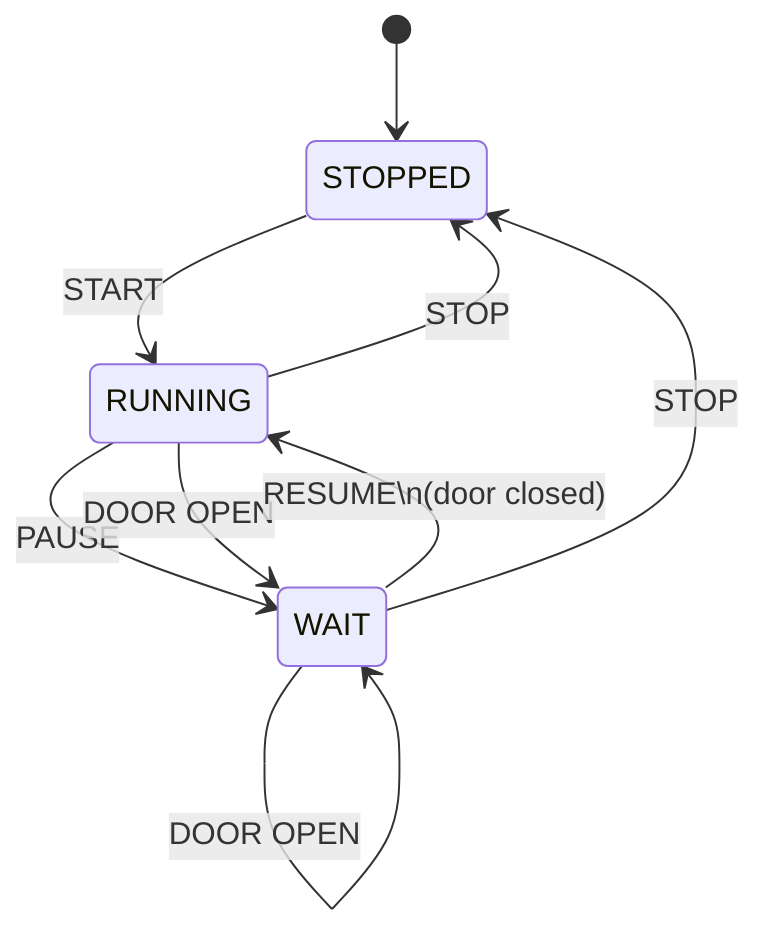
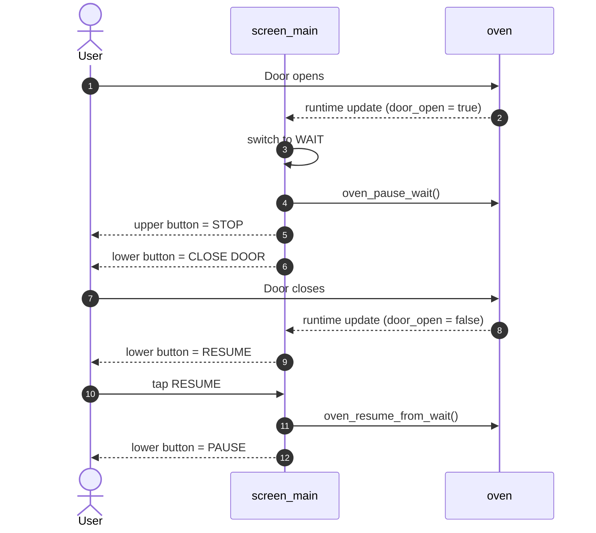

# Screen Main

The Main Screen is your working screen. It gives you a quick view of what the dryer is doing right now, how much time is left, how warm the system is, and which action makes sense next.

This structure is intentionally designed so we can reuse it later for other screen docs as well.

## Quick Overview

- At the top, you see remaining time and run progress.
- In the center, you get status icons, the dial, and the full 6-button action column on the right.
- At the bottom, you see the temperature bars for actual and target values.
- Between center and bottom, you get the screen-switch area.

## Why This Screen Exists

This screen should not dump every detail on you at once. It should mainly answer three questions fast:

1. Is the system running right now or not?
2. Is everything safe and behaving as expected?
3. What is the next useful action you can take?

That is why the two buttons on the right matter so much. The upper button controls the run at a high level. The lower button controls pause/resume behavior or tells you why resuming is currently blocked.

On top of that, there are now four fast-preset buttons. They let you load common filament presets directly from the Main Screen without switching to the preset screen first.

## Layout & Areas

### Top Bar

- time progress bar
- remaining time text
- link and safety status

### Center Left

- status icons for fan, heater, door, motor, lamp
- the icons show current state, not the next action

### Center Middle

- dial as the main visual runtime indicator
- preset name and filament ID in the center

### Center Right

- upper button: `START` or `STOP`
- lower button: `PAUSE`, `RESUME`, or `CLOSE DOOR`
- below that: 4 fast-preset buttons
- default assignment: `PLA`, `PETG`, `ASA`, `TPU`
- fast presets are only active in `STOPPED`

### Page / Swipe Zone

- dots for page position
- swipe area for switching screens
- must not be scrollable

### Bottom

- upper temperature bar: chamber actual value in red
- chamber temperature shown as white text inside the red bar
- hotspot shown as a blue marker above the upper bar
- hotspot temperature shown to the left of the marker
- lower temperature bar: target value in orange
- target temperature shown as white text inside the orange bar
- grey tolerance lines inside the lower bar
- the scale now runs up to `150 °C`

## Interaction Idea

This screen intentionally separates:

- showing state
- offering action

That matters because a label like `WAIT` may be fine as a system state, but it is weak as a button label. A button should tell you what happens when you press it.

That is why this screen follows a simple rule:

- The upper button describes the primary run action.
- The lower button describes the next meaningful secondary action.

## Buttons & Actions

### Upper Button

- `START`: starts the run from `STOPPED`
- `STOP`: stops the run from `RUNNING` or `WAIT`

### Lower Button

- `PAUSE`: switches from `RUNNING` to `WAIT`
- `RESUME`: continues a paused run
- `CLOSE DOOR`: tells you that the door must be closed first while the system is in `WAIT`

### Fast-Preset Buttons

- load a preset directly into the Main Screen
- immediately update filament, target temperature, and runtime to the selected preset
- are only active while the oven is `STOPPED`
- show the preset name with a maximum of 5 characters
- can later be reassigned through a config screen

### Current Default Assignment

| Slot | Label | Preset |
|---|---|---|
| `1` | `PLA` | PLA |
| `2` | `PETG` | PETG |
| `3` | `ASA` | ASA |
| `4` | `TPU` | TPU |

## Workflow / States

### State Logic

The UI workflow uses three main states:

- `STOPPED`
- `RUNNING`
- `WAIT`

`WAIT` is not an error state. It is a deliberate intermediate state:

- manually paused
- or triggered by safety because the door opened

### State Diagram

### State Table

| STATE | Upper Button | Lower Button | Upper Color | Lower Color | Info |
|---|---|---|---|---|---|
| `STOPPED` | `START` | `PAUSE` disabled | orange | grey | You can start the run, but pause does not make sense here |
| `RUNNING` | `STOP` | `PAUSE` | red | orange | Normal active operation |
| `WAIT` + door open | `STOP` | `CLOSE DOOR` disabled | red | red | System is safely paused, resume is blocked |
| `WAIT` + door closed | `STOP` | `RESUME` | red | green | Run can continue immediately |

### Fast-Preset Behavior

| State | Fast-Preset Buttons | Info |
|---|---|---|
| `STOPPED` | active | Preset can be loaded directly |
| `RUNNING` | disabled | No preset switching during an active run |
| `WAIT` | disabled | No preset switching while paused |

### Door Workflow

This is the most important special case on this screen:

1. System is running
2. Door opens
3. UI switches to `WAIT`
4. Upper button stays `STOP`
5. Lower button shows `CLOSE DOOR`
6. Door closes again
7. Lower button changes to `RESUME`
8. Only then can the run continue cleanly

This is much clearer than a static `WAIT`, because the UI tells you directly what to do next.

### Door Flow Sequence

## Visual Language

### Buttons

- Orange: active but non-destructive action
- Red: stop or blocked safety state
- Green: safe to continue
- Grey: not available in the current state
- Dark anthracite: fast-preset button
- Brighter border / accent: currently selected fast preset

### Temperature Area

- Red: chamber actual temperature
- Blue: hotspot marker and hotspot label
- Orange: target temperature
- Grey: tolerance band
- White: numeric temperature values inside the bars or next to the hotspot marker

## Technical Mapping

### Important UI States

- `RunState::STOPPED`
- `RunState::RUNNING`
- `RunState::WAIT`

### Important Functions

- `screen_main_update_runtime(...)`
- `update_start_button_ui()`
- `pause_button_apply_ui(...)`
- `update_fast_preset_buttons_ui()`
- `start_button_event_cb(...)`
- `pause_button_event_cb(...)`
- `fast_preset_button_event_cb(...)`
- `countdown_stop_and_set_wait_ui(...)`

### Relevant Backend Hooks

- `oven_start()`
- `oven_stop()`
- `oven_pause_wait()`
- `oven_resume_from_wait()`

## UX Notes

When you work on this screen later, always check one question first:

> Is the button showing a state, or is it showing an action?

For usability, the action is almost always better.

Good examples:

- `START`
- `STOP`
- `PAUSE`
- `RESUME`
- `CLOSE DOOR`

For fast presets, the same idea applies:

- keep only common materials there
- keep labels short
- block preset changes while the run is active

Weaker examples:

- `WAIT`
- `RUNNING`
- `READY`

Those may be okay as status text, but they are weak as direct actions.

## For Future Screens

This chapter structure is meant to become the default:

1. Quick Overview
2. Why This Screen Exists
3. Layout & Areas
4. Interaction Idea
5. Buttons & Actions
6. Workflow / States
7. Visual Language
8. Technical Mapping
9. UX Notes

If a screen has no buttons or no real state machine, that section can just be shorter. The overall structure should still stay consistent.
