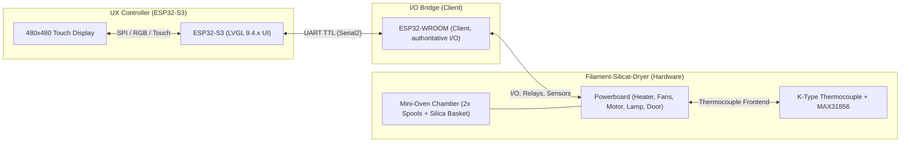

# Architektur-Überblick

## Zielbild

- **ESP32-S3** liefert die komplette UX (480×480 Touch) mit **LVGL 9.4.x**.
- **ESP32-WROOM** ist der **Client** und bleibt **autoritative Quelle** für:
  - Ausgänge (Heater, Fans, Motor, Lamp)
  - Eingänge/Sensorik (z.B. Door)
- Der Host (ESP32-S3) setzt **Policies/Requests**, aber die UI zeigt erst **nach Telemetrie/ACK** den tatsächlichen Zustand.

## Hardware-Komponenten

## Single Source of Truth

Die UI rendert ausschließlich aus:

- `OvenRuntimeState` via `oven_get_runtime_state()`

Wichtig:
- Aktuator-Flags in `OvenRuntimeState` werden **nur** aus `STATUS` / `ACK` abgeleitet.
- Die UI darf **keine eigene Wahrheit** führen.

## Navigation und Safety

- Navigation ist abhängig vom Zustand:
  - Während RUNNING: nur `screen_main` ↔ `screen_log`
  - `screen_dbg_hw` ist **nur** erlaubt, wenn **nicht RUNNING**
- `screen_dbg_hw` besitzt zusätzliche Safety:
  - RUN-Gate (armed/unarmed)
  - Swipe-away: Outputs OFF, RUN-Gate reset
