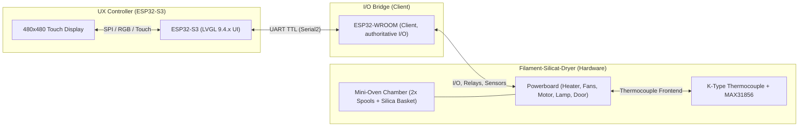

# Architecture Overview

## Target Design

- **ESP32-S3** provides the full UX (480×480 touch) using **LVGL 9.4.x**.
- **ESP32-WROOM** is the **client** and remains the **authoritative source** for:
  - outputs (heater, fans, motor, lamp)
  - inputs/sensors (e.g. door)
- The host (ESP32-S3) issues **policies/requests**, but the UI changes only **after telemetry/ACK** confirms the real state.

## Hardware Components

## Single Source of Truth

The UI renders strictly from:

- `OvenRuntimeState` via `oven_get_runtime_state()`

Key rule:
- Actuator fields inside `OvenRuntimeState` are updated **only** from `STATUS` / `ACK`.
- The UI must not keep its own “truth”.

## Navigation and Safety

- Navigation depends on state:
  - While RUNNING: only `screen_main` ↔ `screen_log`
  - `screen_dbg_hw` is allowed only when **not RUNNING**
- `screen_dbg_hw` adds extra safety:
  - RUN gate (armed/unarmed)
  - swipe-away: outputs OFF, RUN gate reset
