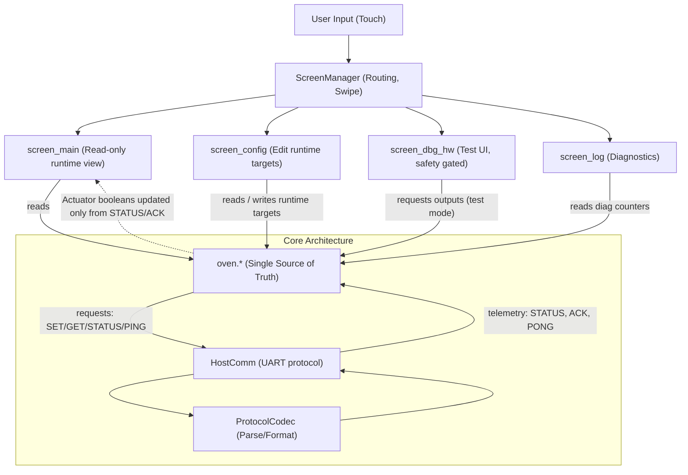

# Workflow: UI ↔ oven ↔ HostComm

## Überblick

Dieses Diagramm zeigt den „roten Faden“ der Architektur: UI ist Darstellung, `oven.*` ist Wahrheit, `HostComm` ist Transport.

## Praktische Regeln

- UI liest `OvenRuntimeState` und rendert.
- User-Aktionen rufen **nur** API-Funktionen in `oven.*` auf (Policy/Requests).
- `oven_comm_poll()` ist der einzige RX-Pfad (UART, non-blocking).
- `oven_tick()` ist der einzige Ort, an dem der Countdown läuft (1 Hz).

## ACK vs STATUS

- `STATUS` liefert periodisch Telemetrie.
- `ACK` kann für „schnellere UI-Rückmeldung“ genutzt werden, bleibt aber weiterhin Remote Truth.
