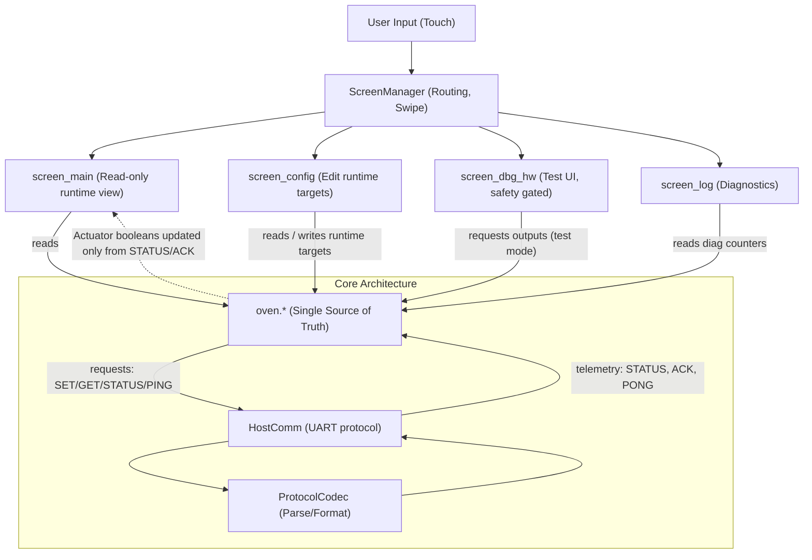

# Workflow: UI ↔ oven ↔ HostComm

## Overview

This diagram shows the core architecture: UI is presentation, `oven.*` holds the truth, `HostComm` is transport.

## Practical Rules

- UI reads `OvenRuntimeState` and renders.
- User actions call **only** `oven.*` APIs (policy/requests).
- `oven_comm_poll()` is the single RX path (UART, non-blocking).
- `oven_tick()` is the only place where the countdown runs (1 Hz).

## ACK vs STATUS

- `STATUS` delivers periodic telemetry.
- `ACK` can be used for faster UI feedback, but it still reflects remote truth.
