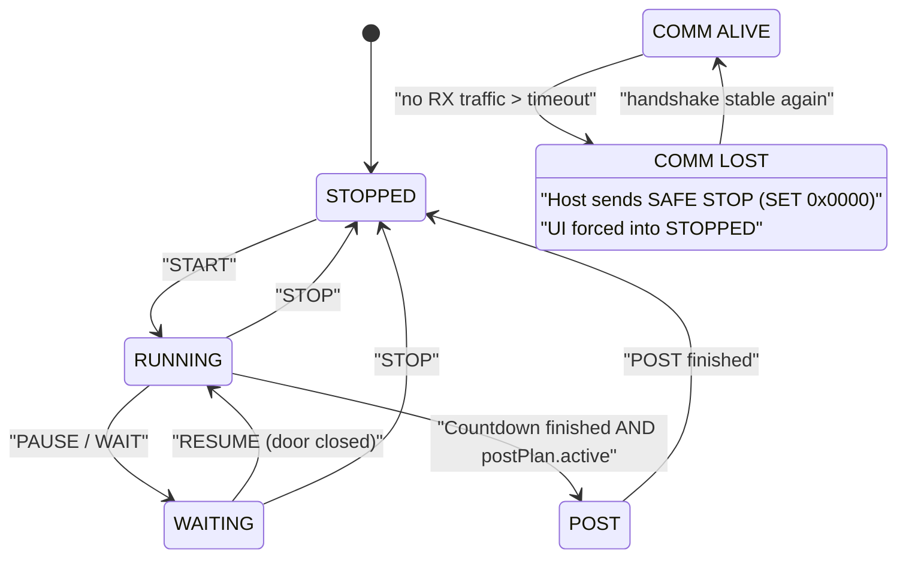

# Zustände und Flags

## Zustandsautomat (Host-Sicht)

## Bedeutungen

- `mode` (STOPPED/RUNNING/WAITING/POST) ist der **primäre** UI-Zustand.
- `running` ist ein Legacy-Flag (Übergangsphase), langfristig durch `mode` ersetzbar.
- `linkSynced` sagt: Handshake stabil (PONG-Streak).
- `commAlive` sagt: RX-Traffic ist frisch genug (Timeout nicht überschritten).

## Safety-Fall

Wenn RX-Traffic ausbleibt:

- Host sendet einmalig „SAFE STOP“ (SET 0x0000)
- UI wird lokal in STOPPED gezwungen (kein „stale green“)
- LinkSync wird zurückgesetzt, damit die Wiederkehr sauber neu synchronisiert
