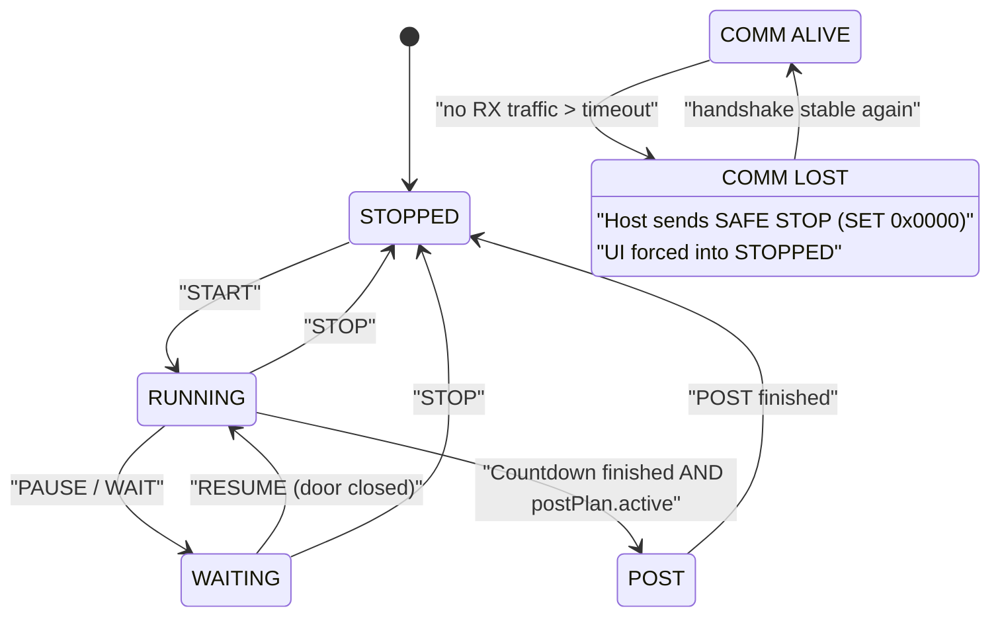

# States and Flags

## Host-Side State Machine

## Meanings

- `mode` (STOPPED/RUNNING/WAITING/POST) is the primary UI state.
- `running` is a legacy flag (transition period), intended to be replaced by `mode`.
- `linkSynced` means: handshake is stable (PONG streak).
- `commAlive` means: RX traffic is fresh enough (timeout not exceeded).

## Safety Case

When RX traffic stops:

- host sends a one-time “SAFE STOP” (SET 0x0000)
- UI is locally forced into STOPPED (no stale green indicators)
- LinkSync is cleared so recovery re-handshakes cleanly
