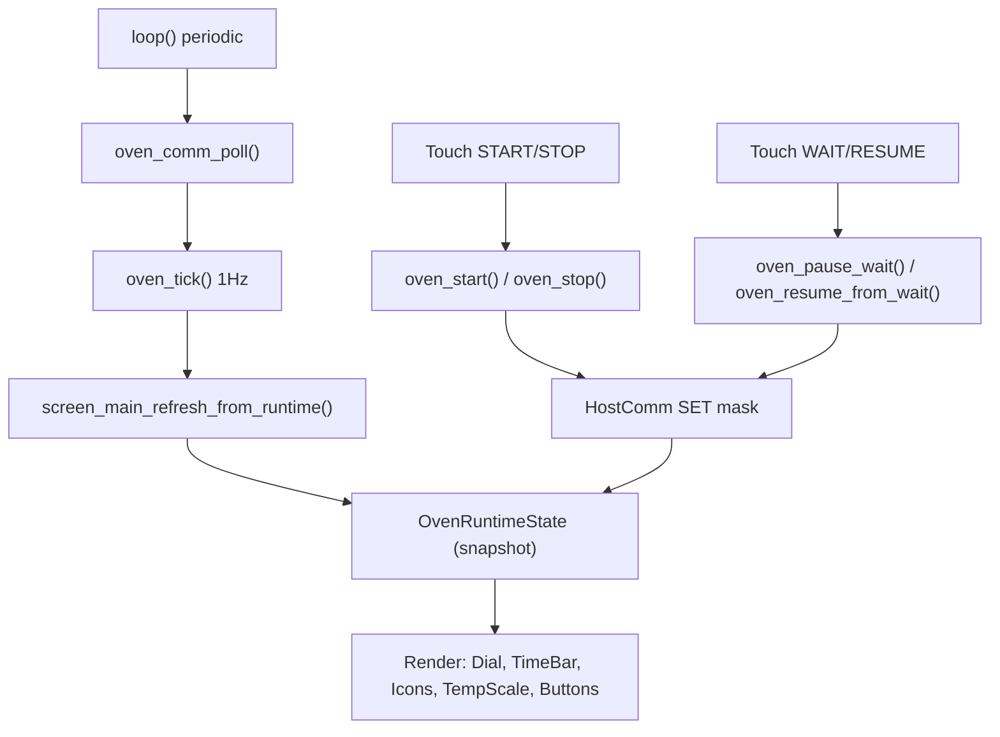

# screen_main – Laufzeitansicht

## Zweck

- Primäre Ansicht im Betrieb
- Zeigt: Zeit, Dial/Countdown, Preset, Icons (Actuators), Temperatur-Skala
- Bedienung: START/STOP sowie WAIT/RESUME

## Workflow

## Regeln

- Icons zeigen Remote Truth (STATUS/ACK), nicht „Wunschzustand“
- Navigation im RUNNING stark eingeschränkt (main ↔ log)
