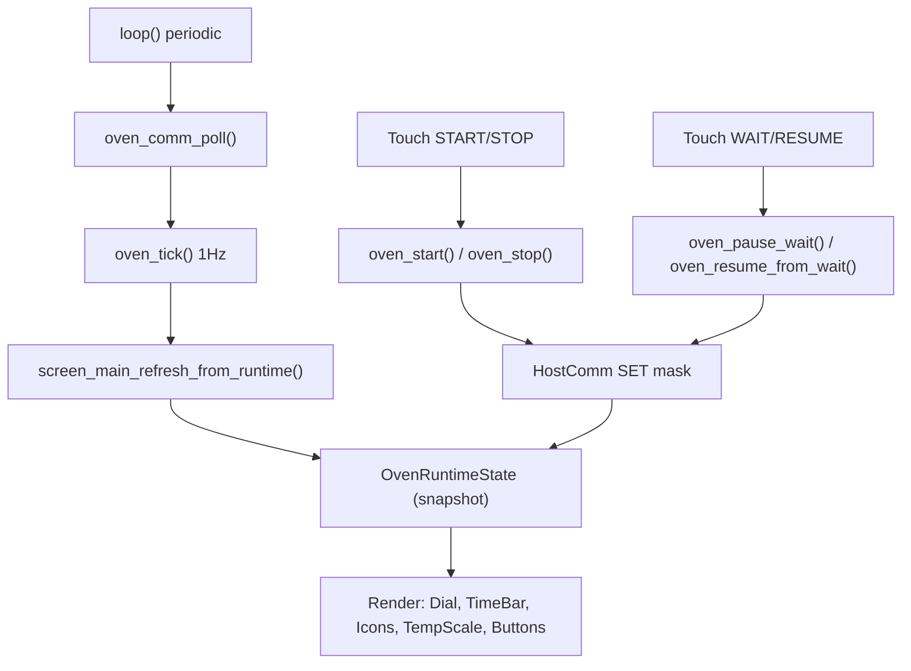

# screen_main – Runtime View

## Purpose

- Primary runtime view during operation
- Shows: time, dial/countdown, preset, actuator icons, temperature scale
- Controls: START/STOP and WAIT/RESUME

## Workflow

## Rules

- Icons reflect remote truth (STATUS/ACK), not “desired state”
- Navigation while RUNNING is restricted (main ↔ log)
