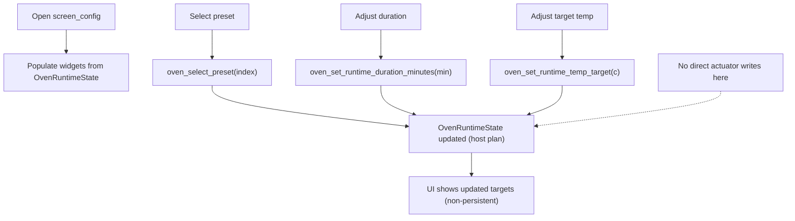

# screen_config – Konfiguration

## Zweck

- Preset auswählen
- Laufzeitparameter (Dauer, Temperatur) anpassen (nicht persistent)

## Workflow

## Wichtige Eigenschaft

- Änderungen betreffen den Host-Plan (Runtime Targets)
- Keine direkten Aktuator-Schreibzugriffe aus diesem Screen
