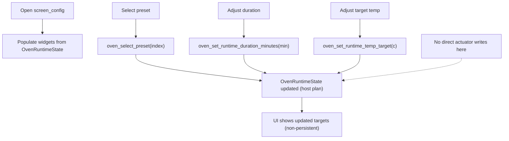

# screen_config – Configuration

## Purpose

- Select preset
- Adjust runtime targets (duration, temperature) (non-persistent)

## Workflow

## Key Property

- Changes update the host plan (runtime targets)
- No direct actuator writes from this screen
