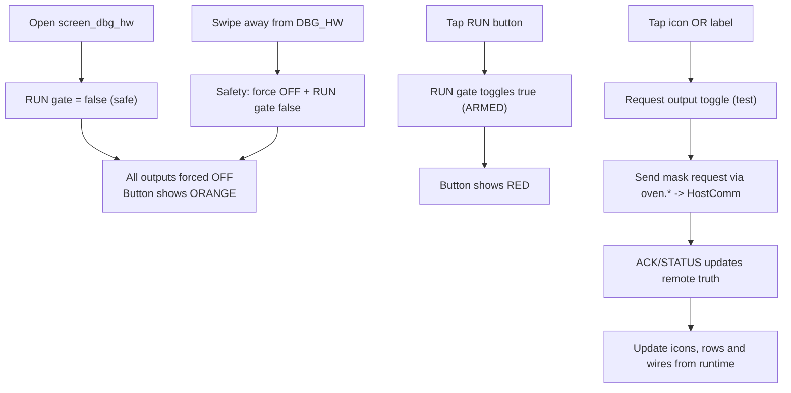

# screen_dbg_hw – Hardware-Testscreen (Safety)

## Zweck

- Testscreen für Hardware/Ports (nur wenn nicht RUNNING)
- Zusätzliche Safety-Mechanismen (RUN-Gate, Swipe-away safe off)
- Optional: komfortableres Togglen über Icon **und** Label

## Workflow

## Safety-Details

- `RUN gate` default: **false** (orange)
- Erst wenn `RUN gate` true: Icon/Label toggles senden Requests
- Swipe weg vom Screen: Outputs OFF + RUN gate zurücksetzen
