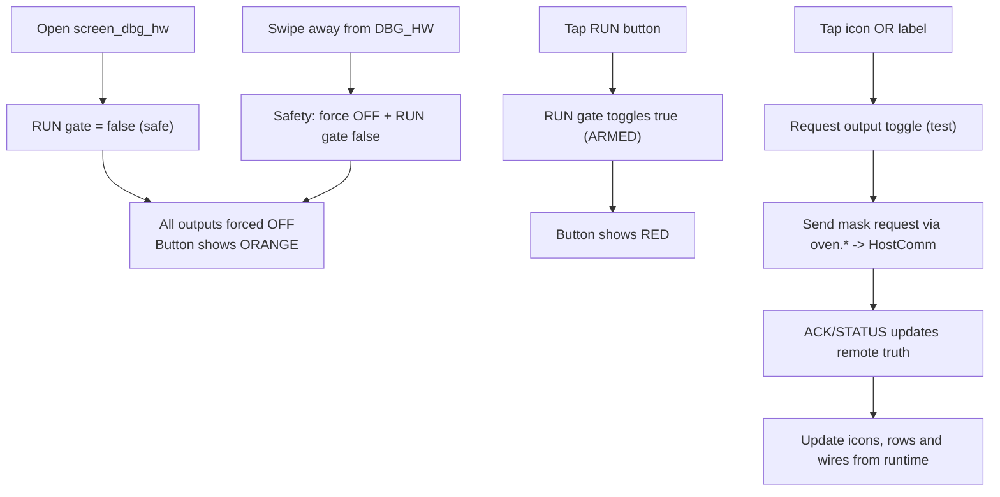

# screen_dbg_hw – Hardware Debug Screen (Safety)

## Purpose

- Hardware/port test screen (only when not RUNNING)
- Extra safety mechanisms (RUN gate, swipe-away safe off)
- Optional: easier toggling via icon **and** label

## Workflow

## Safety Details

- `RUN gate` default: false (orange)
- Only when `RUN gate` true: icon/label toggles send requests
- Swiping away from the screen: outputs OFF + reset RUN gate
