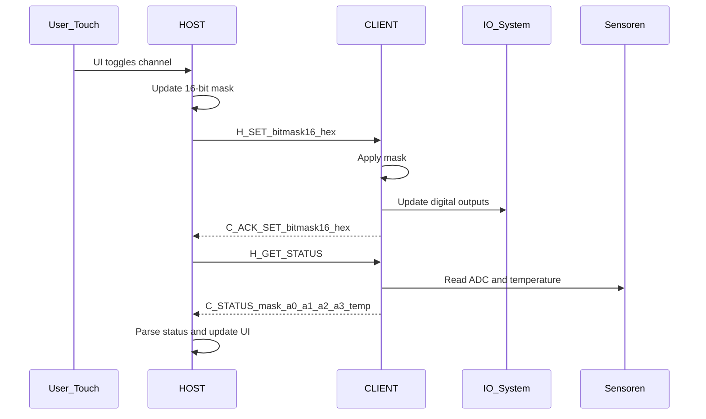

# ESP32-S3 ↔ ESP32-WROOM Kommunikationsprotokoll (Schritt 2 Dokumentation)

## Zusammenfassung der Anforderungen

Dieses Dokument beschreibt das Kommunikationsprotokoll zwischen dem **HOST** (ESP32-S3) und dem **CLIENT** (ESP32-WROOM).  
Der HOST stellt eine Touchscreen-Benutzeroberfläche bereit, während der CLIENT bis zu **16 Kanäle** steuert und Sensordaten erfasst.  
Die Kommunikation erfolgt über **UART** mit einem strukturierten **ASCII-Textprotokoll**.

### Systemanforderungen

- **16 Kanäle insgesamt**
  - **12 digitale IN/OUT-Kanäle** (CH0–CH11)
  - **4 hybride Kanäle** (CH12–CH15), die unterstützen:
    - Digital IN/OUT
    - Analogmessung (ADC-Rohwerte)
- **Temperaturmessung** über MAX6675 Thermoelementmodul (am CLIENT angeschlossen).
- **UART-basiertes ASCII-Protokoll**, leicht debugbar.
- **16-Bit-Digitalmaske** (Hex-Darstellung) zur Kanalsteuerung.
- **4 ADC-Werte** (0–4095) für die analogen Kanäle.
- **Temperaturwert** in 0,25°C Auflösung (`temp_raw = °C × 4`).

---

# Schritt 2 – Spezifikation des Kommunikationsprotokolls

## 1. Kanaldefinition

### 1.1 Kanalübersicht

| Kanal | Bit | Maske  | Typ               | Beschreibung       |
| ----- | --- | ------ | ----------------- | ------------------ |
| CH0   | 0   | 0x0001 | Digital IN/OUT    | z. B. Heater       |
| CH1   | 1   | 0x0002 | Digital IN/OUT    | z. B. Fan230V      |
| CH2   | 2   | 0x0004 | Digital IN/OUT    | z. B. Fan230V-Slow |
| CH3   | 3   | 0x0008 | Digital IN/OUT    | z. B. Fan12V       |
| CH4   | 4   | 0x0010 | Digital IN/OUT    | z. B. Lampe        |
| CH5   | 5   | 0x0020 | Digital IN/OUT    | z. B. Motor        |
| CH6   | 6   | 0x0040 | Digital IN/OUT    | frei               |
| CH7   | 7   | 0x0080 | Digital IN/OUT    | frei               |
| CH8   | 8   | 0x0100 | Digital IN/OUT    | frei               |
| CH9   | 9   | 0x0200 | Digital IN/OUT    | frei               |
| CH10  | 10  | 0x0400 | Digital IN/OUT    | frei               |
| CH11  | 11  | 0x0800 | Digital IN/OUT    | frei               |
| CH12  | 12  | 0x1000 | Digital + Analog0 | ADC-Kanal 0        |
| CH13  | 13  | 0x2000 | Digital + Analog1 | ADC-Kanal 1        |
| CH14  | 14  | 0x4000 | Digital + Analog2 | ADC-Kanal 2        |
| CH15  | 15  | 0x8000 | Digital + Analog3 | ADC-Kanal 3        |

---

### 1.2 Digitalmaske (16 Bit)

Eine **16-Bit-Hex-Maske** repräsentiert die digitalen Zustände aller Kanäle:

- `0000` → alle Kanäle LOW  
- `0001` → CH0 HIGH  
- `0019` → CH0 + CH3 + CH4 HIGH  
- `8001` → CH0 und CH15 HIGH  

Immer **4 Hex-Zeichen** senden (z. B. `000F`, `01A3`, etc.).

---

## 2. Analoge Eingänge (4 Kanäle)

Die analogen Messwerte werden vom CLIENT geliefert:

| ADC Input | Kanal | Feldname im Protokoll |
| --------- | ----- | --------------------- |
| ADC0      | CH12  | adc0_raw              |
| ADC1      | CH13  | adc1_raw              |
| ADC2      | CH14  | adc2_raw              |
| ADC3      | CH15  | adc3_raw              |

Wertebereich: **0–4095**

Die Umrechnung in Spannung (z. B. 0–5 V) erfolgt ausschließlich im HOST.

---

## 3. Temperaturmessung (MAX6675)

- MAX6675 liefert Temperatur in 0,25°C-Schritten.
- Übertragung im Protokoll:

```
temp_raw = °C × 4
```

Beispiele:  
- 25,00°C → `100`  
- 123,75°C → `495`  

---

## 4. UART-Protokollstruktur

Grundstruktur aller Nachrichten:

```
<Sender>;<Command>[;Argument1;Argument2;...]\r\n
```

- **Sender:**  
  - `H` = HOST  
  - `C` = CLIENT  
- **Trennzeichen:** `;`  
- **Ende der Nachricht:** `
`  

---

# 5. Befehle und Antworten

## 5.1 HOST → CLIENT

### 5.1.1 SET – Schreiben der digitalen Kanäle

Setzt den Zustand aller 16 digitalen Kanäle.

```
H;SET;<bitmask16_hex>

```

**Beispiel:**  

Heater (CH0), Fan12V (CH3) und Lampe (CH4) EIN → Maske `0019`

```
H;SET;0019

```

---

### 5.1.2 GET STATUS – Statusanforderung

```
H;GET;STATUS

```

---

### 5.1.3 PING

```
H;PING

```

---

## 5.2 CLIENT → HOST

### 5.2.1 ACK / ERR für SET

Erfolg:

```
C;ACK;SET;<bitmask16_hex>

```

Fehler:

```
C;ERR;SET;<error_code>

```

---

### 5.2.2 STATUS – kompletter Systemstatus

**Erweitertes STATUS-Format:**

```
C;STATUS;<bitmask16_hex>;<adc0_raw>;<adc1_raw>;<adc2_raw>;<adc3_raw>;<temp_raw>

```

**Beispiel:**

```
C;STATUS;0013;1000;2000;3000;4095;100

```

---

### 5.2.3 PONG

Antwort auf `PING`:

```
C;PONG

```

---

# Diagramme
## Sequenz-Diagramm


## Zustandsdiagramm - HOST

```mermaid
stateDiagram-v2
    [*] --> INIT

    INIT --> IDLE: UART initialisieren\nProtokollzustand zurücksetzen

    state IDLE {
        [*] --> READY
        READY --> READY: UI-Ereignis (Button)\n→ Bitmaske ändern\n→ ggf. SET anstoßen
    }

    IDLE --> SEND_SET: UI-Änderung\n→ neue Bitmaske senden
    SEND_SET --> WAIT_ACK: H;SET;<bitmask>\r\n gesendet

    WAIT_ACK --> IDLE: C;ACK;SET;...\nEmpfangen OK
    WAIT_ACK --> ERROR: C;ERR;SET;...\noder Timeout

    IDLE --> REQUEST_STATUS: Poll-Zyklus\noder nach SET
    REQUEST_STATUS --> WAIT_STATUS: H;GET;STATUS\r\n gesendet

    WAIT_STATUS --> IDLE: C;STATUS;... empfangen\nDaten übernehmen, UI aktualisieren
    WAIT_STATUS --> ERROR: Timeout oder Parserfehler

    ERROR --> IDLE: Fehler quittiert / Reset\nKommunikation neu starten
```



## Zustandsdiagramm - CLIENT

```mermaid
stateDiagram-v2
    [*] --> INIT

    INIT --> IDLE: UART, GPIO, ADC,\nSPI (MAX6675) initialisieren

    state IDLE {
        [*] --> WAIT_CMD
        WAIT_CMD --> WAIT_CMD: Keine Daten / Idle\n(ggf. zyklisch STATUS senden)
    }

    IDLE --> PROCESS_SET: Kommando H;SET;... empfangen\nMaske parsen
    PROCESS_SET --> UPDATE_OUTPUTS: Digitale Ausgänge setzen\nBitmaske anwenden
    UPDATE_OUTPUTS --> SEND_ACK: C;ACK;SET;<bitmask>\r\n
    SEND_ACK --> IDLE

    IDLE --> PROCESS_GET_STATUS: Kommando H;GET;STATUS empfangen
    PROCESS_GET_STATUS --> READ_SENSORS: ADC0–ADC3 + MAX6675 lesen
    READ_SENSORS --> SEND_STATUS: C;STATUS;... senden
    SEND_STATUS --> IDLE

    IDLE --> PROCESS_PING: H;PING\r\n empfangen
    PROCESS_PING --> SEND_PONG: C;PONG\r\n
    SEND_PONG --> IDLE

    IDLE --> ERROR: Parserfehler / ungültiger Befehl
    ERROR --> IDLE: ggf. C;ERR;...\r\n senden\noder nur intern loggen
```



# Ende des Dokuments
