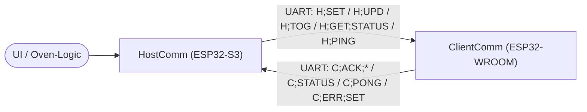
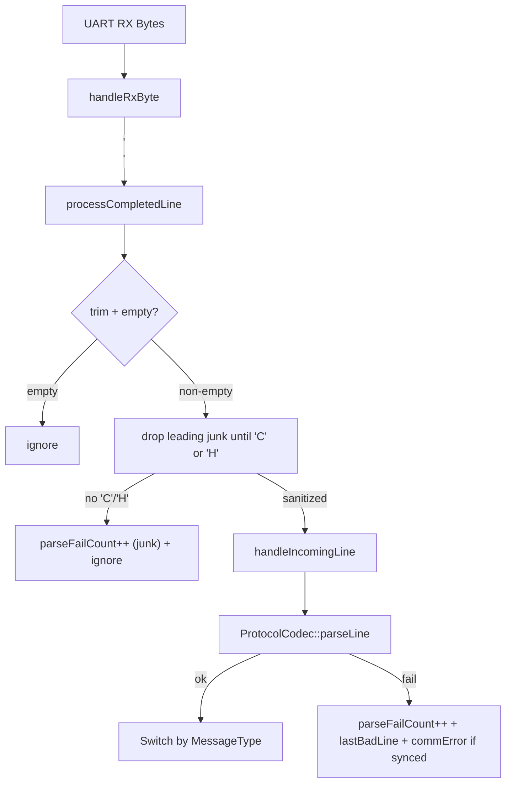
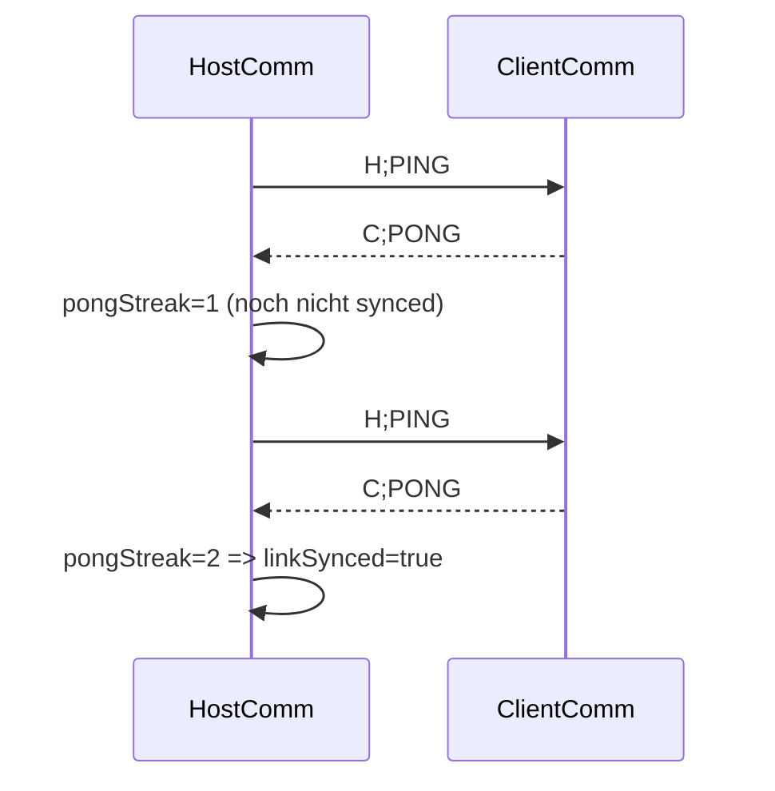
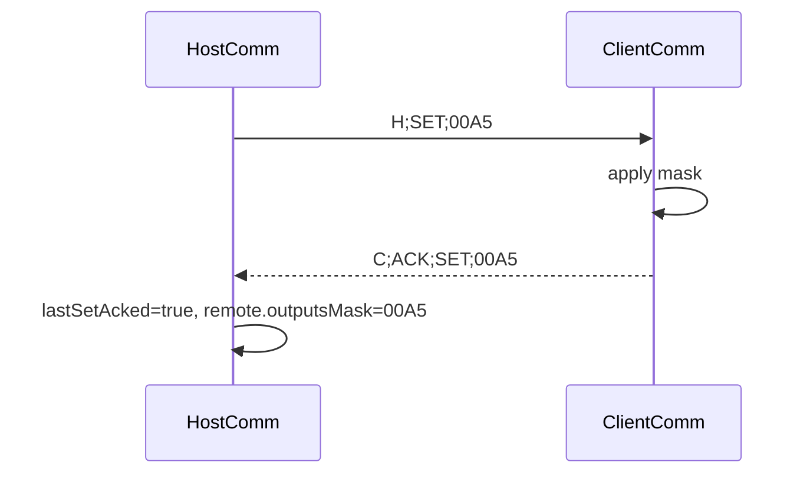
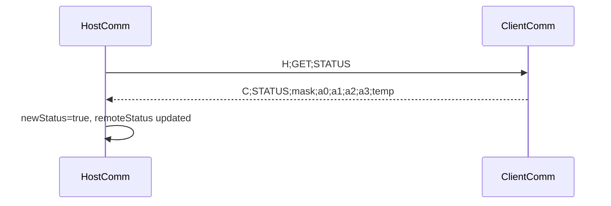

# ESP32 Host-Client Kommunikationsprotokoll – HostComm Dokumentation

## HostComm – Überblick

**Datei:** `HostComm.cpp/.h`  
**Aktuelle Version:** **0.2 (2026-01-07)**  
**Ziel:** Robuste, nicht-blockierende UART-Kommunikation auf der **HOST-Seite (ESP32-S3)** gegenüber dem **CLIENT (ESP32-WROOM)**, geprüft über **16 Testcases**.

### Versionshistorie

- **0.2 (2026-01-07)** – stabilere, robuste Version; RX-Sanitizing, Link-Sync (PONG-Streak), Test-Hooks (`processLine`, `processRxBytes`), Parse-Fail-Zählung
- **0.1 (2025-12-10)** – initiale Version

---

## Rolle im Gesamtsystem

HostComm sitzt zwischen UI/Logik (z. B. LVGL) und der UART-Verbindung zum Client.



---

## Verantwortlichkeiten

### ✅ HostComm macht

- UART RX **non-blocking** konsumieren (`loop()`)
- Bytes zu Zeilen assemblen (`\n`-terminated, `\r` ignoriert)
- RX-Zeilen **sanitizen** (trim + führenden Junk entfernen)
- Protokoll-Frames parsen (`ProtocolCodec::parseLine`)
- Shadow-Status halten (`ProtocolStatus _remoteStatus`)
- Flags & Getter für UI/Applikation bereitstellen
- Link-Sync/Handshake-Heuristik (PONG-Streak → `linkSynced`)

### ❌ HostComm macht NICHT

- Keine LVGL-Abhängigkeiten
- Keine GPIO/ADC/Temperaturlogik
- Keine blockierenden Delays

---

## Externes Interface (Public API)

### Initialisierung

- `begin(baud, rx, tx)` – startet UART (Serial2) mit RX/TX Pins

### Polling (Non-blocking)

- `loop()` – muss **häufig** aus `loop()` aufgerufen werden

### Host → Client Commands

- `setOutputsMask(mask)` → `H;SET;XXXX`
- `updOutputs(setMask, clrMask)` → `H;UPD;SSSS;CCCC`
- `togOutputs(togMask)` → `H;TOG;TTTT`
- `requestStatus()` → `H;GET;STATUS`
- `sendPing()` → `H;PING`
- `sendRst()` → `H;RST`

### Status / Flags / Diagnostics

- `hasNewStatus()`, `clearNewStatusFlag()`
- `lastSetAcked()`, `clearLastSetAckFlag()`
- `lastUpdAcked()`, `clearLastUpdAckFlag()`
- `lastTogAcked()`, `clearLastTogAckFlag()`
- `lastPongReceived()`, `clearLastPongFlag()`
- `hasCommError()`, `clearCommErrorFlag()`

### Link-Sync / Handshake

- `linkSynced()` – wird aktiv, wenn **mind. 2 PONGs** empfangen wurden
- `pongStreak()` – Zähler für aufeinanderfolgende PONGs
- `clearLinkSync()` – setzt Sync-Status zurück

### Parser-Fail Statistik (für Tests/Debug)

- `parseFailCount()` – Anzahl Parse-Fails / Junk-Lines
- `lastBadLine()` – letzte fehlerhafte/junk Zeile (sanitized)

### Test-Hooks (ohne UART)

- `processLine(line)` – verarbeitet eine *vollständige* Zeile wie aus UART
- `processRxBytes(data,len)` – füttert rohe Bytes (Fragmentation/Burst Tests)

---

## Datenfluss in HostComm

### Byte → Line → Sanitizing → Parsing → State Update



---

## RX-Verarbeitung im Detail

### 1) `loop()` ist nur ein Adapter

`loop()` liest Bytes aus `_serial` und ruft **für jedes Byte** `handleRxByte(c)` auf.  
Damit ist der Byte-Pfad identisch zu den Testcases (`processRxBytes`).

### 2) `handleRxByte(char c)`

- Ignoriert `\r`
- Bei `\n` → `processCompletedLine(_rxBuffer)`
- Sonst Byte an `_rxBuffer` anhängen
- Overflow-Schutz: bei >120 Zeichen → Drop + Warn

### 3) `processCompletedLine(String line)`

**Sanitizing-Strategie** (entscheidend für Boot-Junk/Unsync):

1. `trim()` (Whitespace entfernen)
2. Leere Zeilen ignorieren
3. Führenden Junk entfernen bis erstes `'C'` oder `'H'`
4. Wenn keine gültige Startmarke gefunden:  
   - zählt als Junk → `parseFailCount++`, `lastBadLine = line`  
   - **kein** Hard-Fail (kein `_commError`), damit die Link-Initialphase robust bleibt

---

## Parsing und Fehlerpolitik

### `handleIncomingLine(line)`

- ruft `ProtocolCodec::parseLine(...)` auf
- Bei Parse-Fail:
  - `parseFailCount++`
  - `lastBadLine = line`
  - **nur wenn `linkSynced==true`** → `_commError = true`  
    (nach Sync gilt: “Frame muss sauber sein”)

**Warum diese Logik?**  
In der Boot-/Reset-Phase kann es zu Steuerzeichen / Fragmenten / Restbytes kommen.  
Die Tests haben gezeigt: Sobald Link stabil ist, sollen Parse-Fails als Kommunikationsfehler erkennbar werden.

---

## Nachrichtenbehandlung (Switch / MessageType)

### Client → Host

| MessageType    | Beispiel         | Wirkung                                                          |
| -------------- | ---------------- | ---------------------------------------------------------------- |
| `ClientPong`   | `C;PONG`         | `_lastPong=true`, `_pongStreak++`, ab `>=2` → `_linkSynced=true` |
| `ClientStatus` | `C;STATUS;....`  | `_remoteStatus = statusTmp`, `_newStatus=true`                   |
| `ClientAckSet` | `C;ACK;SET;XXXX` | `_lastSetAcked=true`, `_remoteStatus.outputsMask=mask`           |
| `ClientAckUpd` | `C;ACK;UPD;XXXX` | `_lastUpdAcked=true`, `_remoteStatus.outputsMask=mask`           |
| `ClientAckTog` | `C;ACK;TOG;XXXX` | `_lastTogAcked=true`, `_remoteStatus.outputsMask=mask`           |
| `ClientErrSet` | `C;ERR;SET;code` | `_commError=true` (echter Protocol-Error)                        |
| `ClientRst`    | `C;RST`          | `_linkSynced=false`, `_pongStreak=0`                             |

**Default / Unexpected:** Parse war ok, aber Typ passt nicht → `_commError=true`

---

## Sequenzen (Beispiele)

### Ping / Pong Link-Sync



### SET + ACK;SET



### GET/STATUS



---

## Empfohlene Einbindung (Host / ESP32-S3)

```cpp
#include "HostComm.h"

static constexpr uint32_t BAUD = 115200;
static constexpr uint8_t RX_PIN = 2;
static constexpr uint8_t TX_PIN = 40;

HostComm g_host(Serial2);

void setup() {
  Serial.begin(115200);
  g_host.begin(BAUD, RX_PIN, TX_PIN);
}

void loop() {
  g_host.loop();

  // Beispiel: Status poll
  // if (shouldPoll()) g_host.requestStatus();

  if (g_host.hasNewStatus()) {
    const ProtocolStatus &st = g_host.getRemoteStatus();
    // UI / Logik aktualisieren
    g_host.clearNewStatusFlag();
  }
}
```

---

## Hinweise aus den Testcases (Praxis-Learnings)

- **Nie `return` innerhalb der RX-Consume-Schleife**, außer explizit gewollt: sonst bleibt RX-Buffer liegen und erzeugt Artefakte.
- **Sanitizing** (trim + leading junk drop) ist notwendig, um sporadische Steuerzeichen / Boot-Junk abzufangen.
- **Parse-Fails vor Sync**: tolerieren (nur zählen), damit die Link-Initialphase stabil wird.
- **Parse-Fails nach Sync**: als `_commError` auswerten (Hard-Fail), um echte Linkprobleme sichtbar zu machen.
- `processRxBytes()` ist der Schlüssel für **Fragmentation/Burst Tests** und sollte als offizieller Test-Einstiegspunkt beibehalten werden.

---

## Fazit

HostComm v0.2 stellt eine **robuste, testbare und LVGL-taugliche** Host-UART-Schicht dar.  
Durch den einheitlichen Byte-Pfad (`handleRxByte`) und die Sanitizing-Logik sind sowohl reale UART-Frames als auch synthetische Tests identisch behandelbar – ein wesentlicher Grund für die erreichte Stabilität nach den 16 Testcases.

---
