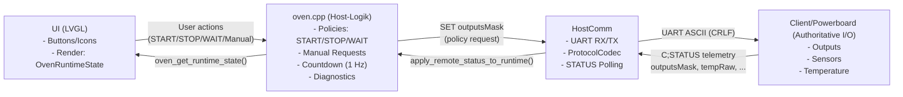
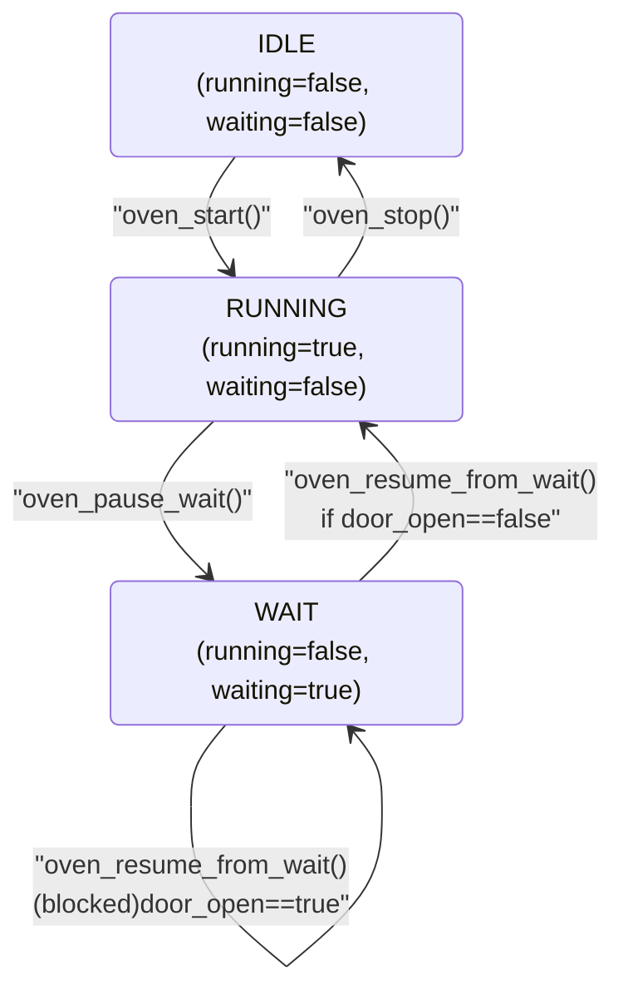
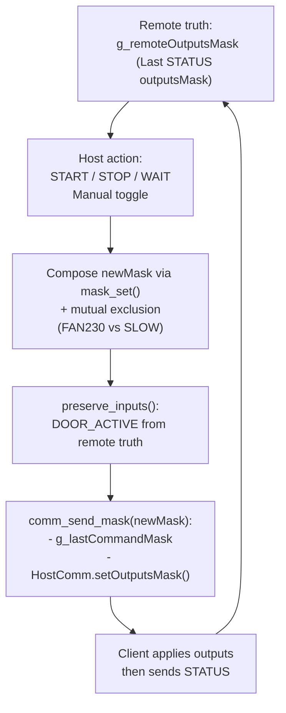
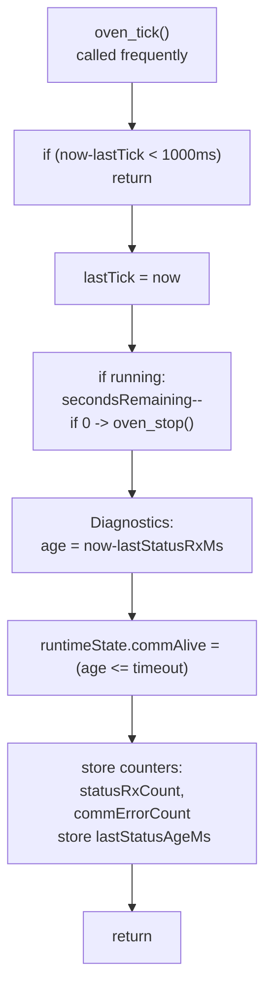
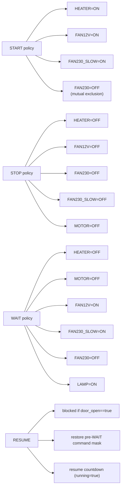

# oven_processing.md

## Ziel

Diese Dokumentation gibt eine **visuelle Übersicht** über die zentrale Funktionsweise von `oven.cpp` im **T6-Stand**:

- ESP32-S3 (**Host/UI**) kommuniziert per UART über `HostComm` mit dem ESP32-WROOM (**Client/Powerboard**).
- Der **Client ist autoritativ** für **Outputs** (Heater/Fans/Motor/Lamp) und **Sensoren** (z. B. Tür).
- Die UI rendert ausschließlich aus `OvenRuntimeState` (**Single Source of Truth** auf Host-Seite).
- Host sendet **Policy-Masken** (START/STOP/WAIT/Manual Requests), übernimmt den **Ist-Zustand** ausschließlich aus **STATUS-Telemetrie**.

> Hinweis zu Mermaid: Alle Texte sind in `"` gesetzt, um Rendering-Probleme zu vermeiden.

---

## 1) Architektur & Datenfluss

### Diagramm: System- und Datenfluss (Flowchart)



### Erläuterung

- **UI → oven.cpp:** Die UI löst Aktionen aus (Start/Stop/Wait/Manual Toggle).  
- **oven.cpp → HostComm:** `oven.cpp` übersetzt Aktionen in **Masken-Policies** und sendet sie als **SET** an den Client.  
- **Client → HostComm → oven.cpp:** Der Client sendet `C;STATUS` zurück. Erst dann werden in `apply_remote_status_to_runtime()` die **Ist-Zustände** in `runtimeState` übernommen.  
- **oven.cpp → UI:** Die UI rendert ausschließlich aus dem Snapshot `OvenRuntimeState` (über `oven_get_runtime_state()`).

---

## 2) Zustandsautomat (Start / Stop / Wait / Resume)

### Diagramm: Zustände und Übergänge (State Diagram)



### Erläuterung

- **IDLE:** Ofen ist nicht aktiv, kein Wait.  
- **RUNNING:** Countdown läuft (nur in `oven_tick()`), Policies können gesendet werden.  
- **WAIT:** Countdown ist eingefroren (Host setzt `running=false`), der Host sendet eine **Safety-Policy** an den Client (Heater/Motor aus, Kühlung an, Lampe an).  
- **RESUME-Sperre:** `oven_resume_from_wait()` darf nicht fortsetzen, wenn `door_open` (aus Telemetrie) wahr ist.

---

## 3) Kommunikations-Loop & Telemetrie-Übernahme

### Diagramm: Ablauf in `oven_comm_poll()` (Sequence Diagram)

```mermaid
sequenceDiagram
  participant LOOP as loop()
  participant COMM as oven_comm_poll()
  participant HC as HostComm
  participant CLIENT as Client/Powerboard
  participant APPLY as apply_remote_status_to_runtime()

  LOOP->>COMM: call frequently
  COMM->>HC: HC.loop()<br>(non-blocking RX parse)

  COMM->>HC: periodically: requestStatus()
  HC->>CLIENT: UART: request STATUS
  CLIENT-->>HC: UART: C#semi; STATUS
  
  COMM->>HC: if hasNewStatus()
  COMM->>APPLY: apply_remote_status_to_runtime(status)
  APPLY-->>APPLY: update runtimeState (truth)<br>update g_remoteOutputsMask<br>update timestamps/counters
  COMM->>HC: clearNewStatusFlag()
  COMM->>HC: if hasCommError(): count + code
```

### Erläuterung

- `oven_comm_poll()` wird **häufig** im Loop aufgerufen.
- `HostComm.loop()` liest UART **non-blocking** und setzt intern Flags (`hasNewStatus`, `hasCommError`).
- Alle `kStatusPollIntervalMs` wird `requestStatus()` ausgelöst.
- Nur wenn `hasNewStatus()` wahr ist, wird Telemetrie via `apply_remote_status_to_runtime()` in `runtimeState` übernommen.
- Kommunikations-/Parsingfehler werden gezählt (`commErrorCount`).

---

## 4) Masken-Konzept: Remote Truth → Policy Command

### Diagramm: Maskenbildung & Rückkopplung (Flowchart)



### Erläuterung

- `g_remoteOutputsMask` ist die **Basis** für neue Befehle, weil er den zuletzt bestätigten Zustand repräsentiert.
- Der Host verändert diese Basis durch Policies (START/STOP/WAIT) oder Manual Requests.
- `preserve_inputs()` verhindert, dass **input-ähnliche** Bits (hier Tür) vom Host unbeabsichtigt überschrieben werden.
- Der Host merkt sich die zuletzt gesendete Maske in `g_lastCommandMask` (Debug/Trace).
- Erst nach der nächsten STATUS-Telemetrie wird die UI die tatsächlichen Zustände sehen.

---

## 5) Countdown & Diagnose in `oven_tick()` (1 Hz)

### Diagramm: 1-Hz Tick Ablauf (Activity/Flow)



### Erläuterung

- `oven_tick()` läuft intern **1 Hz**, unabhängig davon, wie oft es aufgerufen wird.
- **Countdown** wird ausschließlich dort dekrementiert.
- Parallel wird die **Kommunikationsgesundheit** berechnet:
  - `lastStatusAgeMs`: Alter der letzten STATUS-Telemetrie,
  - `commAlive`: true, wenn Alter kleiner/gleich `kCommAliveTimeoutMs`,
  - `statusRxCount`, `commErrorCount`: laufende Zähler.

---

## 6) Policies: START / STOP / WAIT / RESUME (Masken-Intention)

### Diagramm: Policy-Inhalte (Decision/Flow)



### Erläuterung

- **START** schaltet Heizung und Kühlung ein (SLOW) und erzwingt Ausschluss von FAN230 FAST.  
- **STOP** fährt alle relevanten Aktuatoren herunter.  
- **WAIT** ist ein sicherer Zwischenzustand: Heizung/Motor aus, Kühlung an, Lampe an.  
- **RESUME** ist nur erlaubt, wenn `door_open` (Telemetrie) false ist, und stellt die **pre-WAIT Maskenintention** wieder her.

---

## 7) Wichtige Designregeln (T6 Leitplanken)

- **UI ist passiv:** UI schreibt nicht direkt in Aktuator-Flags, sie fordert Aktionen an.
- **Actuator Flags sind Remote Truth:** `fan/heater/motor/lamp/door` kommen aus `C;STATUS`.
- **Host sendet Requests, nicht Wahrheit:** SET-Masken sind Absicht/Policy, keine Bestätigung.
- **Countdown nur in `oven_tick()`:** UI darf keinen eigenen Countdown führen.
- **Presets sind immutable:** Presets definieren Sollwerte (Dauer/Temp/Rotary), sind nicht persistent editierbar (Runtime-Anpassungen sind “bis Reset”).

---

## Ende
