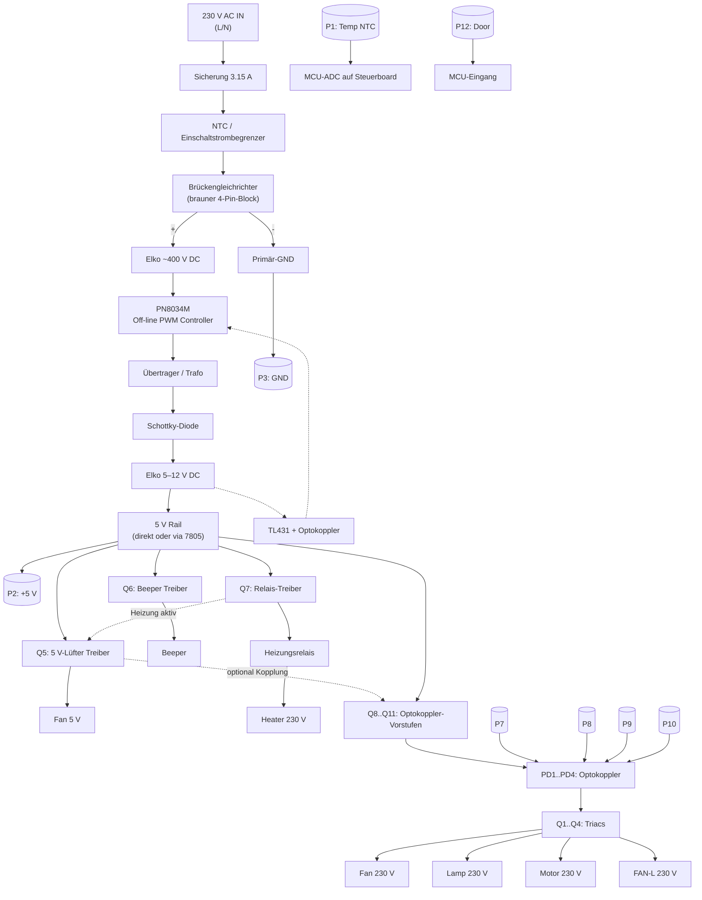

```mermaid
flowchart TD
  A["230 V AC IN\n(L/N)"] --> F["Sicherung 3.15 A"]
  F --> NTC[NTC / Einschaltstrombegrenzer]
  NTC --> BR["Brückengleichrichter<br/>(brauner 4-Pin-Block)"]
  BR -->|+| C400["Elko ~400 V DC"]
  BR -->|-| PGND["Primär-GND"]

  C400 --> PN["PN8034M<br/>Off-line PWM Controller"]
  PN --> TR["Übertrager / Trafo"]

  %% Sekundär
  TR --> SD["Schottky-Diode"]
  SD --> C5V["Elko 5–12 V DC"]
  C5V --> VREG["5 V Rail<br/>(direkt oder via 7805)"]
  C5V -.-> FB["TL431 + Optokoppler"]
  FB -.-> PN

  %% Low-Voltage Seite zu Steuerboard
  VREG --> P2[(P2: +5 V)]
  PGND ---> P3[(P3: GND)]

  %% Sensoren/Eingänge
  P1[(P1: Temp NTC)] --> ADC[MCU-ADC auf Steuerboard]
  DOOR[(P12: Door)] --> MCUin[MCU-Eingang]

  %% 5V-Lasten
  VREG --> Q5[Q5: 5 V-Lüfter Treiber]
  Q5 --> FAN5V[Fan 5 V]

  VREG --> Q6[Q6: Beeper Treiber]
  Q6 --> BEEP[Beeper]

  %% Relais/Heizung
  VREG --> Q7[Q7: Relais-Treiber]
  Q7 --> RELAY[Heizungsrelais]
  RELAY --> HEAT[Heater 230 V]

  %% Gekoppelte Logik (Beispiele)
  Q7 -. Heizung aktiv .-> Q5
  Q5 -. optional Kopplung .-> Q8

  %% Optokoppler/Triacs Hochvolt
  VREG --> Q8[Q8..Q11: Optokoppler-Vorstufen]
  Q8 --> PD1[PD1..PD4: Optokoppler]
  PD1 --> T1[Q1..Q4: Triacs]

  %% Lasten 230V
  T1 --> FAN230[Fan 230 V]
  T1 --> LAMP[Lamp 230 V]
  T1 --> MOTOR[Motor 230 V]
  T1 --> FANL[FAN-L 230 V]

  %% Stecker-Pins zu Hochvolt-Ausgängen
  P7[(P7)] --> PD1
  P8[(P8)] --> PD1
  P9[(P9)] --> PD1
  P10[(P10)] --> PD1
```