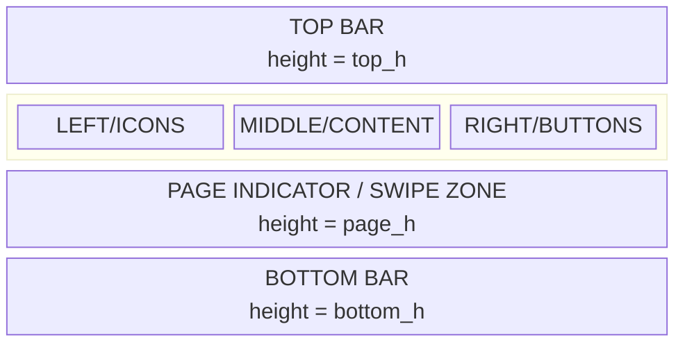
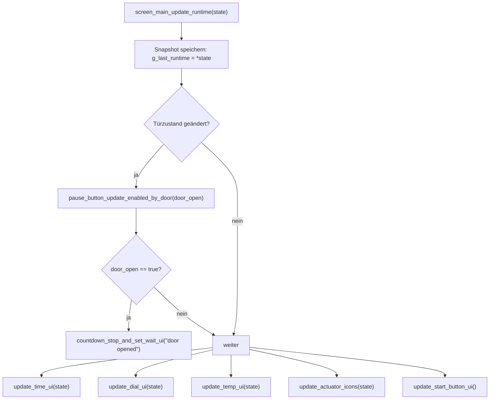

# screen_main – Architektur & Funktionsweise

Dieses Dokument beschreibt den Aufbau und die Laufzeitlogik des **Main Screens** (`screen_main.h/.cpp`) für dein ESP32‑S3/LVGL‑Projekt. Ziel ist, dass ein Entwickler den Ansatz schnell versteht und sicher weiterentwickeln kann.

---

## Ziel der UI

Die UI soll auf einen Blick liefern:

- **Restzeit & Fortschritt**: oben (Progressbar + Label)
- **Countdown‑Visualisierung**: Mitte (Dial + Zeiger)
- **Aktoren‑Status**: links (Icons ON/OFF via Recolor)
- **Preset/Filament**: Dial‑Center Box (Name + `#ID`)
- **Temperatur**: unten (Bar + Target/Current Marker + Labels)

---

## Screen-Aufbau

### Top Bar

- `time_bar`: zeigt den **Elapsed**‑Anteil (0..total)
- `time_label_remaining`: zeigt **Restzeit** (kompakt)

Hinweis: Wenn der UI‑Countdown aktiv ist (`g_countdown_tick != nullptr`), wird die Top‑Bar **nicht** aus dem Runtime‑Update überschrieben (Flicker‑Vermeidung).

### Center

#### Icon-Spalte (links)

- Weißes PNG + Recolor:
  - OFF: Recolor‑OPA transparent (Icon bleibt weiß)
  - ON: Recolor‑OPA cover (Icon wird eingefärbt)

Manuelle Interaktion:
- Lampe: immer toggelbar (`oven_lamp_toggle_manual()`)
- Fan230: toggelbar für „Manual Cooldown“ vor Start (`oven_fan230_toggle_manual()`)

Debug:
- Door‑Icon kann (optional) eine simulierte Tür toggeln, um WAIT‑Flow zu testen.

#### Dial (Mitte)

- `lv_scale` für die Skala
- Needles als `lv_line` mit **mutable points**
- `needles_init_cb()` läuft als one‑shot Timer, um erst nach Layout‑Finalisierung die Needle‑Radii zu berechnen

#### Preset-Box (Overlay im Dial‑Center)

- Container: `preset_box`
- Labels:
  - `label_preset_name`: Presetname
  - `label_preset_id`: `#<filamentId>`

Font-Fit:
- `pick_preset_font_for_width()` / `preset_name_apply_fit()` wählen L/M/S Font anhand `lv_txt_get_size()`.

### Page Indicator

- `page_dots[]` in einem abgerundeten Panel
- `screen_main_set_active_page()` setzt aktiv/inaktiv Farbe

### Bottom (Temperatur)

- `temp_scale`: horizontale Bar (0..120°C)
- Marker:
  - Target: Triangle (unten), rot
  - Current: Triangle (oben), Farbe abhängig vom Status

Statusfarbe:
- kalt: blau
- ok: grün
- heiß: orange

---

## Laufzeit: Datenfluss

### Eingang

- `screen_main_update_runtime(state)` wird zyklisch von außen aufgerufen
- speichert Snapshot: `g_last_runtime = *state`
- reagiert auf Tür‑State‑Changes (Safety):
  - Tür auf => Countdown stoppen + WAIT UI setzen

### Ausgang (Kommandos)

- START/STOP: `oven_start()` / `oven_stop()`
- WAIT resume: `oven_resume_from_wait()`
- Fan/Lamp: manuelle Toggle‑Calls

---

## Blockaufbau der Screens

## Mermaid Prozess-Ablauf

---

## Erweiterungspunkte

- Config‑Page: Presets/Temp/Zeit editierbar
- Persistenz: kleine Anzahl Profile im NVS (User kann Defaults wählen)
- Zustandsmaschine: „Cooldown“, „Error“, „Door Open“ explizit modellieren
- Preset-Name Handling: statt dynamischem Font-Fit auch hartes Kürzen/Umbenennen (wenn Nutzer das nicht ändern kann)

