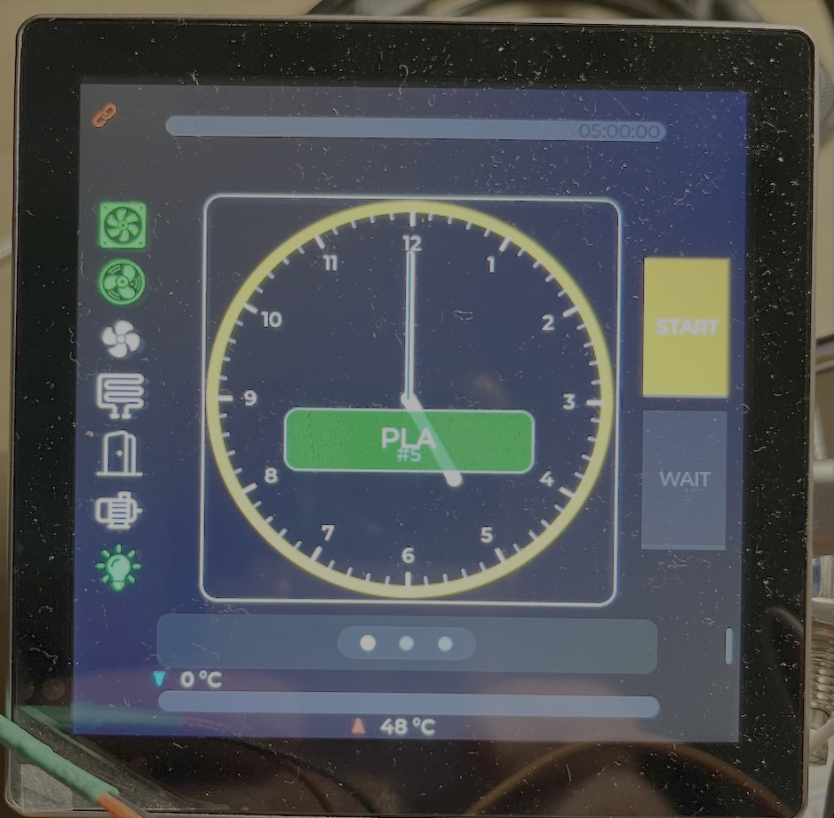
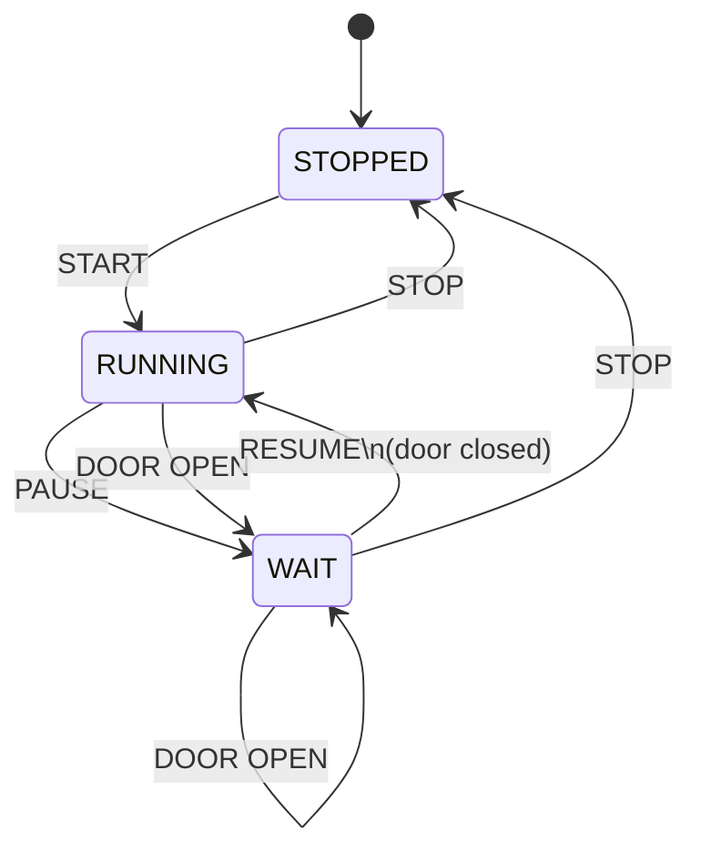
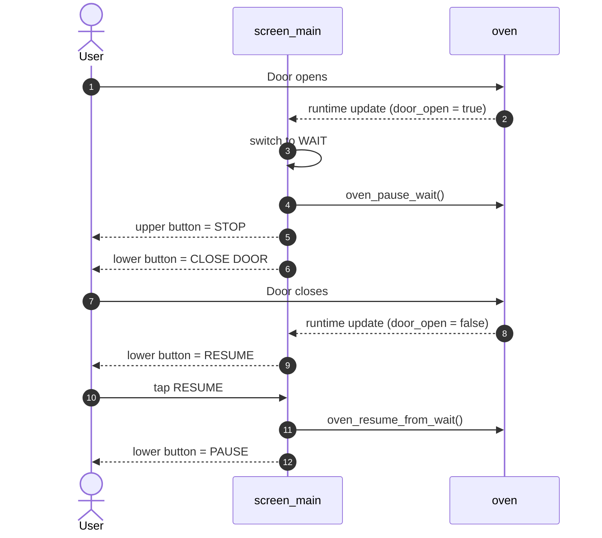

# Screen Main

Der Main Screen ist dein Arbeitsbildschirm. Hier siehst du auf einen Blick, was der Trockner gerade macht, wie lange der Lauf noch dauert, wie warm das System ist und welche Aktion als Nächstes sinnvoll ist.

Diese Struktur ist absichtlich so aufgebaut, dass wir sie später auch für andere Screens wiederverwenden können.

## Kurzüberblick

- Oben siehst du Restzeit und Lauf-Fortschritt.
- In der Mitte bekommst du Status-Icons, den Dial und rechts die beiden Hauptbuttons.
- Unten siehst du die Temperaturbalken für Ist- und Sollwert.
- Zwischen Mitte und unten sitzt der Bereich zum Wechseln der Screens.

## Wofür ist dieser Screen da?

Der Screen soll dir nicht alle Details gleichzeitig um die Ohren hauen. Er soll vor allem drei Fragen schnell beantworten:

1. Läuft das System gerade oder nicht?
2. Ist gerade alles sicher und im erwarteten Zustand?
3. Welche Aktion solltest du jetzt als Nächstes drücken?

Genau deshalb sind die beiden rechten Buttons besonders wichtig. Der obere Button steuert den Lauf grundsätzlich. Der untere Button steuert Unterbrechen, Fortsetzen oder zeigt dir, warum Fortsetzen gerade nicht geht.

## Layout & Bereiche

### Top Bar

- Fortschrittsbalken der Zeit
- Restzeit als Text
- Link-/Safety-Status

### Center Left

- Status-Icons für Fan, Heater, Door, Motor, Lamp
- Die Icons zeigen dir den aktuellen Zustand, nicht die nächste Aktion

### Center Middle

- Dial als zentrale visuelle Laufanzeige
- Preset-Name und Filament-ID im Zentrum

### Center Right

- oberer Button: `START` oder `STOP`
- unterer Button: `PAUSE`, `RESUME` oder `CLOSE DOOR`

### Page / Swipe Zone

- Dots für die Seitenposition
- Swipe-Bereich zum Wechseln der Screens
- darf nicht scrollen

### Bottom

- oberer Temperaturbalken: Chamber-Istwert
- unterer Temperaturbalken: Sollwert
- Hotspot-Hinweis über dem oberen Balken
- Toleranzlinien im unteren Balken

## Bedienidee

Der Screen trennt bewusst zwischen:

- Zustand anzeigen
- Aktion anbieten

Das ist wichtig, weil ein Label wie `WAIT` als Systemzustand okay ist, als Button-Beschriftung aber unklar wird. Ein Button sollte dir immer sagen, was beim Drücken passiert.

Darum gilt auf diesem Screen:

- Der obere Button beschreibt die Hauptaktion des Laufs.
- Der untere Button beschreibt die nächste sinnvolle Nebenaktion.

## Buttons & Aktionen

### Oberer Button

- `START`: startet den Lauf aus `STOPPED`
- `STOP`: beendet den Lauf aus `RUNNING` oder `WAIT`

### Unterer Button

- `PAUSE`: wechselt von `RUNNING` nach `WAIT`
- `RESUME`: setzt einen pausierten Lauf fort
- `CLOSE DOOR`: zeigt dir im `WAIT`-Zustand mit offener Tür, dass zuerst die Tür geschlossen werden muss

## Workflow / States

### Zustandslogik

Der UI-seitige Workflow kennt drei Hauptzustände:

- `STOPPED`
- `RUNNING`
- `WAIT`

`WAIT` ist dabei kein Fehlerzustand, sondern ein bewusster Zwischenzustand:

- manuell pausiert
- oder sicherheitsbedingt durch Tür offen ausgelöst

### State Diagram

### Zustands-Tabelle

| STATE | Oberer Button | Unterer Button | Farbe oben | Farbe unten | Info |
|---|---|---|---|---|---|
| `STOPPED` | `START` | `PAUSE` disabled | orange | grau | Lauf kann gestartet werden, Pause ist hier nicht sinnvoll |
| `RUNNING` | `STOP` | `PAUSE` | rot | orange | Normaler aktiver Betrieb |
| `WAIT` + Tür offen | `STOP` | `CLOSE DOOR` disabled | rot | rot | System wartet sicher, Fortsetzen ist blockiert |
| `WAIT` + Tür geschlossen | `STOP` | `RESUME` | rot | grün | Lauf kann direkt fortgesetzt werden |

### Tür-Workflow

Das ist der wichtigste Sonderfall auf diesem Screen:

1. System läuft
2. Tür geht auf
3. UI wechselt nach `WAIT`
4. Oberer Button bleibt `STOP`
5. Unterer Button zeigt `CLOSE DOOR`
6. Tür geht wieder zu
7. Unterer Button wechselt auf `RESUME`
8. Erst dann kann der Lauf sauber weitergehen

Das ist deutlich verständlicher als ein statisches `WAIT`, weil du direkt siehst, was zu tun ist.

### Door Flow als Sequenz

## Visuelle Sprache

### Buttons

- Orange: aktive, aber nicht destruktive Aktion
- Rot: Stop oder blockierter Sicherheitszustand
- Grün: sicher fortsetzen möglich
- Grau: im aktuellen Zustand nicht verfügbar

### Temperaturbereich

- Rot: Chamber-Isttemperatur
- Blau: Hotspot-Hinweis
- Orange: Solltemperatur
- Grau: Toleranzband
- Weiß: Temperaturwerte als Text im Balken oder neben dem Hotspot-Marker

## Technische Abbildung

### Wichtige UI-Zustände

- `RunState::STOPPED`
- `RunState::RUNNING`
- `RunState::WAIT`

### Wichtige Funktionen

- `screen_main_update_runtime(...)`
- `update_start_button_ui()`
- `pause_button_apply_ui(...)`
- `start_button_event_cb(...)`
- `pause_button_event_cb(...)`
- `countdown_stop_and_set_wait_ui(...)`

### Relevante Backend-Hooks

- `oven_start()`
- `oven_stop()`
- `oven_pause_wait()`
- `oven_resume_from_wait()`

## UX-Notizen

Wenn du später an diesem Screen weiterarbeitest, prüfe immer diese Frage:

> Zeigt der Button gerade einen Zustand oder eine Aktion?

Für die Bedienung ist fast immer die Aktion besser.

Gute Beispiele:

- `START`
- `STOP`
- `PAUSE`
- `RESUME`
- `CLOSE DOOR`

Schwächere Beispiele:

- `WAIT`
- `RUNNING`
- `READY`

Die können als Statusanzeige okay sein, aber nicht als klare Handlungsaufforderung.

## Für spätere Screens

Diese Kapitelstruktur ist als Standard gedacht:

1. Kurzüberblick
2. Wofür ist dieser Screen da?
3. Layout & Bereiche
4. Bedienidee
5. Buttons & Aktionen
6. Workflow / States
7. Visuelle Sprache
8. Technische Abbildung
9. UX-Notizen

Wenn ein Screen keine Buttons oder keine Zustandsmaschine hat, kann das Kapitel einfach kleiner ausfallen. Die Grundstruktur sollte aber gleich bleiben.
