# screen_main processing (T5) - 20251228

## UML Sequence Diagram – "Prozessuraler Ablauf inkl. Button-Steuerung"

> Hinweis: Alle Texte im Diagramm sind in `""` gesetzt (Mermaid-Rendering-Sicherheit).

```mermaid
sequenceDiagram
    autonumber
    actor User as "User"
    participant SM as "ScreenManager"
    participant Main as "screen_main.cpp"
    participant LVGL as "LVGL"
    participant Oven as "oven.cpp"
    participant Timer as "LVGL Timer"

    Note over SM,Main: "Boot / Init"
    SM->>Main: "screen_main_create(parent)"
    Main->>LVGL: "create_top_bar()"
    Main->>LVGL: "create_center_section()"
    Main->>LVGL: "create_page_indicator()"
    Main->>LVGL: "create_bottom_section()"
    Main->>LVGL: "lv_timer_create(needles_init_cb, 50ms)"
    LVGL-->>Main: "needles_init_cb() (retries until dial has size)"
    Main->>LVGL: "lv_obj_update_layout(root/dial)"
    Main->>LVGL: "compute needle radii (rFrom/rTo)"
    Main->>LVGL: "update_needle() x3 (HH/MM/SS)"
    Main->>LVGL: "init progressbar range/value"
    Main->>LVGL: "lv_timer_del(needles_init_timer)"

    Note over SM,Main: "Runtime UI Update (periodic from app loop)"
    loop "App loop calls UI update"
        SM->>Oven: "oven_get_runtime_state(&state)"
        SM->>Main: "screen_main_update_runtime(&state)"
        Main->>Main: "door edge check (last_door_open)"
        alt "door opened"
            Main->>Main: "countdown_stop_and_set_wait_ui(\"door opened\")"
            Main->>Timer: "lv_timer_del(countdown_tick) if running"
            Main->>Main: "g_run_state = WAIT"
        end
        Main->>Main: "update_time_ui(state)"
        Main->>Main: "update_dial_ui(state)"
        Main->>Main: "update_temp_ui(state)"
        Main->>Main: "update_actuator_icons(state)"
        Main->>Main: "update_start_button_ui()"
        Main->>Main: "pause_button_apply_ui(g_run_state, door_open)"
    end

    Note over User,Main: "START/STOP Button"
    User->>LVGL: "tap \"START/STOP\""
    LVGL-->>Main: "start_button_event_cb(LV_EVENT_CLICKED)"
    alt "g_run_state != STOPPED"
        Main->>Oven: "oven_stop()"
        Main->>Timer: "lv_timer_del(countdown_tick) if exists"
        Main->>Main: "g_run_state = STOPPED"
        Main->>Main: "return"
    else "g_run_state == STOPPED"
        Main->>Oven: "oven_start()"
        Main->>Main: "g_run_state = RUNNING"
        Main->>Main: "screen_main_refresh_from_runtime()"
        Main->>Main: "set remaining label + needles from runtime"
        alt "g_remaining_seconds <= 0"
            Main-->>User: "\"nothing to start\" (log)"
        else "g_remaining_seconds > 0"
            Main->>LVGL: "progressbar range/value reset"
            Main->>Timer: "lv_timer_create(countdown_tick_cb, 1000ms)"
            Main->>Main: "pause_button_apply_ui(RUNNING, door_open)"
        end
    end

    Note over User,Main: "PAUSE/WAIT Button"
    User->>LVGL: "tap \"PAUSE/WAIT\""
    LVGL-->>Main: "pause_button_event_cb(LV_EVENT_CLICKED)"
    alt "g_run_state == RUNNING"
        Main->>Timer: "lv_timer_del(countdown_tick)"
        Main->>Main: "snapshot g_last_runtime -> g_pre_wait_snapshot"
        Main->>Main: "g_run_state = WAIT"
        Main-->>User: "\"WAIT entered\" (log)"
    else "g_run_state == WAIT"
        alt "door open"
            Main-->>User: "\"cannot resume: door open\" (log)"
        else "door closed"
            Main->>Oven: "oven_resume_from_wait()"
            alt "resume rejected"
                Main-->>User: "\"resume rejected\" (log)"
            else "resume ok"
                Main->>Main: "g_run_state = RUNNING"
                Main->>Timer: "lv_timer_create(countdown_tick_cb) if missing"
                Main-->>User: "\"WAIT resumed\" (log)"
            end
        end
    else "g_run_state == STOPPED"
        Main-->>User: "\"PAUSE disabled\" (implicit via UI state)"
    end

    Note over Main,Timer: "Countdown Timer Tick"
    Timer-->>Main: "countdown_tick_cb() every 1000ms"
    Main->>Main: "g_remaining_seconds--"
    Main->>LVGL: "update progressbar elapsed"
    Main->>LVGL: "set_remaining_label_seconds()"
    Main->>LVGL: "update_needle() x3 (HH/MM/SS)"
    alt "remaining <= 0"
        Main->>Timer: "lv_timer_del(countdown_tick)"
        Main-->>User: "\"COUNTDOWN finished\" (log)"
    end

    Note over User,Main: "Manual Icon Actions"
    User->>LVGL: "tap \"fan230\" icon"
    LVGL-->>Main: "fan230_toggle_event_cb()"
    Main->>Oven: "oven_fan230_toggle_manual()"
    Main->>Main: "update_actuator_icons(last_runtime)"

    User->>LVGL: "tap \"lamp\" icon"
    LVGL-->>Main: "lamp_toggle_event_cb()"
    Main->>Oven: "oven_lamp_toggle_manual()"
    Main->>Main: "update_actuator_icons(last_runtime)"

    User->>LVGL: "tap \"door\" debug icon"
    LVGL-->>Main: "door_debug_toggle_event_cb()"
    Main->>Main: "toggle simulated door"
    alt "door opens while RUNNING"
        Main->>Main: "countdown_stop_and_set_wait_ui(\"door opened\")"
        Main->>Oven: "oven_pause_wait()"
        Main->>Main: "g_run_state = WAIT"
    end
    Main->>Main: "pause_button_update_enabled_by_door(door_open)"
    Main->>Main: "update_actuator_icons(last_runtime)"
```

## Prozessbeschreibung

### 1) Aufbau / Erzeugung des Screens
- `screen_main_create(parent)` erstellt einen Screen-Container `ui.root` (als Child des App-Roots).
- Danach werden vier UI-Bereiche erzeugt:
  - `create_top_bar()` (Progressbar + Remaining-Label)
  - `create_center_section()` (Icons links, Dial + Needles + Preset-Box, Start/Pause Buttons rechts)
  - `create_page_indicator()` (Dots + Swipe-Hit-Zone; `ui.s_swipe_target`)
  - `create_bottom_section()` (Temperatur-Bar + Target/Current Marker + Labels)
- Die Zeiger (Needles) sind `lv_line`-Objekte mit **mutable points** (Buffers `g_*_hand_points`).
- Da Layout/Koordinaten nach Screenwechseln/Erzeugen nicht sofort stabil sind, wird einmalig ein Timer gestartet:
  - `lv_timer_create(needles_init_cb, 50ms)`  
  Dieser wartet, bis `ui.dial` eine valide Größe hat, berechnet Radien und initialisiert Zeiger + Progressbar.

### 2) Runtime-Update (vom App-Loop getrieben)
- Von außen wird regelmäßig `screen_main_update_runtime(&state)` aufgerufen.
- Ablauf:
  1. Door-Edge-Detection (`last_door_open`): bei „Tür auf“ wird ggf. sofort auf WAIT gewechselt und Countdown gestoppt.
  2. `g_last_runtime = *state` (Snapshot für Icon-Callbacks und Door-Logik).
  3. UI-Teilupdates:
     - `update_time_ui(state)`  
       - setzt Progressbar + Remaining-Time aus `durationMinutes/secondsRemaining`
       - **wichtig:** wenn `g_countdown_tick != nullptr` läuft, wird **nicht** aktualisiert (Countdown „besitzt“ die Topbar → verhindert Flicker).
     - `update_dial_ui(state)`  
       - setzt Preset-Name + Preset-ID
       - Font-Fit / Truncation über `pick_preset_font_for_width()` + `preset_name_apply_fit()`
     - `update_temp_ui(state)`  
       - setzt Labels + positioniert Dreiecksmarker über lineare Skalierung
       - Current-Marker Farbe abhängig von `temp_status_color_hex(cur, tgt)`
     - `update_actuator_icons(state)`  
       - Recolor-Logik, WAIT-Override (sichere Anzeige unabhängig von echten Bits)
       - optional Heater-Pulse (Animation) wenn Heater aktiv und nicht WAIT
     - `update_start_button_ui()` (START/STOP, Farbe abhängig von `g_run_state`)
  4. `pause_button_apply_ui(g_run_state, door_open)` setzt Label/Enable/Color des Pause-Buttons.

### 3) Start/Stop Button (State Machine)
- Callback: `start_button_event_cb()`
- STOP-Fall (`g_run_state != STOPPED`):
  - `oven_stop()`
  - Countdown-Timer löschen (`lv_timer_del(g_countdown_tick)`)
  - `g_run_state = STOPPED`
- START-Fall (`g_run_state == STOPPED`):
  - `oven_start()`
  - `g_run_state = RUNNING`
  - `screen_main_refresh_from_runtime()` synchronisiert:
    - `g_total_seconds` / `g_remaining_seconds`
    - Progressbar Range/Value
    - Remaining Label
    - Needles (`set_needles_hms(hh%12, mm, ss)`)
  - dann Countdown-Timer starten: `lv_timer_create(countdown_tick_cb, 1000ms)`

### 4) Countdown Timer (UI-eigene Zeitführung)
- Callback: `countdown_tick_cb()` jede Sekunde
- Aufgaben:
  - `g_remaining_seconds--`
  - Progressbar (elapsed = total - remaining)
  - Remaining Label
  - Needles update (HH/MM/SS → Winkelberechnung → `update_needle()` x3)
- Wenn `g_remaining_seconds <= 0`:
  - Timer löschen
  - Needles auf 0 setzen
  - Log „finished“

> Wichtiges Design-Detail: Solange `g_countdown_tick` aktiv ist, blockiert `update_time_ui()` Updates aus `oven_get_runtime_state()`. Damit bleibt das UI „ruhig“ und der Countdown ist alleiniger Taktgeber für die Topbar.

### 5) Pause/WAIT Button
- Callback: `pause_button_event_cb()`
- Wenn RUNNING:
  - Countdown-Timer stoppen
  - Snapshot `g_pre_wait_snapshot = g_last_runtime`
  - `g_run_state = WAIT`
- Wenn WAIT:
  - Wenn Door open → Resume blockiert
  - Sonst `oven_resume_from_wait()`
  - Bei Erfolg: `g_run_state = RUNNING`, Countdown-Timer wieder starten (falls nicht vorhanden)

### 6) Manuelle Aktionen (Icons)
- Fan230: `fan230_toggle_event_cb()` → `oven_fan230_toggle_manual()` → Icons refresh
- Lamp: `lamp_toggle_event_cb()` → `oven_lamp_toggle_manual()` → Icons refresh
- Door-Debug: `door_debug_toggle_event_cb()` toggelt Sim-Door; wenn Tür im RUNNING öffnet:
  - Countdown stoppen, WAIT UI setzen
  - `oven_pause_wait()`
  - Pause-Button Enable wird über `pause_button_update_enabled_by_door()` geregelt

## Notizen / typische Stolperstellen
- **Needle-Positionen hängen von Dial-Koordinaten ab.**  
  Deshalb: `screen_main_refresh_from_runtime()` macht `lv_obj_update_layout(ui.root/ui.dial)` bevor `set_needles_hms()` aufgerufen wird.
- **12h-Dial**: In `screen_main_refresh_from_runtime()` wird `hh12 = hh % 12` verwendet, damit der Stundenzeiger auf der 12h-Skala korrekt steht.
- **UI vs. Oven-Zeit**: Während Countdown läuft, soll `update_time_ui()` nicht gegen den UI-Countdown „kämpfen“ → Guard mit `g_countdown_tick`.

